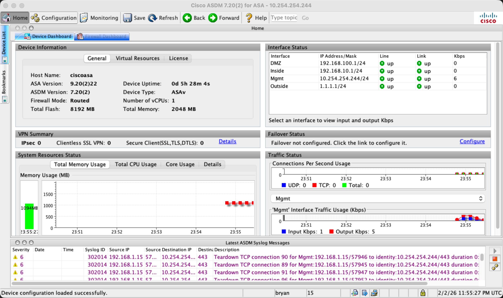
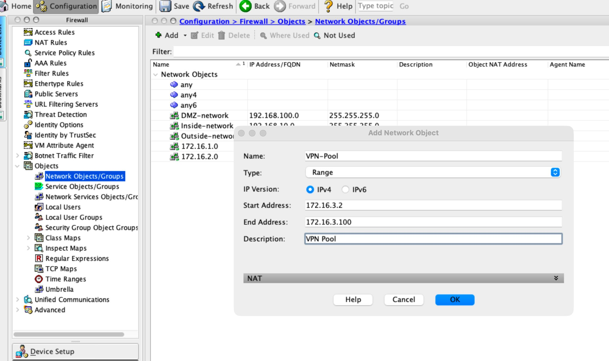
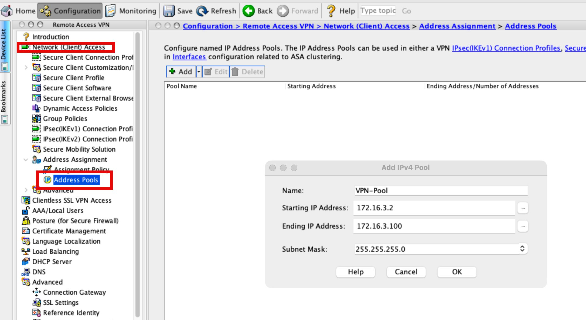

# Lab

Configure ASDM Management (easier for anyconnect and ssl vpns)
Note: eve-ng asdm interface is bridged to local home network, get ip from dhcp

```
conf t
int management 0/0
	ip address dhcp
	nameif Mgmt
	no shut

# create user for asdm

username bryan password cisco priv 15

# enable web server, allow management traffic

http server enable
http 0.0.0.0 0.0.0.0 Mgmt
	
```

[Open: Pasted image 20260202185536.png](../../../Media/4eac36550adf67bfd15c742bc737c211_MD5.jpeg)


* Create vpn pool ips (network object for ACLs, and Pool object for vpn config)
	* 172.16.3.2 - 172.16.3.100

[Open: Pasted image 20260202190128.png](../../../Media/559e16cb7c7ec8e7b1888b72a98c1cc7_MD5.jpeg)


[Open: Pasted image 20260202190319.png](../../../Media/939943004461aeabeae349d7c0b81a51_MD5.jpeg)


