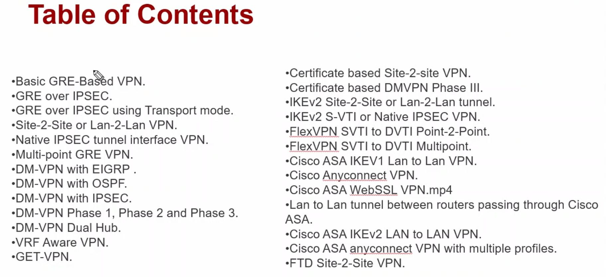
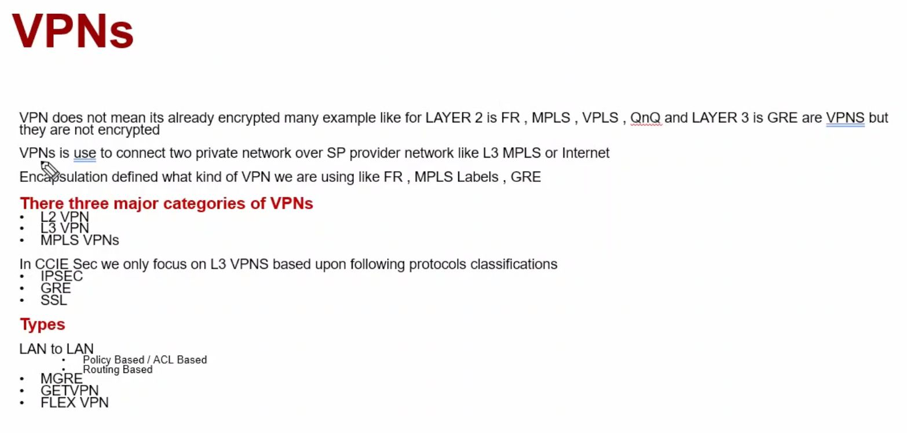
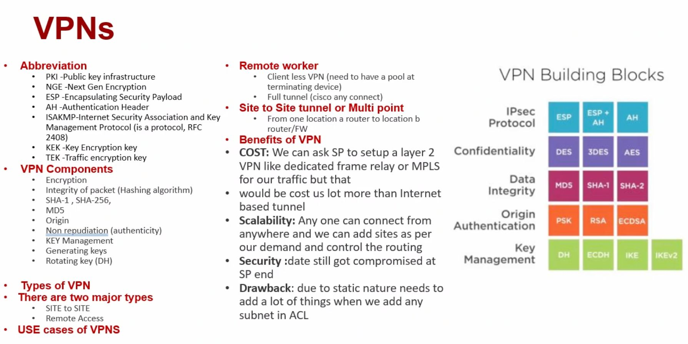
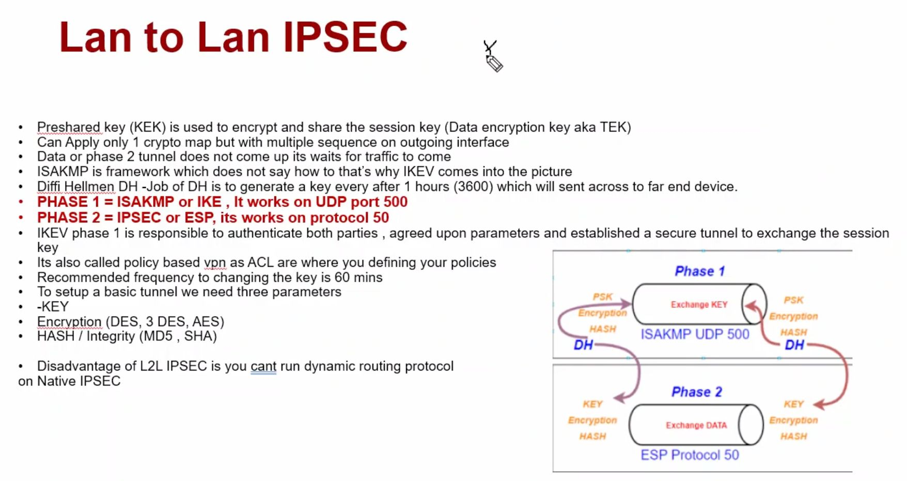
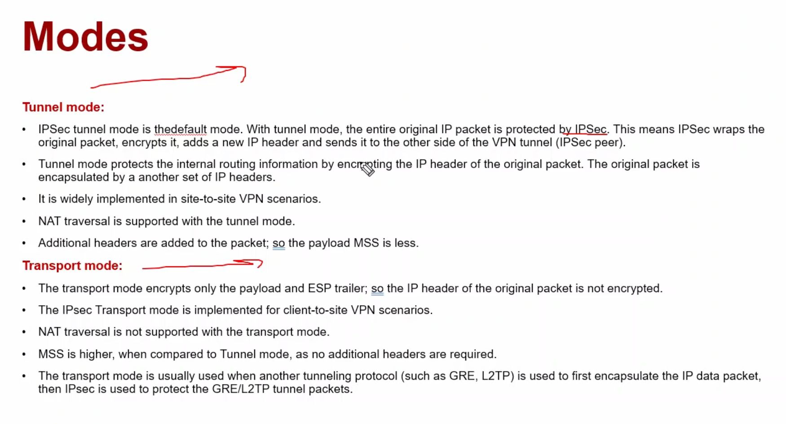
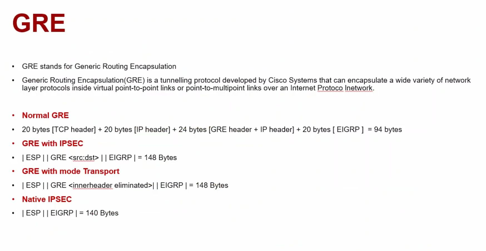
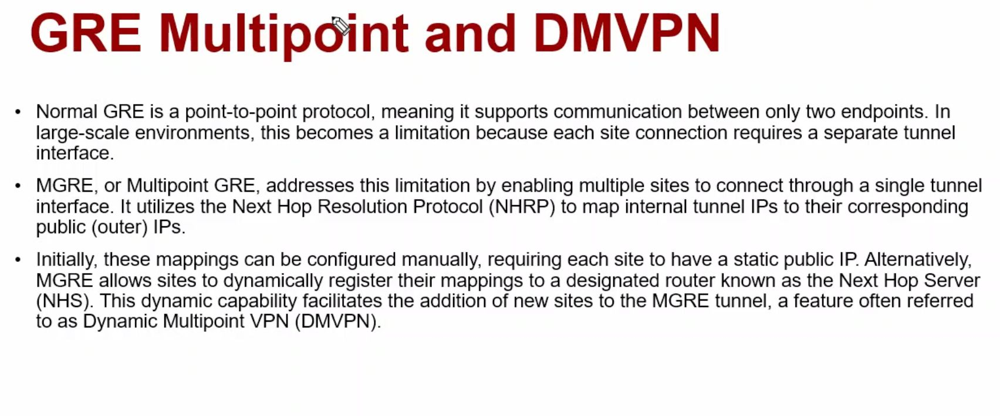
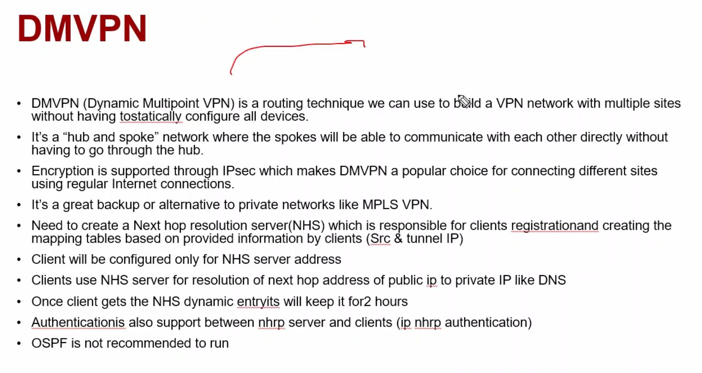
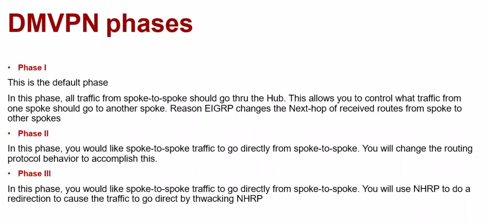

# Table of Contents
[Open: Pasted image 20260208091415.png](../../../Media/6468142a271cbcbe2c5d1bee12064209_MD5.jpeg)

Tips & Tricks for the exam
Example 1
You may see a task that says

Create an IPSEC VPN between R1 and R2
Preshare key C!sC0123
name your transform set CiscoTS esp-sha esp-sha-hmac
make sure policy number is 100
crypto-map should be named as CiscoCMAP

If it doesn't say use ikev2, assume ikev1
Follow all instructions EXACTLY, case of names, numbers, etc. all need to match exactly
Copy and paste as much as possible from things like notepad to keep things the same
Can also use notepad to create configs to copy and paste across multiple devices to save time

---

Example 2
Task asks to create two anyconnect profiles - sales and hr
Sales profile should named as Sales_Cisco_prof and HR should be named HR_Cisco_prof
Create a certificate named ciscoasa and use encryption 2048
ensure that your anyconnect vpn is split tunnel and running IKE/IPSEC 
Creat vpn pool for sales 172.16.10.20 - 172.16.10.30

[Open: Pasted image 20260208094548.png](../../../Media/44f5acd9a2c8743cfe641ce27820b95d_MD5.jpeg)

[Open: Pasted image 20260208095002.png](../../../Media/8df7c5a0ce98e320478c5550229cb247_MD5.jpeg)

[Open: Pasted image 20260208100331.png](../../../Media/34c6a8ee3924b92074fdcac33306d890_MD5.jpeg)

[Open: Pasted image 20260208100719.png](../../../Media/f367f5a5487a74b66968268ef2490c15_MD5.jpeg)

[Open: Pasted image 20260208100858.png](../../../Media/463af82bab8a1afd79f4d43999585ee0_MD5.jpeg)

[Open: Pasted image 20260208101101.png](../../../Media/6cb6e18dafd7ab5cbe5158a9e43d0055_MD5.jpeg)

[Open: Pasted image 20260208101309.png](../../../Media/3003fd7bf0cb1f36c69eb250c2cb18d3_MD5.jpeg)

[Open: Pasted image 20260208102156.png](../../../Media/1ed0bc8665132d522c1eacb6218ad26f_MD5.jpeg)

