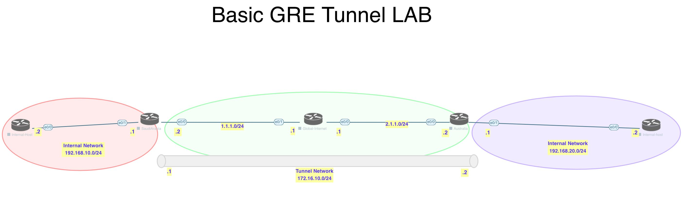

# Notes

# Lab

[Open: Pasted image 20260210190346.png](../../../Media/2b24061c8b0b44a84a335d79589bee74_MD5.jpeg)


Create GRE tunnel between two routers, use ospf on top to exchange routes.

Create tunnel interfaces to connect our two routers

Saudi Router

```
interface tunnel 100
	no shut
	tunnel source 1.1.1.2
	tunnel destination 2.1.1.2
	ip address 172.16.10.1 255.255.255.0
```

Australia Router

```
interface tunnel 200
	no shut
	tunnel source 2.1.1.2
	tunnel destination 1.1.12
	ip address 172.16.10.2 255.255.255.0
```

Next, add routing protocol to advertise networks on each router

Saudi router

```
router ospf 1
	router-id 0.0.0.1
	
```