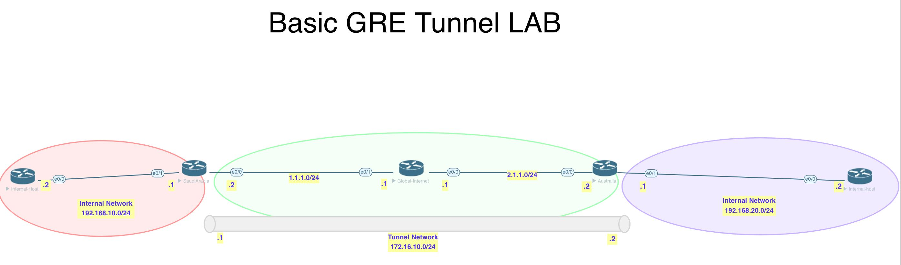
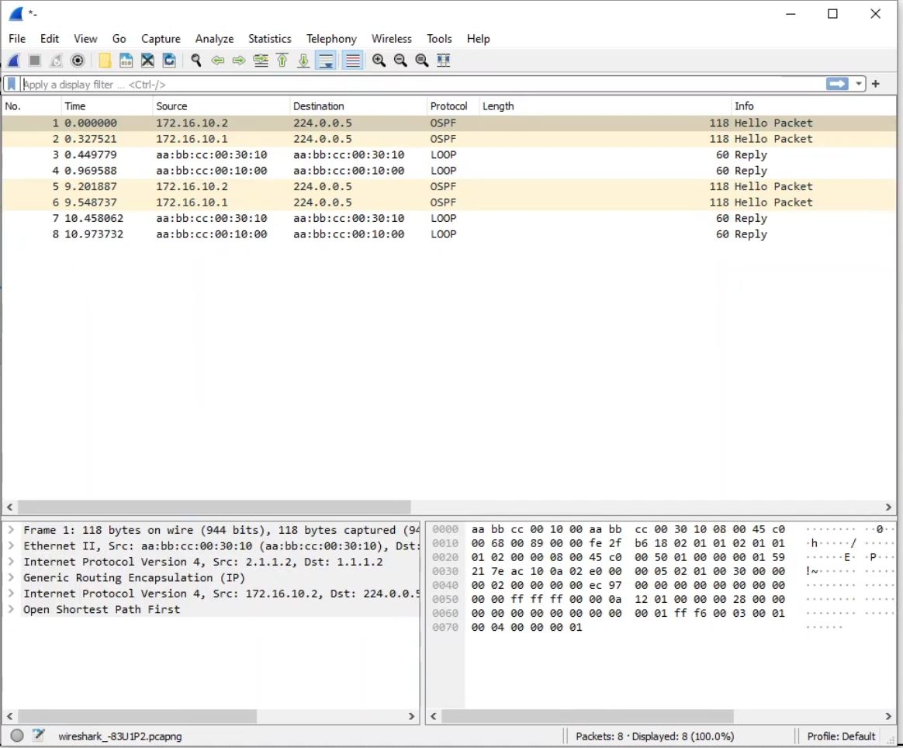
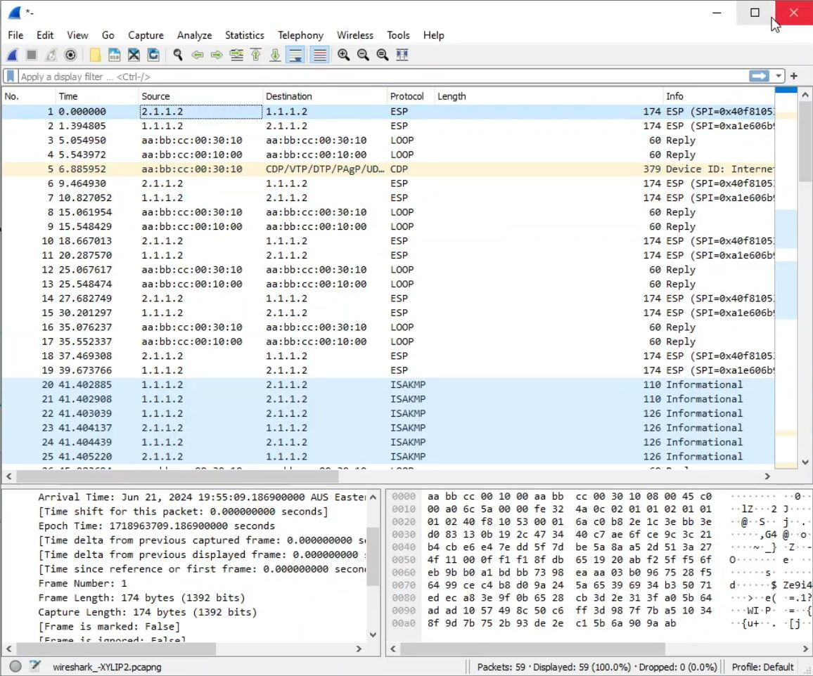

# Lab

[Open: Pasted image 20260211133340.png](../../../Media/263798cd8a83590eaebed3a94862c9a3_MD5.jpeg)


Use IPSEC to secure the GRE Tunnel (never run gre tunnel unencrypted over the internet - insecure)

[Open: Pasted image 20260211133535.png](../../../Media/bf0a0e9729d588d878408480d024724f_MD5.jpeg)



Saudi Arabia Config

```
# Configure Phase 1 - ISAKMP

crypto isakmp policy 12
	authentication pre-share
	hash sha
	group 14
	encryption aes
	
# Configure pre share key

crypto isakmp key cisco123 address 2.1.1.2	
	
# Configure Phase 2 - IPSEC

crypto ipsec transform-set TS esp-aes esp-sha-hmac

# Create profile to apply to interface

crypto ipsec profile GREPROFILE
	set transform-set TS
	
# apply to tunnel interface

interface tunnel 100
	tunnel protection ipsec profile GREPROFILE
```

Australia Config

```
# Configure Phase 1 - ISAKMP

crypto isakmp policy 12
	authentication pre-share
	hash sha
	group 14
	encryption aes
	
# Configure pre share key

crypto isakmp key cisco123 address 1.1.1.2	
	
# Configure Phase 2 - IPSEC

crypto ipsec transform-set TS esp-aes esp-sha-hmac

# Create profile to apply to interface

crypto ipsec profile GREPROFILE
	set transform-set TS
	
# apply to tunnel interface

interface tunnel 200
	tunnel protection ipsec profile GREPROFILE
```

[Open: Pasted image 20260211135706.png](../../../Media/9b99e724868ac82aa1867b8a8b7db286_MD5.jpeg)


