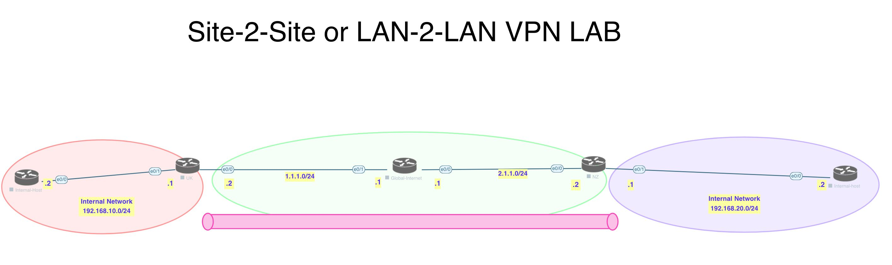

# Lab

[Open: Pasted image 20260218174904.png](../../../Media/00286315827df2e10aa5731a0247e9ea_MD5.jpeg)


Phase 1 - ISAKMP - UDP/500

Phase 2 - ESP - UDP/50

## UK Config

```
# configure phase 1

crypto isakmp policy 10
	authentication pre-share
	hash sha
	encryption aes
	group 14
	
# set pre-share key

crypto isakmp key moshin123 address 2.1.1.2

# configure phase 2

crypto ipsec transform-set TS esp-3des esp-sha-hmac

# create ACL for interesting traffic

access-list 102 permit ip 192.168.10.0 0.0.0.255 192.168.20.0 0.0.0.255

# apply crypto map to outgoing interface

crypto map CMAP 10 ipsec-isakmp
	match address 102
	set peer 2.1.1.2
	set transform-set TS
	
# apply cmap

interface e0/0
	cryptomap CMAP
```

NZ Config

```
# configure phase 1

crypto isakmp policy 10
	authentication pre-share
	hash sha
	encryption aes
	group 14
	
# set pre-share key

crypto isakmp key moshin123 address 1.1.1.2

# configure phase 2

crypto ipsec transform-set TS esp-3des esp-sha-hmac

# create ACL for interesting traffic

access-list 102 permit ip 192.168.20.0 0.0.0.255 192.168.10.0 0.0.0.255

# apply crypto map to outgoing interface

crypto map CMAP 10 ipsec-isakmp
	match address 102
	set peer 1.1.1.2
	set transform-set TS
	
# apply cmap

interface e0/0
	cryptomap CMAP
```