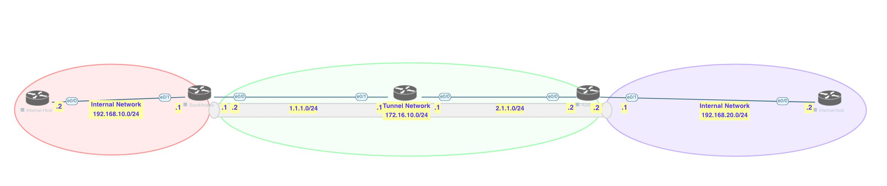

# Lab

[Open: Pasted image 20260219102914.png](../../../Media/9353da1ec0e7c96fb453c88e3da2faeb_MD5.jpeg)


Saudi Config

```
# Phase 1 Config
crypto isakmp policy 10
	authentication pre-share
	hash md5
	encryption 3des
	group 2
	
# Configure pre-shared key

crypto isakmp key moshin123 address 2.1.1.2

# Configure Phase 2 Transform Set

crypto ipsec transform-set TS esp-3des esp-sha-hmac
	mode transport
	
# Create ipsec profile

crypto ipsec profile GREPROFILE
	set transform-set TS
	
# Apply to tunnel interface

inteface tunnel 100
	ip address 172.16.10.1 255.255.255.0
	tunnel source 1.1.1.2
	tunnel destination 2.1.1.2
	tunnel protection ipsec profile GREPROFILE
	tunnel mode ipsec ipv4
```

Australia Config

```
# Phase 1 Config
crypto isakmp policy 10
	authentication pre-share
	hash md5
	encryption 3des
	group 2
	
# Configure pre-shared key

crypto isakmp key moshin123 address 1.1.1.2

# Configure Phase 2 Transform Set

crypto ipsec transform-set TS esp-3des esp-sha-hmac
	mode transport
	
# Create ipsec profile

crypto ipsec profile GREPROFILE
	set transform-set TS
	
# Apply to tunnel interface

inteface tunnel 100
	ip address 172.16.10.2 255.255.255.0
	tunnel source 2.1.1.2
	tunnel destination 1.1.1.2
	tunnel protection ipsec profile GREPROFILE
	tunnel mode ipsec ipv4
```