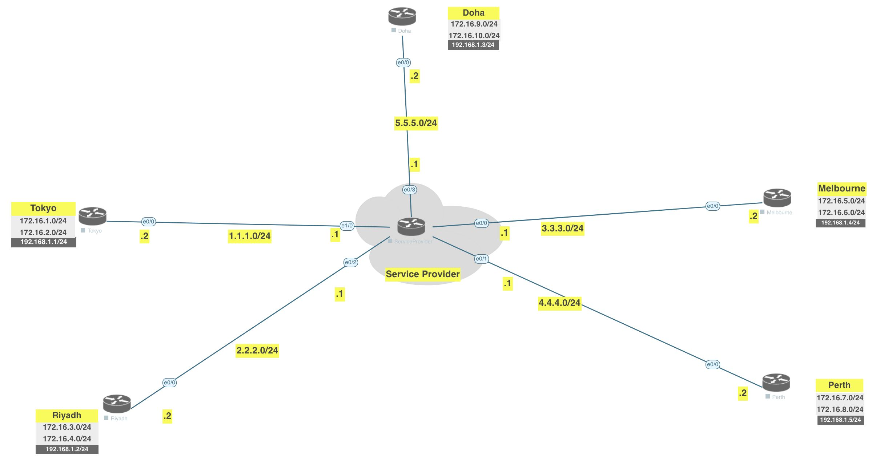

[Open: Pasted image 20260221144106.png](../../../Media/77ac6dca4cdcd653babd299ff610d071_MD5.jpeg)


# Lab

Doha will be hub and NHS (next hop server)
Tunnel subnet 192.168.1.0/24


Doha Config (hub and nhrp nhs)

```
int tunnel 1
	ip address 192.168.1.3 255.255.255.0
	tunnel source 5.5.5.2
	tunnel mode gre multipoint 
	ip nhrp network-id 1
	ip nhrp map 192.168.1.1 1.1.1.2
	ip nhrp map 192.168.1.2 2.2.2.2
	ip nhrp map 192.168.1.4 3.3.3.2
	ip nhrp map 192.168.1.5 4.4.4.2
```

Tokyo

```
int tunnel 1
	ip address 192.168.1.1 255.255.255.0
	tunnel source 1.1.1.2
	tunnel mode gre multipoint 
	ip nhrp network-id 1
	ip nhrp map 192.168.1.3 5.5.5.2
	ip nhrp map 192.168.1.2 2.2.2.2
	ip nhrp map 192.168.1.4 3.3.3.2
	ip nhrp map 192.168.1.5 4.4.4.2
```

Riyadh
```
int tunnel 1
	ip address 192.168.1.2 255.255.255.0
	tunnel source 2.2.2.2
	tunnel mode gre multipoint 
	ip nhrp network-id 1
	ip nhrp map 192.168.1.3 5.5.5.2
	ip nhrp map 192.168.1.1 1.1.1.2
	ip nhrp map 192.168.1.4 3.3.3.2
	ip nhrp map 192.168.1.5 4.4.4.2
```

Melbourne

```
int tunnel 1
	ip address 192.168.1.4 255.255.255.0
	tunnel source 3.3.3.2
	tunnel mode gre multipoint 
	ip nhrp network-id 1
	ip nhrp map 192.168.1.3 5.5.5.2
	ip nhrp map 192.168.1.1 1.1.1.2
	ip nhrp map 192.168.1.2 2.2.2.2
	ip nhrp map 192.168.1.5 4.4.4.2
```

Perth

```
int tunnel 1
	ip address 192.168.1.5 255.255.255.0
	tunnel source 4.4.4.2
	tunnel mode gre multipoint 
	ip nhrp network-id 1
	ip nhrp map 192.168.1.3 5.5.5.2
	ip nhrp map 192.168.1.1 1.1.1.2
	ip nhrp map 192.168.1.2 2.2.2.2
	ip nhrp map 192.168.1.4 3.3.3.2
```

EIGRP Configs

Doha

```
router eigrp 1
	network 192.168.1.0 255.255.255.0
	network 172.16.9.0 255.255.255.0
	network 172.16.10.0 255.255.255.0
```

Tokyo

```
router eigrp 1
	network 192.168.1.0 255.255.255.0
	network 172.16.1.0 255.255.255.0
	network 172.16.2.0 255.255.255.0
```

Riyadh

```
router eigrp 1
	network 192.168.1.0 255.255.255.0
	network 172.16.3.0 255.255.255.0
	network 172.16.4.0 255.255.255.0
```


Melbourne

```
router eigrp 1
	network 192.168.1.0 255.255.255.0
	network 172.16.5.0 255.255.255.0
	network 172.16.6.0 255.255.255.0
```

Peth

```
router eigrp 1
	network 192.168.1.0 255.255.255.0
	network 172.16.7.0 255.255.255.0
	network 172.16.8.0 255.255.255.0
```

No routes are being advertised yet. What are we missing?
Need multicast mappings

Doha

```
int tunnel 1
	ip nhrp map multicast 1.1.1.2
	ip nhrp map multicast 2.2.2.2
	ip nhrp map multicast 3.3.3.2
	ip nhrp map multicast 4.4.4.2
```

Spoke sites only need 1 mapping to 5.5.5.2

```
int tunnel 1
	ip nhrp map multicast 5.5.5.2
```


Still missing most of our routes, whats up with that?


