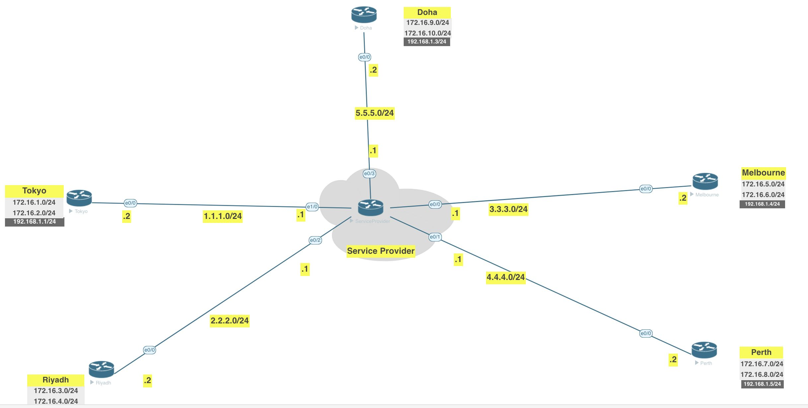

[Open: Pasted image 20260222103016.png](../../../Media/0a3ff46278a129070ff222a4757fc92f_MD5.jpeg)



Previous lab we did multipoint GRE - with manual/static nhrp mappings.
DMVPN - makes this dynamic - D for dymanic

Start with Hub - Doha Router

```
int tunnel 1
	ip address 192.168.1.3 255.255.255.0
	tunnel source 5.5.5.2
	tunnel mode gre multipoint
	ip nhrp network-id 1
```

Additional Router Configs

Tokyo 
```
int tunnel 1
	ip address 192.168.1.1 255.255.255.0
	tunnel source 1.1.1.2
	tunnel mode gre multipoint
	ip nhrp network-id 1
	ip nhrp nhs 192.168.1.3
	ip nhrp map 192.168.1.3 5.5.5.2
```

Ryadh 
```
int tunnel 1
	ip address 192.168.1.2 255.255.255.0
	tunnel source 2.2.2.2
	tunnel mode gre multipoint
	ip nhrp network-id 1
	ip nhrp nhs 192.168.1.3
	ip nhrp map 192.168.1.3 5.5.5.2
```

Melbourne 
```
int tunnel 1
	ip address 192.168.1.4 255.255.255.0
	tunnel source 3.3.3.2
	tunnel mode gre multipoint
	ip nhrp network-id 1
	ip nhrp nhs 192.168.1.3
	ip nhrp map 192.168.1.3 5.5.5.2
```

Perth 
```
int tunnel 1
	ip address 192.168.1.5 255.255.255.0
	tunnel source 4.4.4.2
	tunnel mode gre multipoint
	ip nhrp network-id 1
	ip nhrp nhs 192.168.1.3
	ip nhrp map 192.168.1.3 5.5.5.2
```


To get EIGRP working on Doha

```
int tunnel 1
	ip nhrp map multicast dynamic
	no ip split-horizon eigrp 1
```

On spokes

```
int tunnel 1
	ip nhrp map multicast 5.5.5.2
```

