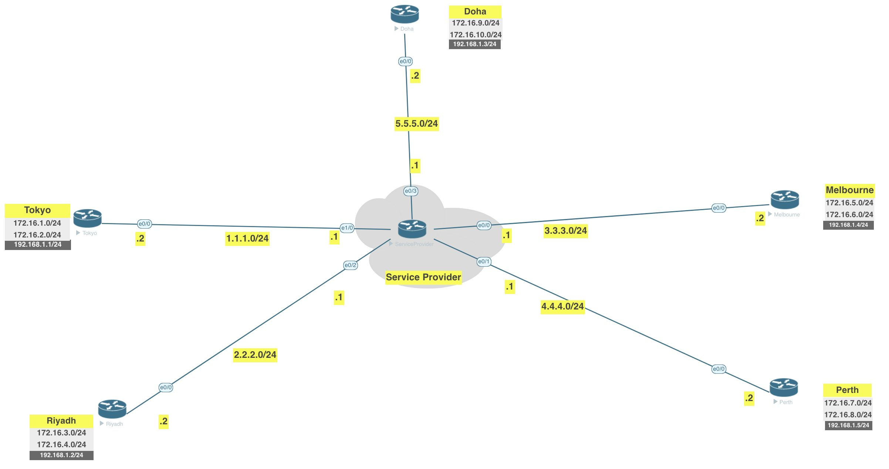
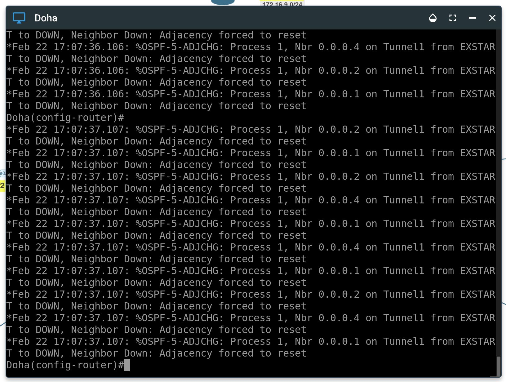
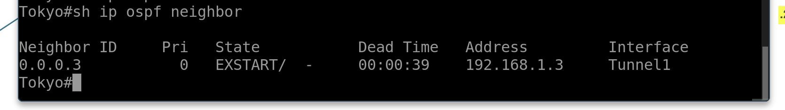
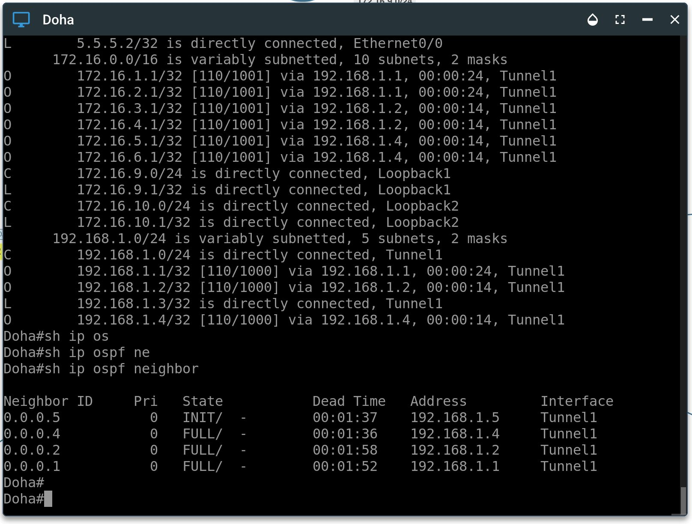

[Open: Pasted image 20260222115710.png](../../../Media/878c47d3f3e040c10882cdbe503bbc8c_MD5.jpeg)


# Lab

Remove eigrp config, configure ospf

Tokyo

```
no router eigrp 1
router ospf 1
	router-id 0.0.0.1
	network 192.168.1.0 0.0.0.255 area 0
	network 172.16.1.0 0.0.0.255 area 0
	network 172.16.2.0 0.0.0.255 area 0
```


Riyadh

```
no router eigrp 1
router ospf 1
	router-id 0.0.0.2
	network 192.168.1.0 0.0.0.255 area 0
	network 172.16.3.0 0.0.0.255 area 0
	network 172.16.4.0 0.0.0.255 area 0
```


Melbourne

```
no router eigrp 1
router ospf 1
	router-id 0.0.0.4
	network 192.168.1.0 0.0.0.255 area 0
	network 172.16.5.0 0.0.0.255 area 0
	network 172.16.6.0 0.0.0.255 area 0
```


Perth

```
no router eigrp 1
router ospf 1
	router-id 0.0.0.5
	network 192.168.1.0 0.0.0.255 area 0
	network 172.16.7.0 0.0.0.255 area 0
	network 172.16.8.0 0.0.0.255 area 0
```

Hub Config
Doha

```
no router eigrp 1
router ospf 1
	router-id 0.0.0.3
	network 192.168.1.0 0.0.0.255 area 0
	network 172.16.7.0 0.0.0.255 area 0
	network 172.16.8.0 0.0.0.255 area 0
```

OSPF relationships stuck in exstart

[Open: Pasted image 20260222120745.png](../../../Media/aadda3a16ad1c6eb57937110f8ae7c20_MD5.jpeg)


[Open: Pasted image 20260222120806.png](../../../Media/eb897f5a35956621f778c4ae99d3587d_MD5.jpeg)


Need to change ospf from p2p to multipoint

Tunnel config

```
int tunnel 1
	ip ospf network point-to-multipoint
```

[Open: Pasted image 20260222121208.png](../../../Media/9d465f43d5750c1a82381bd204735243_MD5.jpeg)


