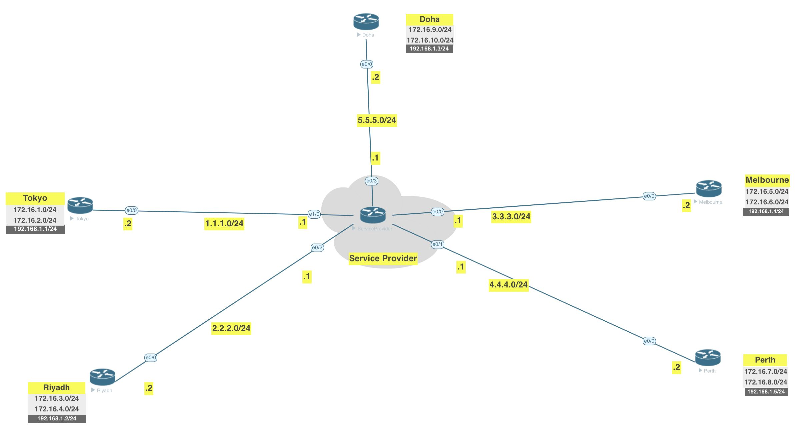

# Lab

[Open: Pasted image 20260222121431.png](../../../Media/9f82852f05f834ef40c0ca20fe166d39_MD5.jpeg)


Goal - apply ipsec to these dmvpn tunnels

Create phase1/2 proposals and apply to tunnel interfaces


```

# Phase 1 Config

crpto isakmp policy 10
	authenticaton pre-share
	group 2
	encryption 3des
	hash md5
	
crypto isakmp key moshin123 address 0.0.0.0

# Phase 2 Config

```