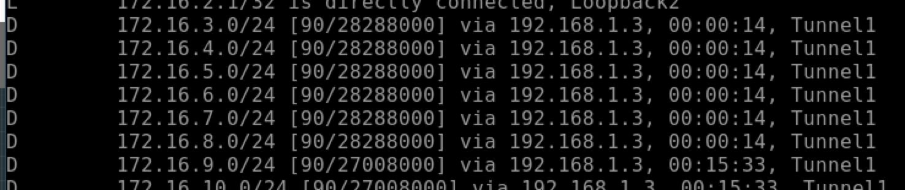
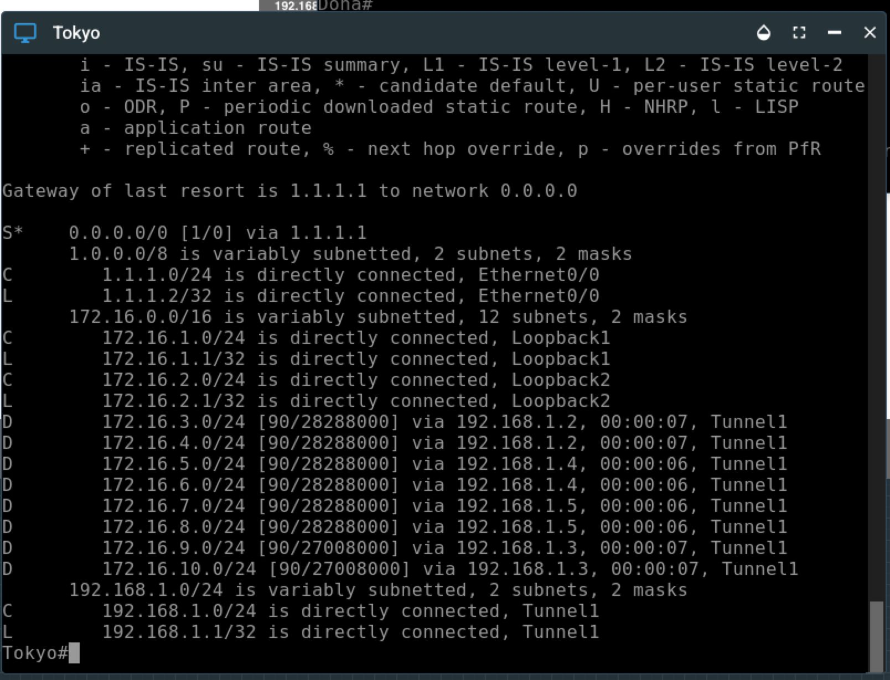
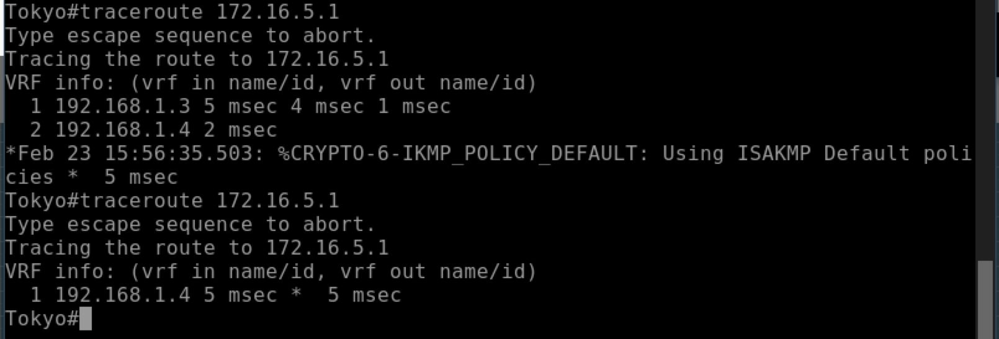

[Open: Pasted image 20260223101236.png](../../../Media/1f4e4f9e826693e3f487c76a5af4c96d_MD5.jpeg)


Revert back to EIGRP

```
# Doha

en
conf t
no router ospf 1
router eigrp 1
	network 192.168.1.0 255.255.255.0
	network 172.16.9.0 255.255.255.0
	network 172.16.10.0 255.255.255.0

# Tokyo

en
conf t
no router ospf 1
router eigrp 1
	network 192.168.1.0 255.255.255.0
	network 172.16.1.0 255.255.255.0
	network 172.16.2.0 255.255.255.0


# Riyadh

en
conf t
no router ospf 1
router eigrp 1
	network 192.168.1.0 255.255.255.0
	network 172.16.3.0 255.255.255.0
	network 172.16.4.0 255.255.255.0

# Melbourne

en
conf t
no router ospf 1
router eigrp 1
	network 192.168.1.0 255.255.255.0
	network 172.16.5.0 255.255.255.0
	network 172.16.6.0 255.255.255.0

# Perth 

en
conf t
no router ospf 1
router eigrp 1
	network 192.168.1.0 255.255.255.0
	network 172.16.7.0 255.255.255.0
	network 172.16.8.0 255.255.255.0
```

[Open: Pasted image 20260223103106.png](../../../Media/178cf7c93a65a561c9dcfc048aefee14_MD5.jpeg)


DMVPN Phase 1 - Only allows spoke to hub.

DMVPN is the first phase that was defined when this technology was implemented by Cisco and is strictly designed for Hub and Spoke communications only. Spoke-To-Spoke traffic flows will need to reach the Hub and then be transported down to the spoke. This is the exact same traffic flow as a hub and spoke design in Frame-Relay or ATM.


Right now, all next hops for spoke networks point to Doha

[Open: Pasted image 20260223104046.png](../../../Media/6e23fb422814e117c7f54b603649710a_MD5.jpeg)


#### DMVPN Phase 2

In DMVPN phase 2 spoke to spoke traffic flows is now permitted and all spoke routers implement multipoint GRE. Equally, resolution request NHRP messages are now sent to resolve a spokes VPN address to it's NBMA address. This function however relies heavily on your routing design and in ensuring that the next-hop address is preserved during advertisement from the hub down to other spokes. Much like how the next-hop is preserved on an ethernet switch to allow more efficient traffic flows. To demonstrate this the topology has been updated to reflect this change, along with new loopback addresses added and advertised into EIGRP.


On Doha router -

```
int tunnel 1
	no ip next-hop-self eigrp 1
```

Tokyo now sees the spoke routers as next hops

[Open: Pasted image 20260223104203.png](../../../Media/ad7140be18a90878aa5a91bfa1daae01_MD5.jpeg)



#### DMPVN Phase 3

DMVPN Phase 3 is the final and most scalable phase in DMVPN as it combines the summarisation benefits of phase 1 with the spoke-to-spoke traffic flows achieved via phase 2. This phase works by having the Hub summarise a default route or to summarise all spoke prefixes and then to enable NHRP redirection messages. On the spokes you only need to enable NHRP shortcuts for DMVPN phase 3 as routing will complete the rest.

DMVPN Phase 3, however, the hub and spokes still use NHRP, but instead of using an NHRP query, the source spoke will send the traffic to the hub temporary to send to the destination spoke. This process will trigger an NHRP redirection from the hub to the source spoke informing it of a direct path to the destination spoke router. The source spoke router can then bypass the hub router for subsequent traffic between them and send the traffic directly to the destination spoke router, thus reducing the load on the hub.

NHRP Redirect

Doha

```
int tunnel 1
	ip nhrp redirect
```

Spokes

```
int tunnel 1
	ip nhrp shortcut
```

First traceroute shows Tokyo going to hub first to get the redirect.
Second traceroute shows tokyo now going direct after caching, overriding the routing table

[Open: Pasted image 20260223105729.png](../../../Media/a4cff1a320b6f04c28c31732d479dd8c_MD5.jpeg)


