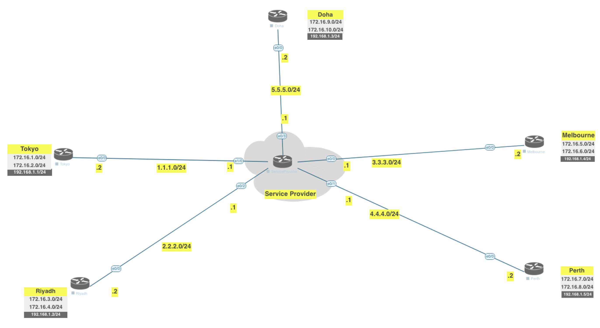

[Open: Pasted image 20260223101236.png](../../../Media/1f4e4f9e826693e3f487c76a5af4c96d_MD5.jpeg)


Revert back to EIGRP

```
# Doha

en
conf t
no router ospf 1
router eigrp 1
	network 192.168.1.0 255.255.255.0
	network 172.16.9.0 255.255.255.0
	network 172.16.10.0 255.255.255.0

# Tokyo

en
conf t
no router ospf 1
router eigrp 1
	network 192.168.1.0 255.255.255.0
	network 172.16.1.0 255.255.255.0
	network 172.16.2.0 255.255.255.0


# Riyadh

en
conf t
no router ospf 1
router eigrp 1
	network 192.168.1.0 255.255.255.0
	network 172.16.3.0 255.255.255.0
	network 172.16.4.0 255.255.255.0

# Melbourne

en
conf t
no router ospf 1
router eigrp 1
	network 192.168.1.0 255.255.255.0
	network 172.16.5.0 255.255.255.0
	network 172.16.6.0 255.255.255.0

# Perth 

en
conf t
no router ospf 1
router eigrp 1
	network 192.168.1.0 255.255.255.0
	network 172.16.7.0 255.255.255.0
	network 172.16.8.0 255.255.255.0
```

[Open: Pasted image 20260223103106.png](../../../Media/178cf7c93a65a561c9dcfc048aefee14_MD5.jpeg)


DMVPN Phase 1 - allows us to control spoke to spoke traffic

