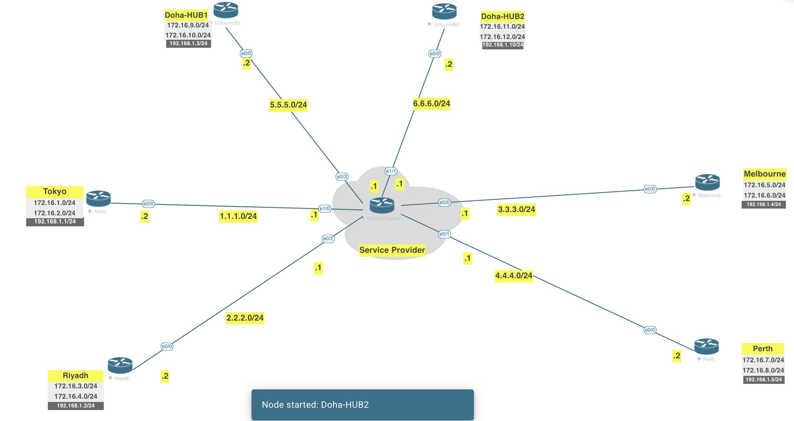

[Open: Pasted image 20260224184502.png](../../../Media/461f550e1520bccbec7b6541cc0d7d13_MD5.jpeg)


1) Great static mappings for the two hubs
2) Enable nhrp redirect on both hubs
3) Create additional mappings from spokes to hub2

Doha-1

```
int tunnel 1
	ip nhrp map 192.168.1.10 6.6.6.2
	ip nhrp map multicast dynamic
	ip nhrp map multicast 6.6.6.2
```

Doha-2 needs all new config

```
# Config phase 1 and pre-share key

crypto isakmp policy 10
 encr 3des
 hash md5
 authentication pre-share
 group 2
crypto isakmp key mohsin123 address 0.0.0.0        
!
!

# Config phase 2

crypto ipsec transform-set TS esp-3des esp-sha-hmac 
 mode tunnel
!
crypto ipsec profile DMVPNPROF
 set transform-set TS 
!

# config tunnel interface

interface Tunnel1
 ip address 192.168.1.10 255.255.255.0
 no ip redirects
 no ip split-horizon eigrp 1
 ip nhrp map multicast 5.5.5.2
 ip nhrp map 192.168.1.3 5.5.5.2
 ip nhrp network-id 1
 ip nhrp redirect
 ip ospf network point-to-multipoint
 tunnel source 6.6.6.2
 tunnel mode gre multipoint
 tunnel protection ipsec profile DMVPNPROF

 # eigrp config

 router eigrp 1
 network 172.16.11.0 0.0.0.255
 network 172.16.12.0 0.0.0.255
 network 192.168.1.0
```

For the spokes

```
int tunnel 1
	ip nhrp map 192.168.1.10 6.6.6.2
	ip nhrp map multicast 6.6.6.2
	ip nhrp nhs 192.168.1.10
```

