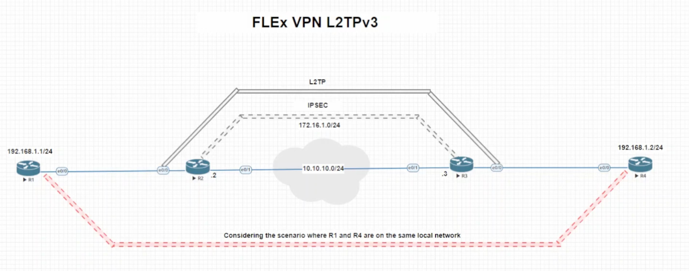

[Open: Pasted image 20260226094620.png](../../../Media/7f6291e97e90be587772dec2bd1e658a_MD5.jpeg)


LTPv3 - layer tunnel protocol version 3
allows to tunnel protocols over l3

useful for remote/branch sites to allow resources to be on the "same layer 2 network"

R2

```


```

