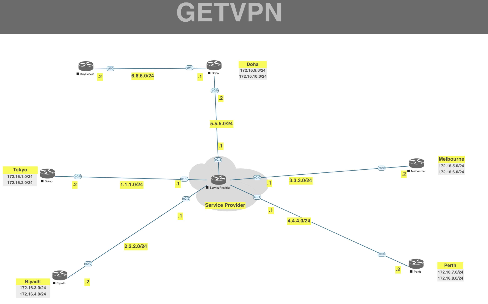

[Open: Pasted image 20260310081035.png](../../../Media/520fddff07097b9560b10d57740caedc_MD5.jpeg)


GET-VPN (group encrypted transport vpn) uses GDOI - group domain of interpretation

Get VPN topology requires key servers and members

EIGRP Routing Config
```
SP

router eigrp 1
	network 5.5.5.0 255.255.255.0
	network 1.1.1.0 255.255.255.0
	network 2.2.2.0 255.255.255.0
	network 3.3.3.0 255.255.255.0
	network 4.4.4.0 255.255.255.0

Tokyo

router eigrp 1
	network 172.16.1.0 255.255.255.0
	network 172.16.2.0 255.255.255.0
	network 1.1.1.0 255.255.255.0

Riyadh

router eigrp 1
	network 172.16.3.0 255.255.255.0
	network 172.16.4.0 255.255.255.0
	network 2.2.2.0 255.255.255.0

Melbourne

router eigrp 1
	network 172.16.5.0 255.255.255.0
	network 172.16.6.0 255.255.255.0
	network 3.3.3.0 255.255.255.0

Perth

router eigrp 1
	network 172.16.7.0 255.255.255.0
	network 172.16.8.0 255.255.255.0
	network 4.4.4.0 255.255.255.0

Doha

router eigrp 1
	network 172.16.9.0 255.255.255.0
	network 172.16.10.0 255.255.255.0
	network 5.5.5.0 255.255.255.0
	network 6.6.6.0 255.255.255.0

KeyServer

router eigrp 1
	network 6.6.6.0 255.255.255.0

```

Key Server Config
```
crypto isakmp policy 10
	authentication pre-share
	encryption 3des
	group 2
	hash md5
	
crypto isakmp key moshin123 address 0.0.0.0

crypto ipsec transform-set TS esp-3des esp-md5-hmac

access-list 102 permit ip 172.16.0.0 0.0.255.255 172.16.0.0 0.0.255.255

crypto ipsec profile GETVPN
	set transform-set TS
	
crypto gdoi group GETVPN
	identity number 112
	server local
	sa ipsec 5
	match address ipv4 102
	exit
	
address ipv4 6.6.6.2
```

Member Config

```
crypto isakmp policy 10
	authentication pre-share
	encryption 3des
	group 2
	hash md5
	
crypto isakmp key moshin123 address 6.6.6.2

crypto gdoi group GETVPN-Members
	identity number 112
	server address ipv4 6.6.6.2

crypto map CMAP 10 gdoi
	set group GETVPN-Members
	
int e0/0
	crypto map CMAP

```