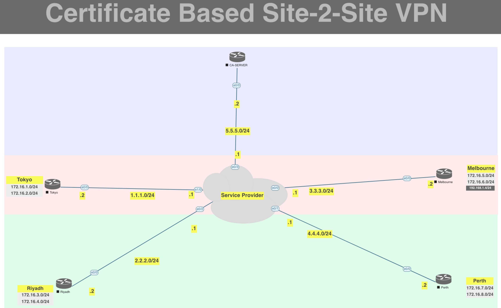

[Open: Pasted image 20260311134842.png](../../../Media/270913457de65eafcc70e8f12a420f06_MD5.jpeg)


Certificate as an alternative to pre-shared keys. Have certificates issued from CA-Server Router

Baseline Config

```
SP

en
conf t

hostname SP
no ip domain-lookup

int e0/3
ip address 5.5.5.1 255.255.255.0
no shut

int e1/0
ip address 1.1.1.1 255.255.255.0
no shut

int e0/2
ip address 2.2.2.1 255.255.255.0
no shut

int e0/0
ip address 3.3.3.1 255.255.255.0
no shut

int e0/1
ip address 4.4.4.1 255.255.255.0
no shut

router eigrp 1
	network 5.5.5.0 255.255.255.0
	network 1.1.1.0 255.255.255.0
	network 2.2.2.0 255.255.255.0
	network 3.3.3.0 255.255.255.0
	network 4.4.4.0 255.255.255.0

end
wr

==============

Tokyo

en
conf t

hostname Tokyo
no ip domain-lookup

int e0/0
ip address 1.1.1.2 255.255.255.0
no shut

int lo1
ip address 172.16.1.1 255.255.255.0
no shut

int lo2
ip address 172.16.2.1 255.255.255.0
no shut

ip route 0.0.0.0 0.0.0.0 1.1.1.1


router eigrp 1
	network 172.16.1.0 255.255.255.0
	network 172.16.2.0 255.255.255.0
	network 1.1.1.0 255.255.255.0

end
wr

================

Riyadh


en
conf t

hostname Riyadh
no ip domain-lookup

int e0/0
ip address 2.2.2.2 255.255.255.0
no shut

int lo1
ip address 172.16.3.1 255.255.255.0
no shut

int lo2
ip address 172.16.4.1 255.255.255.0
no shut

ip route 0.0.0.0 0.0.0.0 2.2.2.1

router eigrp 1
	network 172.16.3.0 255.255.255.0
	network 172.16.4.0 255.255.255.0
	network 2.2.2.0 255.255.255.0

end
wr

==============

Melbourne


en
conf t

hostname Melbourne
no ip domain-lookup

int e0/0
ip address 3.3.3.2 255.255.255.0
no shut

int lo1
ip address 172.16.5.1 255.255.255.0
no shut

int lo2
ip address 172.16.6.1 255.255.255.0
no shut

ip route 0.0.0.0 0.0.0.0 3.3.3.1

router eigrp 1
	network 172.16.5.0 255.255.255.0
	network 172.16.6.0 255.255.255.0
	network 3.3.3.0 255.255.255.0

end
wr

==============

Perth


en
conf t

hostname Perth
no ip domain-lookup

int e0/0
ip address 4.4.4.2 255.255.255.0
no shut

int lo1
ip address 172.16.7.1 255.255.255.0
no shut

int lo2
ip address 172.16.8.1 255.255.255.0
no shut

ip route 0.0.0.0 0.0.0.0 4.4.4.1

router eigrp 1
	network 172.16.7.0 255.255.255.0
	network 172.16.8.0 255.255.255.0
	network 4.4.4.0 255.255.255.0

end
wr

==============

CA Server


en
conf t

hostname CA-Server
no ip domain-lookup

int e0/0
ip address 5.5.5.2 255.255.255.0
no shut


ip route 0.0.0.0 0.0.0.0 1.1.1.1

router eigrp 1
	network 5.5.5.0 255.255.255.0


end
wr

```

CA Server Config

```
ip domain-name ca-server.xyz.com

crypto key generate rsa modulu 2048 label Trust-CA

ip http server 

crypto pki server Trust-CA
	issuer-name CN=cisco L=NewZealand C=NZ
	no shut
	# Enter Password moshin123
	
CA-Server#show crypto
*Mar 11 18:05:36.936: %SYS-5-CONFIG_I: Configured from console by console
CA-Server#show crypto pki server
Certificate Server Trust-CA:
    Status: disabled, HTTP Server is disabled
    State: check failed
    Server's configuration is locked  (enter "shut" to unlock it)
    Issuer name: CN=cisco L=NewZealand C=NZ
    CA cert fingerprint: 8C2EA580 AD3B0A93 7649299A 14D6E7CF 
    Granting mode is: manual
    Last certificate issued serial number (hex): 1
    CA certificate expiration timer: 18:05:13 UTC Mar 10 2029
    CRL NextUpdate timer: 00:05:13 UTC Mar 12 2026
    Current primary storage dir: nvram:
    Database Level: Minimum - no cert data written to storage
CA-Server#
```

Tokyo Config

```
ip domain-name tokyo.xyz.com

crypto key generate rsa modulus 2024

crypto pki trustpoint SITES
	enrollment url http://5.5.5.2
	revocation-check none
	
crypto pki authenticate SITES
	# Yes
	
Tokyo(config)#
Tokyo(config)#crypto pki authenticate SITES
Certificate has the following attributes:
       Fingerprint MD5: B339BCA5 4B1894D0 5A18A187 E2E79EFC 
      Fingerprint SHA1: F2EDB00B 8B6499F5 A31DC746 5DB02451 F2E42831 

% Do you accept this certificate? [yes/no]: yes
Trustpoint CA certificate accepted.
Tokyo(config)#
Tokyo(config)#
	
crypto pki enroll SITES
	# Password
	
Tokyo(config)#crypto pki enroll SITES
%
% Start certificate enrollment .. 
% Create a challenge password. You will need to verbally provide this
   password to the CA Administrator in order to revoke your certificate.
   For security reasons your password will not be saved in the configuration.
   Please make a note of it.

Password: 
Re-enter password: 

% The subject name in the certificate will include: Tokyo.tokyo.xyz.com
% Include the router serial number in the subject name? [yes/no]: yes
% The serial number in the certificate will be: 69216261
% Include an IP address in the subject name? [no]: yes
Enter Interface name or IP Address[]: e0/0
% Bad interface or address. Try again.
Enter Interface name or IP Address[]: 1.1.1.2    
Request certificate from CA? [yes/no]: yes
% Certificate request sent to Certificate Authority
% The 'show crypto pki certificate verbose SITES' commandwill show the fingerp
rint.

Tokyo(config)#
*Mar 11 18:19:04.508: CRYPTO_PKI:  Certificate Request Fingerprint MD5: 6B52A8
BB A5AF4FFC 942CC820 DAE69E75 
*Mar 11 18:19:04.508: CRYPTO_PKI:  Certificate Request Fingerprint SHA1: 613D1
B08 FEE203EF 50C4CC6D 4696ABFA A2779A8A 
Tokyo(config)#
```

Riyadh

```
ip domain-name riyadh.xyz.com

crypto key generate rsa modulus 2024

crypto pki trustpoint SITES
	enrollment url http://5.5.5.2
	revocation-check none
	
crypto pki authenticate SITES
	# Yes
	
crypto pki enroll SITES
```

Melbourne

```
ip domain-name melbourne.xyz.com

crypto key generate rsa modulus 2024

crypto pki trustpoint SITES
	enrollment url http://5.5.5.2
	revocation-check none
	
crypto pki authenticate SITES
	# Yes
	
crypto pki enroll SITES
```

Perth

```
ip domain-name perth.xyz.com

crypto key generate rsa modulus 2024

crypto pki trustpoint SITES
	enrollment url http://5.5.5.2
	revocation-check none
	
crypto pki authenticate SITES
	# Yes
	
crypto pki enroll SITES
```