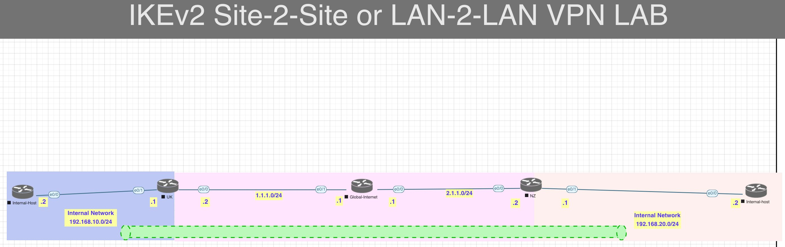

[Open: Pasted image 20260311180728.png](../../../Media/697f8a01b61686fa05856bdd40cf51ba_MD5.jpeg)


IKEv2 allows for more options than IKEv1

RFC4306

Allows for proposals of encryption/integrity/group - devices can negotiate parameters

Integrity - stronger options - sha256, sha512

```
UK

crypto ikev2 proposal PROPOSAL
	encryption aes-cbc-128 3des
	integrity sha1 md5
	group 2 5

crypto ikev2 policy POLICY
	proposal PROPOSAL

crypto ikev2 keyring UK
	peer NZ
	address 2.1.1.2
	pre-share local moshin123
	pre-share remote abc123

crypto ikev2 profile PROFILE
	match identity remote address 2.1.1.2 255.255.255.255
	authentication local pre-share
	authentication remote pre-share
	keyring local UK

crypto ipsec transform-set TS esp-3des esp-sha-hmac
	
access-list 102 permit ip 192.168.10.0 0.0.0.255 192.168.20.0 0.0.255.255

crypto map CMAP 10 ipsec-isakmp
	set peer 2.1.1.2
	set transform-set TS
	match address 102
	set ikev2-profile PROFILE

int e0/0
	crypto map CMAP

NZ

crypto ikev2 proposal PROPOSAL
	encryption aes-cbc-128 3des
	integrity sha1 md5
	group 2 5

crypto ikev2 policy POLICY
	proposal PROPOSAL

crypto ikev2 keyring NZ
	peer UK
	address 1.1.1.2
	pre-share local abc123
	pre-share remote moshin123

crypto ikev2 profile PROFILE
	match identity remote address 1.1.1.2 255.255.255.255
	authentication local pre-share
	authentication remote pre-share
	keyring local NZ

crypto ipsec transform-set TS esp-3des esp-sha-hmac
	
access-list 102 permit ip 192.168.20.0 0.0.0.255 192.168.10.0 0.0.255.255

crypto map CMAP 10 ipsec-isakmp
	set peer 1.1.1.2
	set transform-set TS
	match address 102
	set ikev2-profile PROFILE

int e0/0
	crypto map CMAP

======


NZ#show crypto ikev2 sa
 IPv4 Crypto IKEv2  SA 

Tunnel-id Local                 Remote                fvrf/ivrf            Status 
1         2.1.1.2/500           1.1.1.2/500           none/none            READY  
      Encr: AES-CBC, keysize: 128, PRF: SHA1, Hash: SHA96, DH Grp:2, Auth sign: PSK
, Auth verify: PSK
      Life/Active Time: 86400/10 sec

 IPv6 Crypto IKEv2  SA 

NZ#show crypto ipsec sa

interface: Ethernet0/0
    Crypto map tag: CMAP, local addr 2.1.1.2

   protected vrf: (none)
   local  ident (addr/mask/prot/port): (192.168.20.0/255.255.255.0/0/0)
   remote ident (addr/mask/prot/port): (192.168.0.0/255.255.0.0/0/0)
   current_peer 1.1.1.2 port 500
     PERMIT, flags={origin_is_acl,}
    #pkts encaps: 0, #pkts encrypt: 0, #pkts digest: 0
    #pkts decaps: 0, #pkts decrypt: 0, #pkts verify: 0
    #pkts compressed: 0, #pkts decompressed: 0
    #pkts not compressed: 0, #pkts compr. failed: 0
    #pkts not decompressed: 0, #pkts decompress failed: 0
    #send errors 1, #recv errors 0

     local crypto endpt.: 2.1.1.2, remote crypto endpt.: 1.1.1.2
     plaintext mtu 1500, path mtu 1500, ip mtu 1500, ip mtu idb Ethernet0/0
     current outbound spi: 0x0(0)
     PFS (Y/N): N, DH group: none

     inbound esp sas:
    current outbound spi: 0x0(0)
     PFS (Y/N): N, DH group: none

     inbound esp sas:

     inbound ah sas:

     inbound pcp sas:

     outbound esp sas:

     outbound ah sas:

     outbound pcp sas:

   protected vrf: (none)
   local  ident (addr/mask/prot/port): (192.168.20.0/255.255.255.0/0/0)
   remote ident (addr/mask/prot/port): (192.168.10.0/255.255.255.0/0/0)
   current_peer 1.1.1.2 port 500
     PERMIT, flags={}
    #pkts encaps: 4, #pkts encrypt: 4, #pkts digest: 4
    #pkts decaps: 4, #pkts decrypt: 4, #pkts verify: 4
    #pkts compressed: 0, #pkts decompressed: 0
    #pkts not compressed: 0, #pkts compr. failed: 0
    #pkts not decompressed: 0, #pkts decompress failed: 0
    #send errors 0, #recv errors 0

    local crypto endpt.: 2.1.1.2, remote crypto endpt.: 1.1.1.2

         plaintext mtu 1446, path mtu 1500, ip mtu 1500, ip mtu idb Ethernet0/0
     current outbound spi: 0x9CDA54E9(2631554281)
     PFS (Y/N): N, DH group: none

     inbound esp sas:
      spi: 0x38547DAE(945061294)
        transform: esp-3des esp-sha-hmac ,
        in use settings ={Tunnel, }
        conn id: 2, flow_id: SW:2, sibling_flags 80000040, crypto map: CMAP
        sa timing: remaining key lifetime (k/sec): (4294038/3494)
        IV size: 8 bytes
        replay detection support: Y
        Status: ACTIVE(ACTIVE)

     inbound ah sas:

     inbound pcp sas:

     outbound esp sas:
      spi: 0x9CDA54E9(2631554281)
        transform: esp-3des esp-sha-hmac ,
        in use settings ={Tunnel, }
        conn id: 1, flow_id: SW:1, sibling_flags 80000040, crypto map: CMAP
             sa timing: remaining key lifetime (k/sec): (4294038/3494)
        IV size: 8 bytes
        replay detection support: Y
        Status: ACTIVE(ACTIVE)

     outbound ah sas:

     outbound pcp sas:
NZ#

```