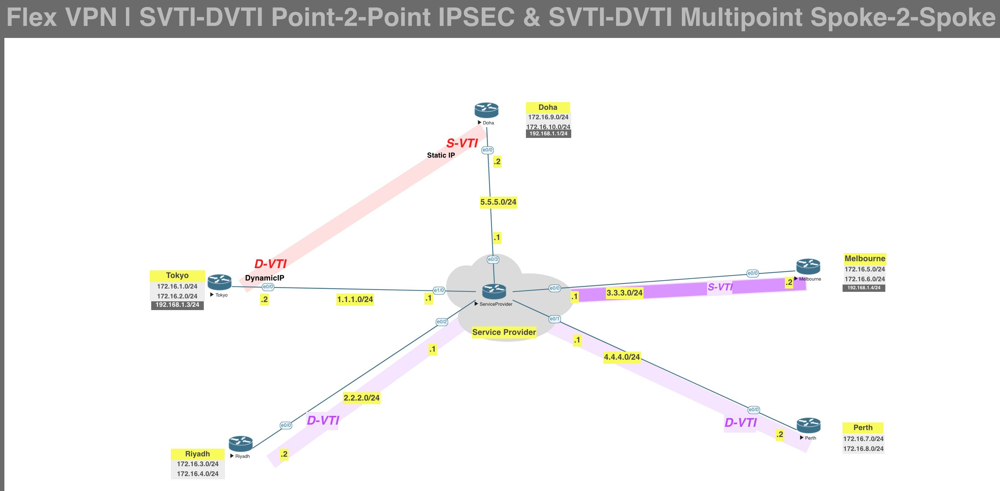

[Open: Pasted image 20260314114551.png](../../../Media/e9bb3db8c1ba341bd62b362a494f6ad6_MD5.jpeg)

Multipoint mappings. Melbourne will be the hub with SVTI interface. Riyadh and Perth will be spokes with DVTI interfaces. Multipoint will allow for spoke-to-hub, hub-to-spoke, and spoke-to-spoke traffic.

Melbourne as the hub will need nhrp/nhs to allow for spokes to resolve each other's IPs.
Hub - ip nhrp redirect
Spokes - ip nhrp shortcut

We can also have the hub assign tunnel ip's to the spokes. 
Create an ip pool on Hub.
192.168.1.15-20

