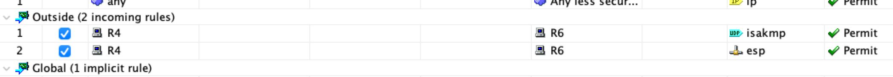

[Open: Pasted image 20260319142910.png](../../../Media/56bd3d89b310c4cb9993d2f41b7bd4da_MD5.jpeg)


S2S tunnel between R6/R4 passing through ASA

Phase 1
R6

```
crypto isakmp policy 10
	auth pre-share
	hash md5
	enc 3des
	group 2
	
crypto isakmp key moshin123 address 4.4.4.2

crypto ipsec transform-set TS esp-3des esp-sha-hmac

access-list 102 permit ip 10.10.10.0 0.0.0.255 10.10.20.0 0.0.0.255

crypto map CMAP 10 ipsec-isakmp
	set peer 4.4.4.2
	set transform-set TS
	match address 102
	
int e0/0
	crypto map CMAP
	
```

R4

```
crypto isakmp policy 10
	auth pre-share
	hash md5
	enc 3des
	group 2
	
crypto isakmp key moshin123 address 5.5.5.2

crypto ipsec transform-set TS esp-3des esp-sha-hmac

access-list 102 permit ip 10.10.20.0 0.0.0.255 10.10.10.0 0.0.0.255

crypto map CMAP 10 ipsec-isakmp
	set peer 5.5.5.2
	set transform-set TS
	match address 102
	
int e0/0
	crypto map CMAP
	
```

Create ASA fw rules to allow R4 to hit R6 over isakmp (udp/500) and esp (esp/50)

[Open: Pasted image 20260319175818.png](../../../Media/79f710eaf515855abb62b7192e1881c5_MD5.jpeg)



