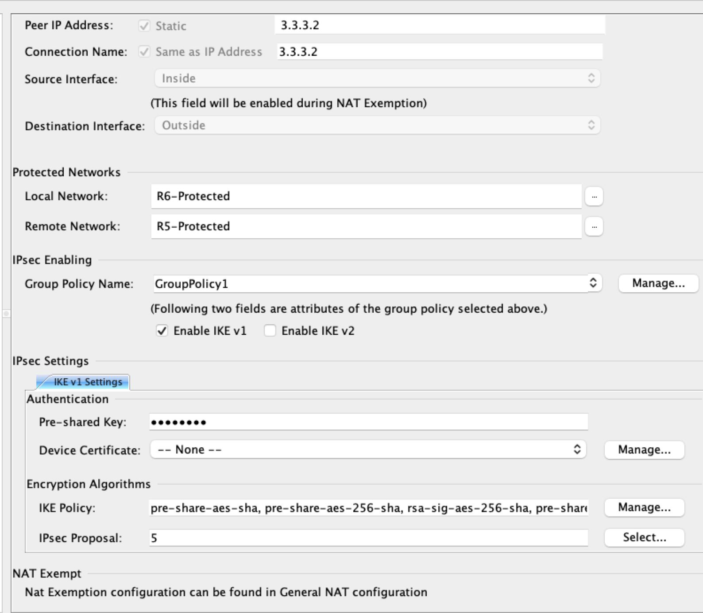
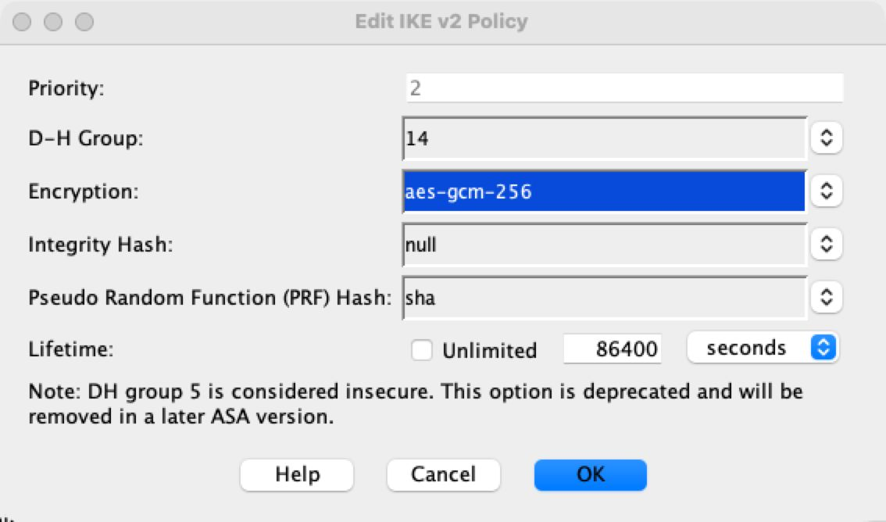
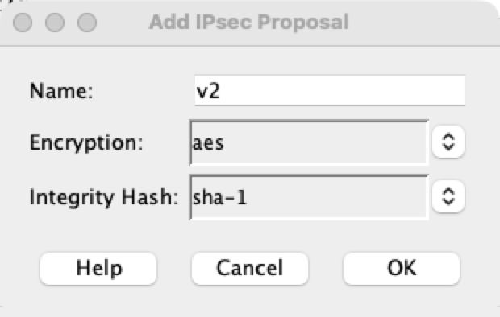

[Open: Pasted image 20260323115349.png](../../../Media/69d24495a560b4ae578165561a4c21bc_MD5.jpeg)


Establish tunnel between asa and router 5

pre-shared key
cisco123

IKEv1 - 
pre-share / aes / 14 / sha

IPSec
aes-128 / sha

[Open: Pasted image 20260323120007.png](../../../Media/9888af3e416dc1b20a1ce8931506be57_MD5.jpeg)


R5

```
IKEv1 Config

crypto isakmp policy 10
	authentication pre-share
	encryption aes
	group 14
	hash sha
	
crypto isakmp key cisco123 address 3.3.3.2

crypto ipsec transform-set TS esp-aes esp-sha-hmac

access-list 102 permit ip 10.20.20.0 0.0.0.255 10.20.10.0 0.0.0.255

crypto map CMAP 10 ipsec-isakmp
	set peer 1.1.1.1
	set transform-set TS
	match address 102
	
int e0/0
	crypto map CMAP
	
```

That was only ikev1 you dummy, do it again with ikev2

ASA

[Open: Pasted image 20260323123815.png](../../../Media/922931fd28b915e5291d97a679073592_MD5.jpeg)


[Open: Pasted image 20260323123308.png](../../../Media/bf6b84b6f88b8f6fbd1ae37a22ec0d50_MD5.jpeg)


R5
```
crypto ikev2 proprosal v2-proposal
	encryption aes-gcm-256
	prf sha1
	group 14

crypto ikev2 policy v2-policy
	proposal v2-proposal
	
crypto ikev2 keyring ASA
	peer ASA
	address 1.1.1.1
	pre-share local cisco123
	pre-share remote cisco123

crypto ikev2 profile PROFILE
	match identity remote address 1.1.1.1 255.255.255.255
	authentication local pre-share
	authentication remote pre-share
	keyring local ASA

```