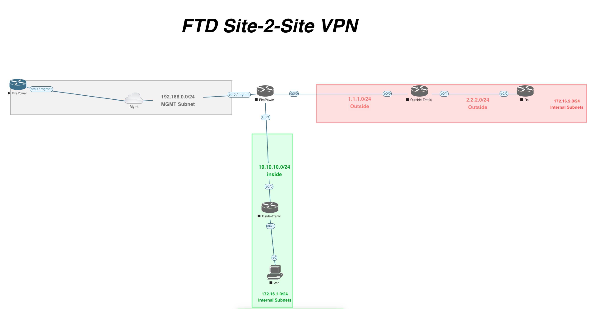
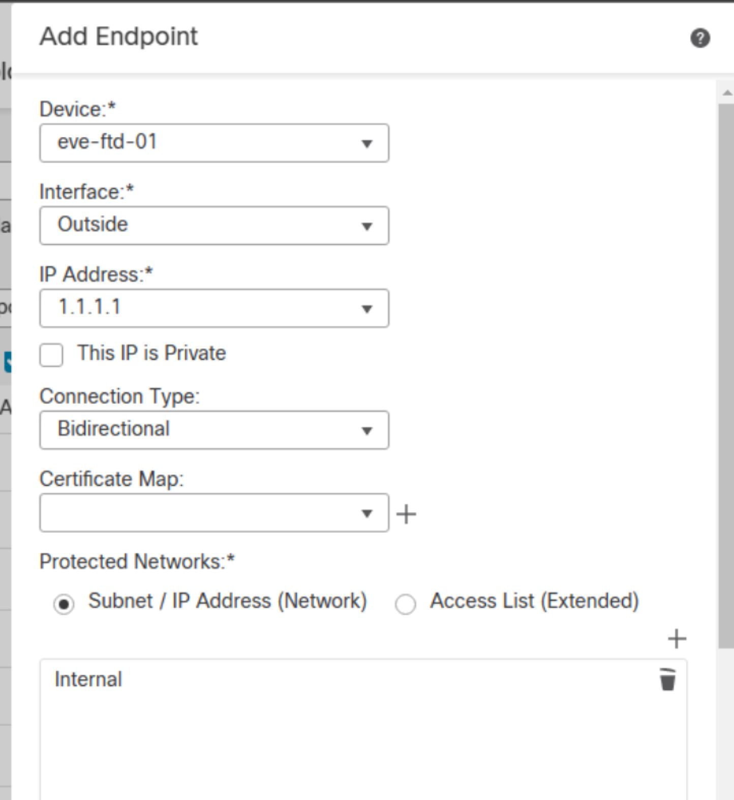
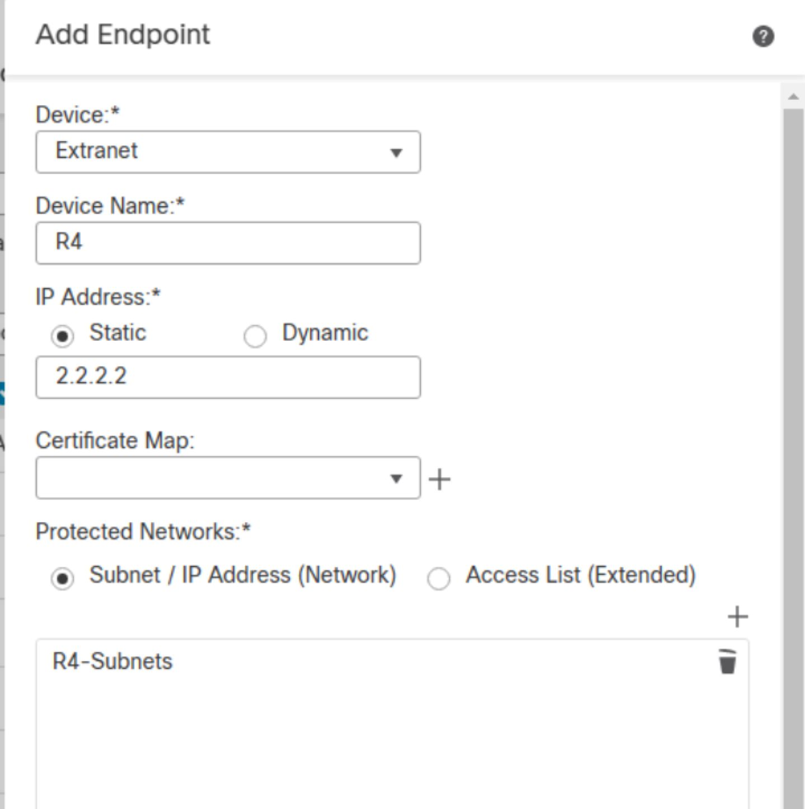
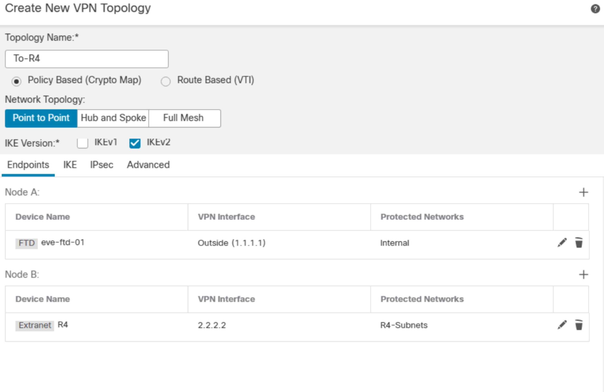
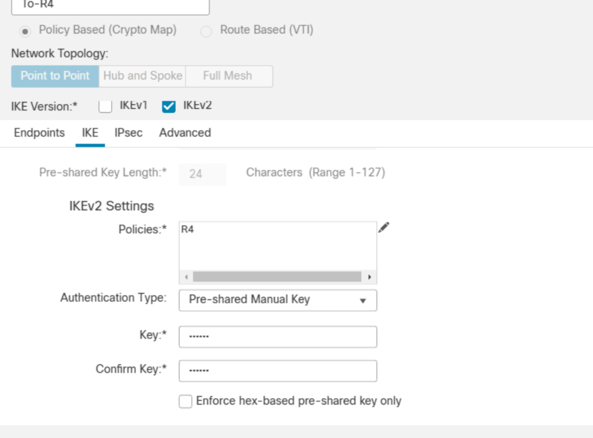

[Open: Pasted image 20260324084159.png](../../../Media/1f534e31fd19f2644f4e5dbff6e29751_MD5.jpeg)

Default creds - admin / Admin123

FMC Config

[Open: Pasted image 20260325135912.png](../../../Media/3af0159f1b8c21726982fc85f2639d49_MD5.jpeg)

[Open: Pasted image 20260325140005.png](../../../Media/778ec3a233c74cccd968f2ffdc504ed8_MD5.jpeg)

[Open: Pasted image 20260325140018.png](../../../Media/109eed23f5d4e5a34038bdc1f974a65b_MD5.jpeg)

[Open: Pasted image 20260325140302.png](../../../Media/fe14f153dd0bd8745a59691e021c3bee_MD5.jpeg)

R4 IKEv2 Policy
Integrity - SHA
Encryption - 3des
PRF - SHA
DH - 14

R4 IPSec Proposal
HASH - SHA-1
Encryption - 3des