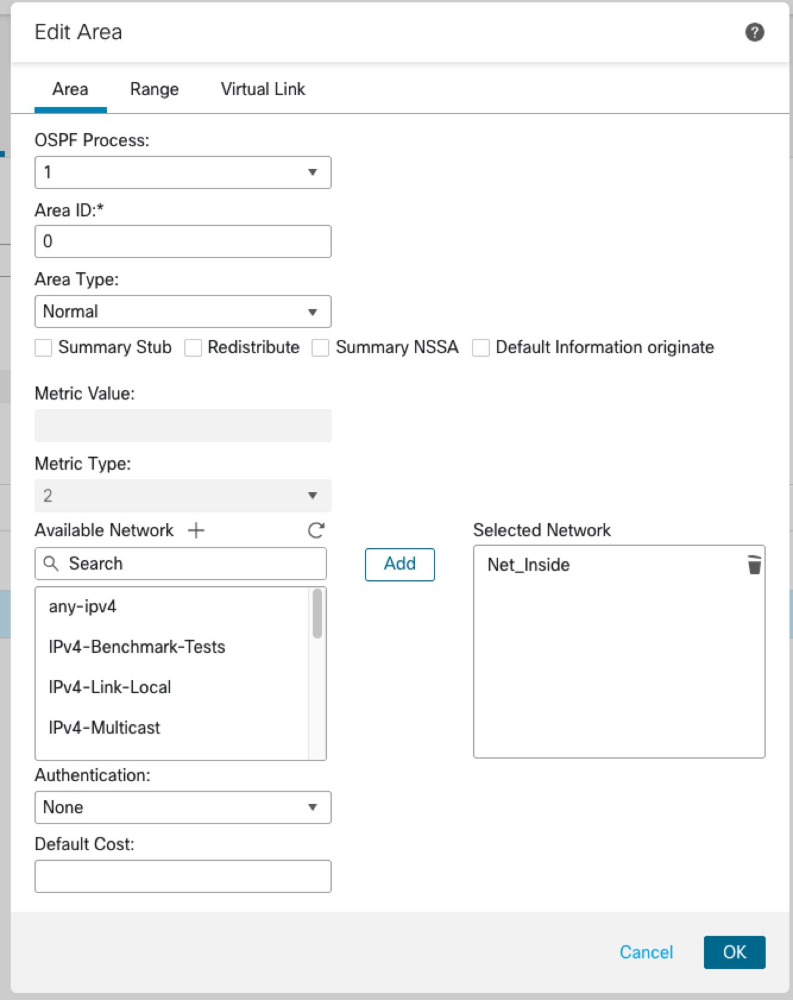
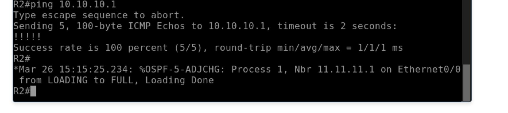
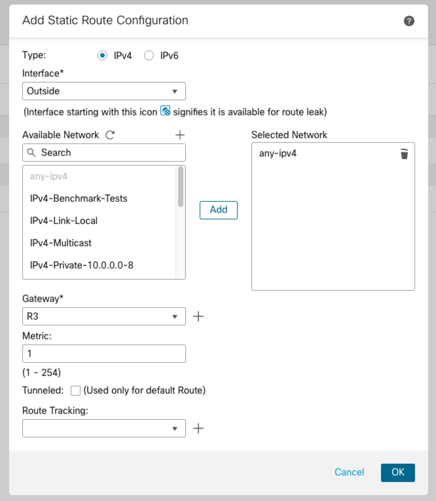
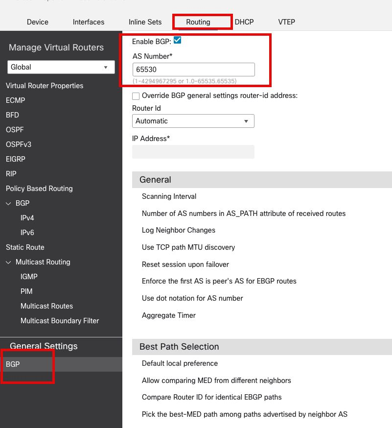
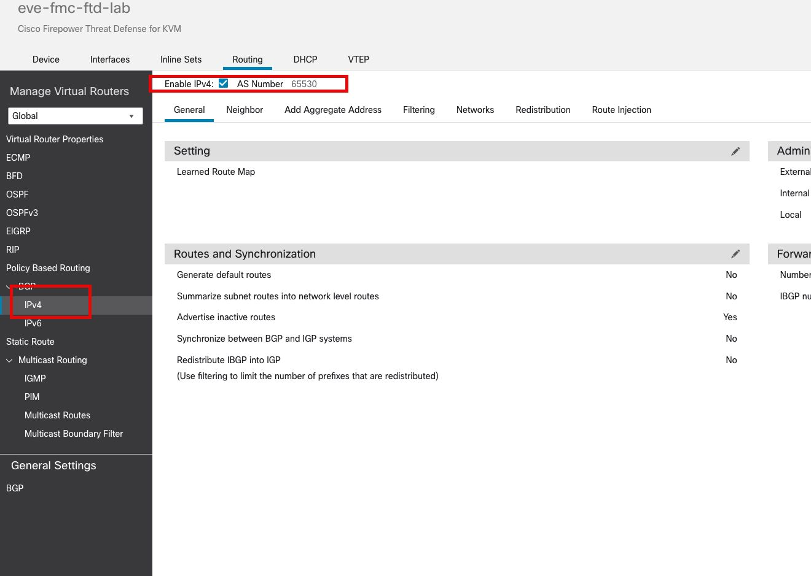
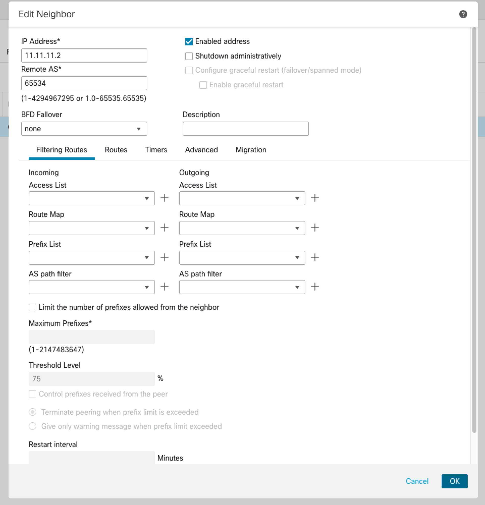
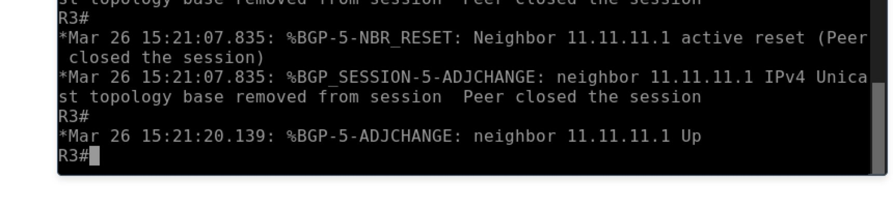
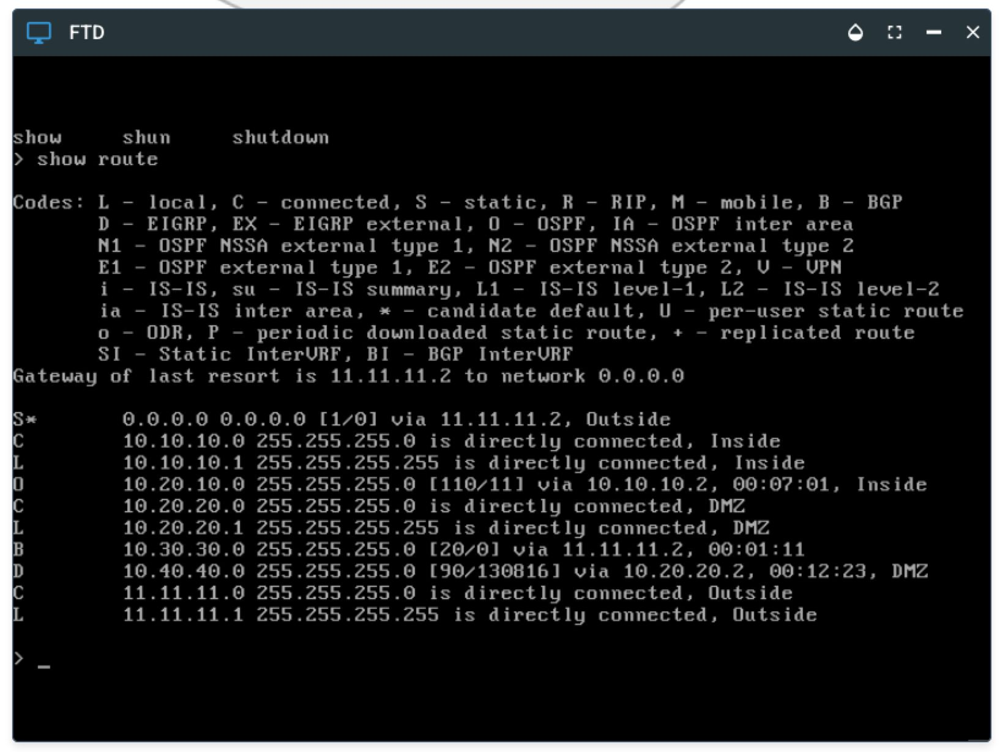

[Open: Pasted image 20260326102219.png](../../../Media/e10e54b7bcbbf760139e78a343faeaeb_MD5.jpeg)


Register ftd to fmc

[Open: Pasted image 20260326103327.png](../../../Media/0cf7f8ee878d574d26b9eff3ec92e709_MD5.jpeg)


[Open: Pasted image 20260326103358.png](../../../Media/bc8169a48971c6c787e9688aaaac7dc8_MD5.jpeg)


[Open: Pasted image 20260326103513.png](../../../Media/085e2f0f583783c710cbca1cf6af12c8_MD5.jpeg)


Lab notes - use dynamic routing from FTD to routers

R1 - EIGRP
R2 - OSPF
R3 - BGP

create loopbacs to simulate remote network

R1 Lo1 - 10.40.40.1/24
R2 Lo1 - 10.20.10.1/24
R3 Lo1 - 10.30.30.1/24

Routing config

```
R1

router eigrp 100
 network 10.20.20.0 0.0.0.255
 network 10.40.40.0 0.0.0.255
 
R2

router ospf 1
 router-id 0.0.0.2
 network 10.10.10.0 0.0.0.255 area 0
 network 10.20.10.0 0.0.0.255 area 0
 
R3

router bgp 65534
 bgp log-neighbor-changes
 network 10.30.30.0 mask 255.255.255.0
 neighbor 11.11.11.1 remote-as 65530

```

FTD Config

Interfaces

[Open: Pasted image 20260326104254.png](../../../Media/cd323ee86b1f030cf56f558f352c3f7c_MD5.jpeg)


Routing

EIGRP

[Open: Pasted image 20260326110010.png](../../../Media/fece8a96ebe991d3366d8df710eeeb8e_MD5.jpeg)


[Open: Pasted image 20260326105829.png](../../../Media/52b7338780c9e47ef2da0613acaf3536_MD5.jpeg)


[Open: Pasted image 20260326110044.png](../../../Media/617a1ce6ff8cab6e3e080fa0e33bdd08_MD5.jpeg)

====

OSPF

[Open: Pasted image 20260326111143.png](../../../Media/69930fa9a45996bc529d2119578cd32b_MD5.jpeg)



[Open: Pasted image 20260326111547.png](../../../Media/d4f92d02c7f39102536c3d442f81263c_MD5.jpeg)


=====

Default Route and BGP

[Open: Pasted image 20260326111635.png](../../../Media/47dacf82cb72c374f28aad95f0eb9567_MD5.jpeg)


[Open: Pasted image 20260326111755.png](../../../Media/7c39486b8c1cbaba2c5cafd7a4f52b00_MD5.jpeg)


[Open: Pasted image 20260326111827.png](../../../Media/f8e012aca74b3dabbe2651126fae9be4_MD5.jpeg)


[Open: Pasted image 20260326112141.png](../../../Media/3700b6c1ba950993219b9f16492af207_MD5.jpeg)


[Open: Pasted image 20260326112156.png](../../../Media/4297b1382c17aa38fc3d50182c9d76cf_MD5.jpeg)


[Open: Pasted image 20260326112241.png](../../../Media/a345f3fad951247bf0f5e51097b6e0a8_MD5.jpeg)


