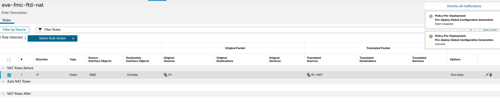
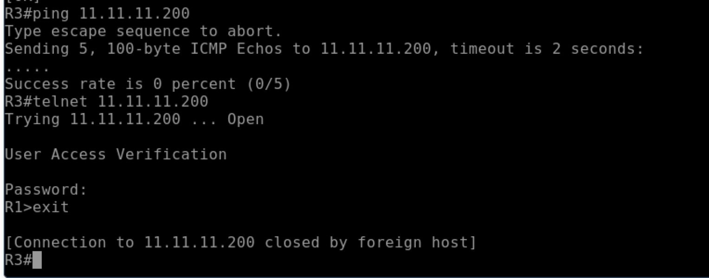
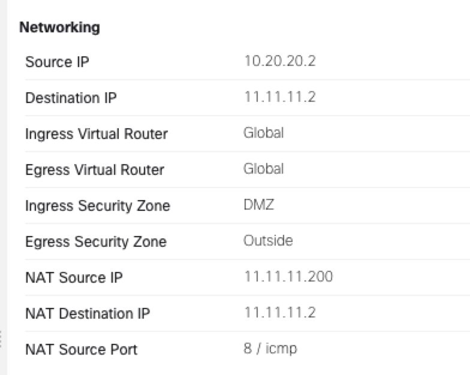

[Open: Pasted image 20260326132753.png](../../../Media/7c81c9d67104c386a6e34c379c85f7a9_MD5.jpeg)

Tasks:
ACP for inside to outside
ACP for DMZ to outside
Static NAT for R1 (10.20.20.2) to 11.11.11.200
ACP for R3 (11.11.11.2) to access R1 over telnet (10.20.20.2:23)

ACP Rules:

[Open: Pasted image 20260326133132.png](../../../Media/b0d095a0f19a3a11b9ee1c876e63f8c5_MD5.jpeg)

NAT Policy

[Open: Pasted image 20260326133854.png](../../../Media/544829293048cad287d5a6285da33471_MD5.jpeg)

[Open: Pasted image 20260326133948.png](../../../Media/d075323274c15ffd0f8779a1c40096e8_MD5.jpeg)

Showing R1 getting NAT'ed as 11.11.11.200

[Open: Pasted image 20260326134300.png](../../../Media/962ff90aa832f3915cb0bade7abe3eb8_MD5.jpeg)

