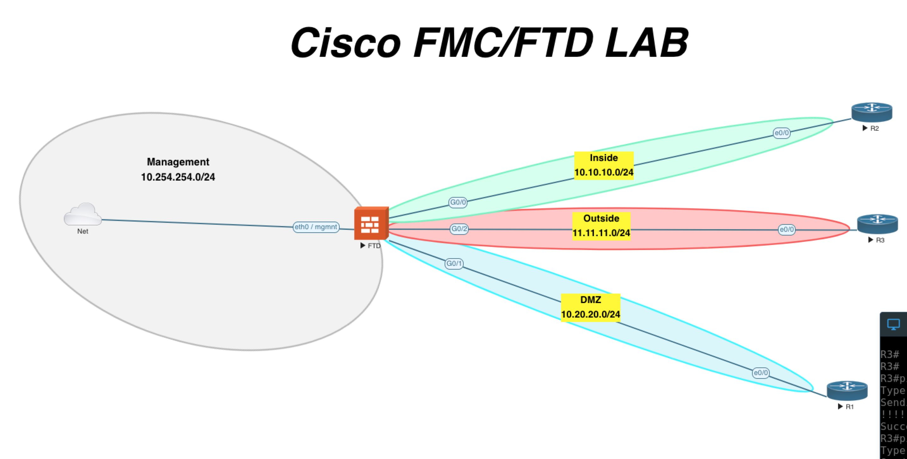
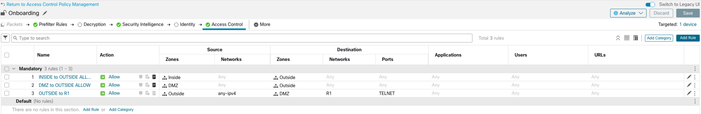

[Open: Pasted image 20260326132753.png](../../../Media/7c81c9d67104c386a6e34c379c85f7a9_MD5.jpeg)

Tasks:
ACP for inside to outside
ACP for DMZ to outside
Static NAT for R1 (10.20.20.2) to 11.11.11.200
ACP for R3 (11.11.11.2) to access R1 over telnet (10.20.20.2:23)

ACP Rules:

[Open: Pasted image 20260326133132.png](../../../Media/b0d095a0f19a3a11b9ee1c876e63f8c5_MD5.jpeg)

NAT Policy

