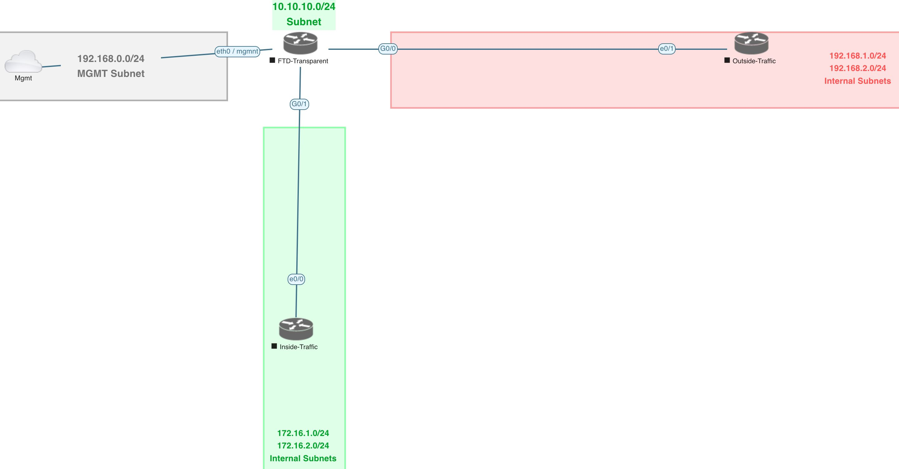
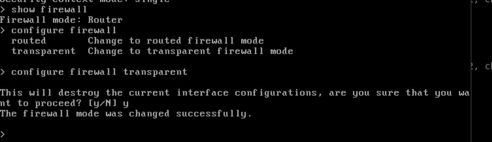
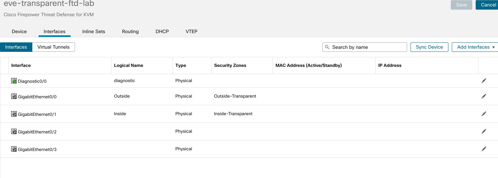
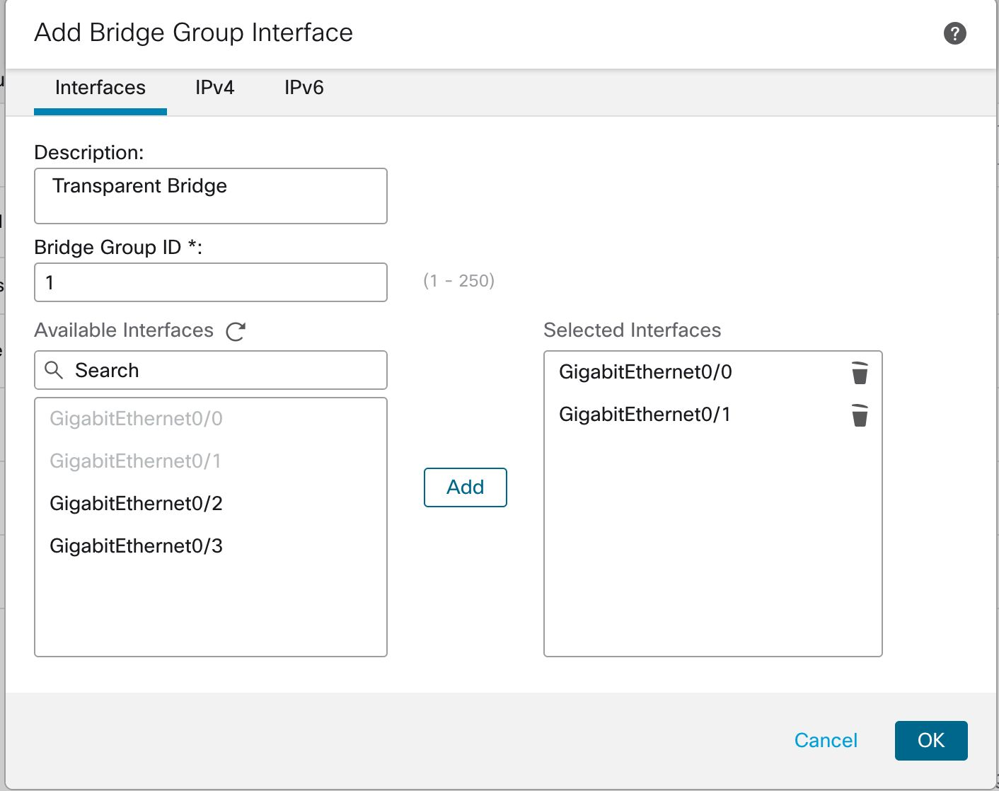
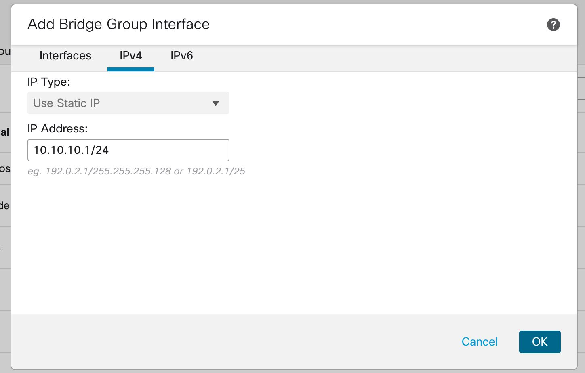
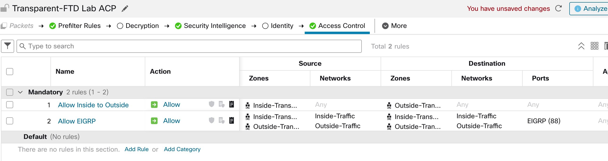

[Open: Pasted image 20260327140836.png](../../../Media/44c983e84eefe62dec70d406750e5754_MD5.jpeg)


How to switch ftd to transparent mode:

[Open: Pasted image 20260327141501.png](../../../Media/44e2117940f473442f9483488f2abb6c_MD5.jpeg)


[Open: Pasted image 20260327143804.png](../../../Media/d6d5ea1dc448e66be72cdd348cf9ce63_MD5.jpeg)


No option for ipv4 address due to transparent configuration.

Next great a bridge interface to bridge the two zones. Add ip info.

[Open: Pasted image 20260327144232.png](../../../Media/ef9ddc96feb71914bd833ffbad3e8a6f_MD5.jpeg)


[Open: Pasted image 20260327144249.png](../../../Media/282afbee59644d6fa936f87a8246d830_MD5.jpeg)


Create ACP

One rule for inside to outside
One for eigrp between routers

[Open: Pasted image 20260327145413.png](../../../Media/c15ffcf2b76f79a3d58d8262f28aba5c_MD5.jpeg)



EIGRP Router config

Inside Router

```
Inside-Traffic#sh run | s router
router eigrp 1
 network 10.10.10.0 0.0.0.255
 network 172.16.1.0 0.0.0.255
 network 172.16.2.0 0.0.0.255
Inside-Traffic#
```

Outside Router

```
router eigrp 1
 network 10.10.10.0 0.0.0.255
 network 192.168.1.0 0.0.0.255
 network 192.168.2.0 0.0.0.255
```

Verification

```
Outside-Traffic#sh ip eigrp neighbors 
EIGRP-IPv4 Neighbors for AS(1)
H   Address                 Interface              Hold Uptime   SRTT   RTO  Q  Seq
                                                   (sec)         (ms)       Cnt Num
0   10.10.10.2              Et0/1                    12 00:01:12    1  5000  1  0
Outside-Traffic#


```

Only getting one way route exchange..why? Also need to allow multicast traffic for eigrp

