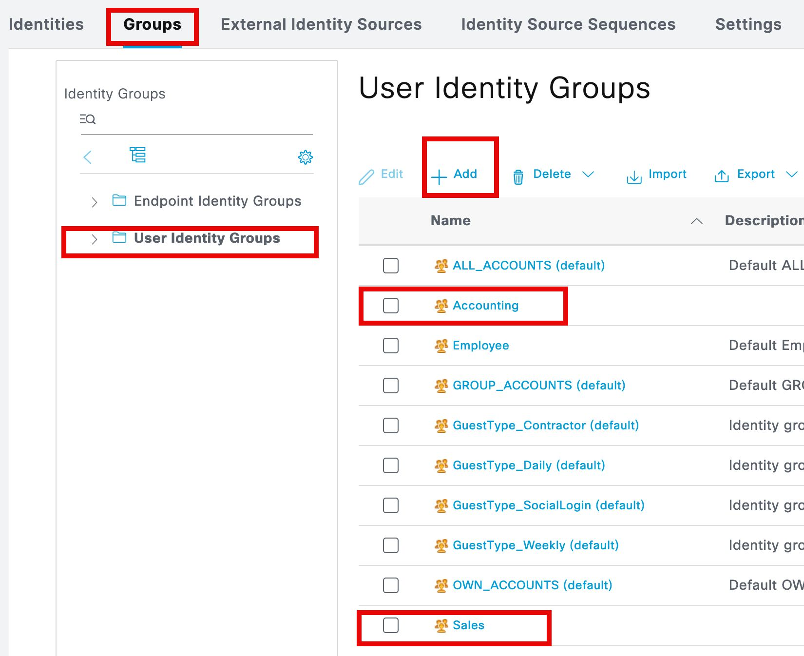
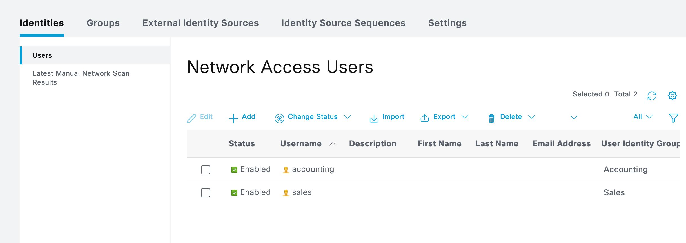
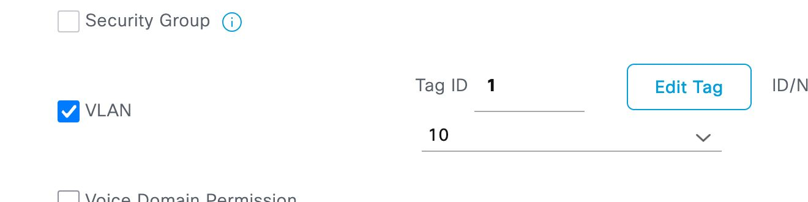
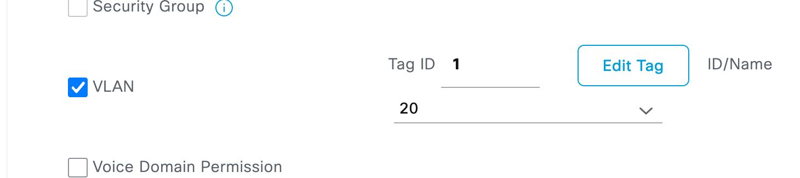
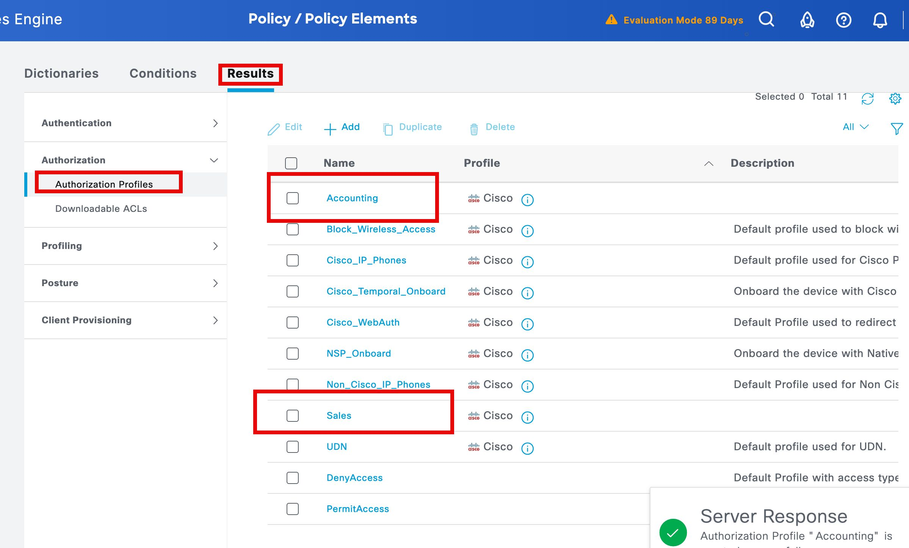
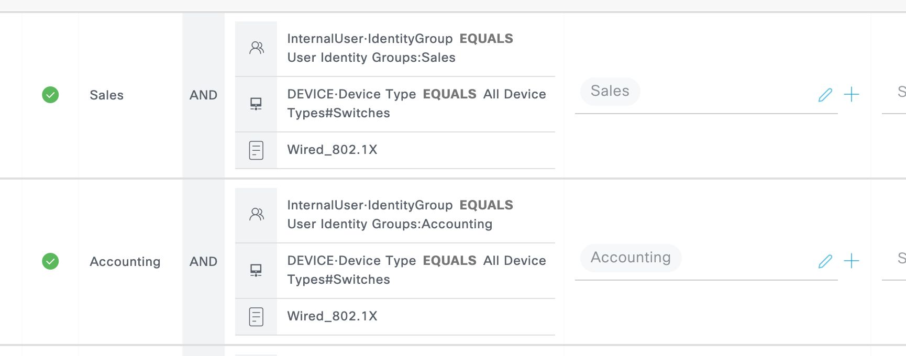

```
# Enable dot1x auth/authz

aaa authentication dot1x default group ISE-Server
aaa authorization network default group ISE-Server


dot1x system-auth-control
```

Configure dot1x on switchports

```
int e0/0

switchport mode access
switchport access vlan 10
authentication port-control auto
authentication order dot1x mab
authentication priority dot1x mab
dot1x pae authenticator
no shut

int e0/1

switchport mode access
switchport access vlan 20
authentication port-control auto
authentication order dot1x mab
authentication priority dot1x mab
dot1x pae authenticator
no shut
```

Create local identity group

[Open: Pasted image 20260407091010.png](../../../Media/74988ea0a42a9d26210b4a6738abb418_MD5.jpeg)


Create local users

[Open: Pasted image 20260407091414.png](../../../Media/5dade4502860e7f15e0db77c22ee8405_MD5.jpeg)


Create authorization profiles

Stick Sales in VLAN 10

[Open: Pasted image 20260407092759.png](../../../Media/31d8e195e0c050b04b05822be8c9f113_MD5.jpeg)


Accounting VLAN 20

[Open: Pasted image 20260407092822.png](../../../Media/a3b472e1326e228d4dbfb65ec1333bec_MD5.jpeg)


[Open: Pasted image 20260407092849.png](../../../Media/d067692f55685f3f14d243c3a20a7765_MD5.jpeg)


Create Policy Set

[Open: Pasted image 20260407100457.png](../../../Media/0e8a71544d9ec39bd2ca0cc31b523340_MD5.jpeg)


