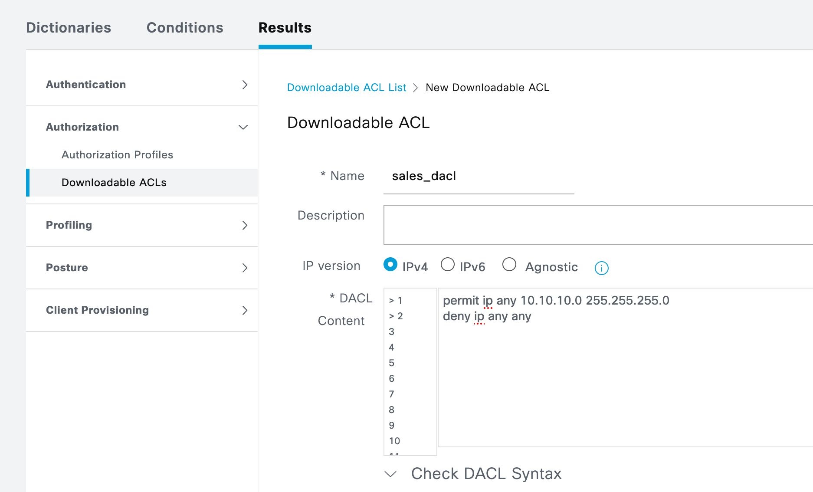
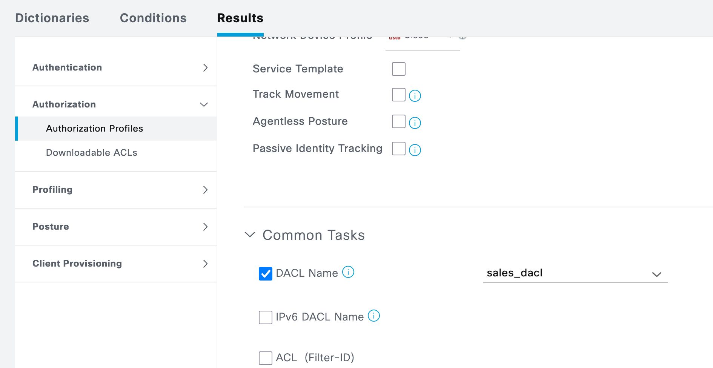
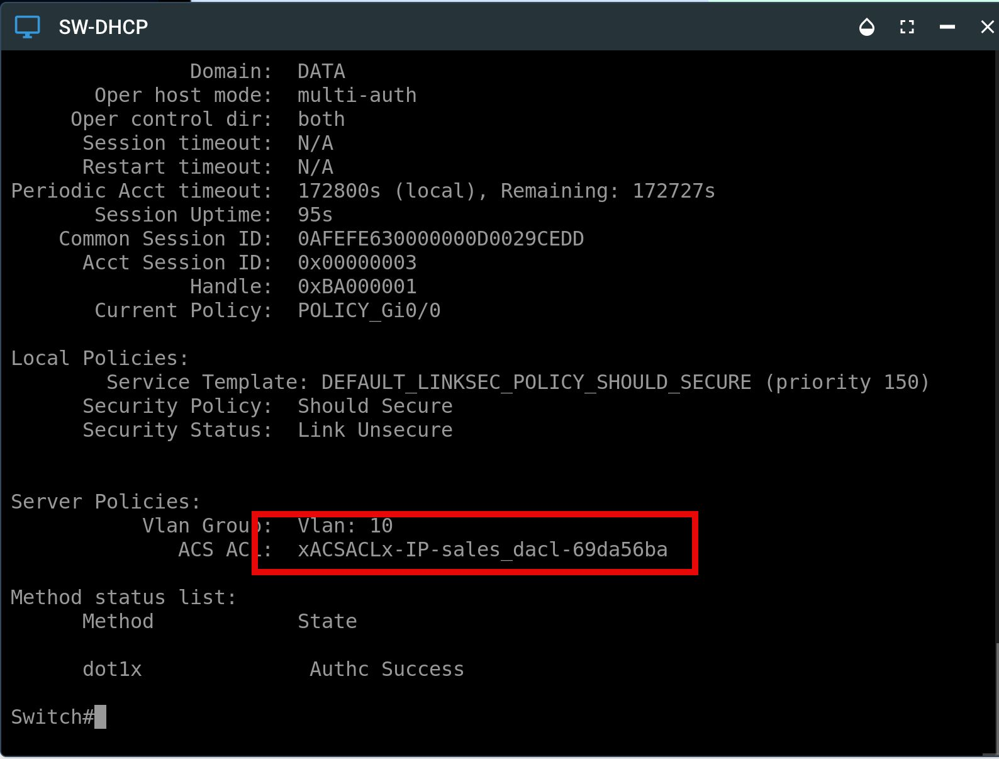
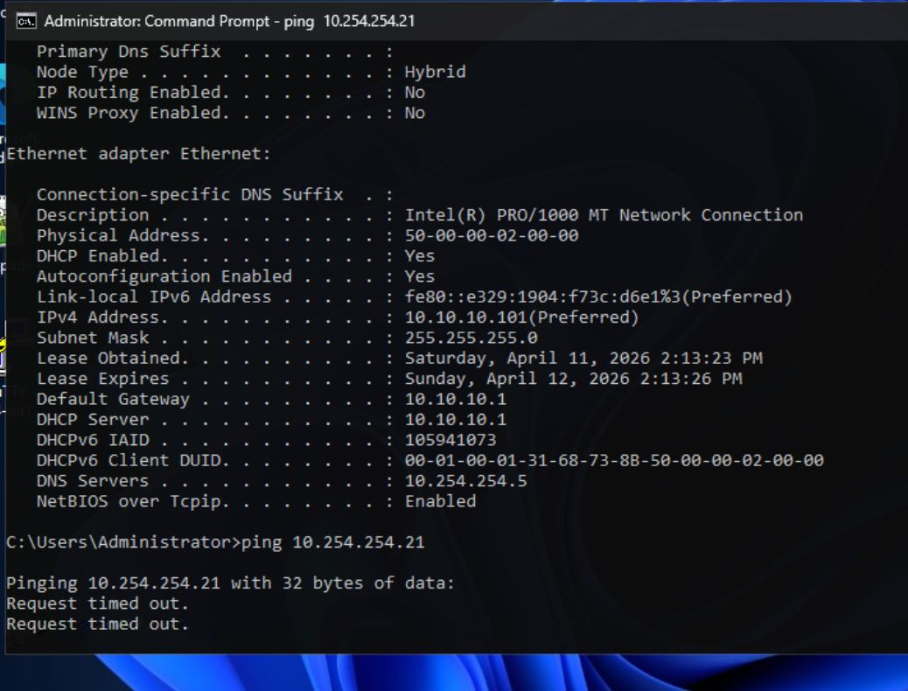

# DACLs
## Downloadable Access Control Lists

For example, when the sales user authenticates, ISE can push a DACL preventing it getting to certain resources. Only allow sales to talk to the sales network 10.10.10.0/24

permit ip any 10.10.10.0 255.255.255.0
deny ip any any

[Open: Pasted image 20260411101032.png](../../../Media/defc7455106407b63a7e3f84f71f81e9_MD5.jpeg)

[Open: Pasted image 20260411101102.png](../../../Media/a24a9f0d51879bbac8aca68513320550_MD5.jpeg)

[Open: Pasted image 20260411101509.png](../../../Media/4606d012598a458f34fb37e19aa85c90_MD5.jpeg)

[Open: Pasted image 20260411101539.png](../../../Media/d59d04ce587a6625027af0b94d685e66_MD5.jpeg)

