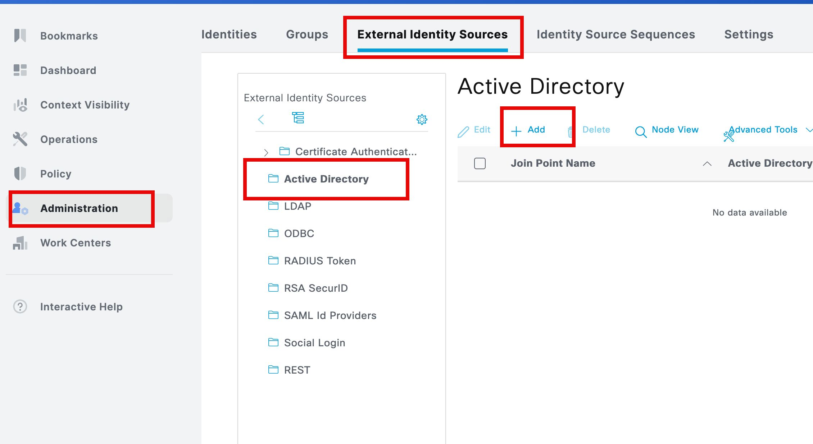
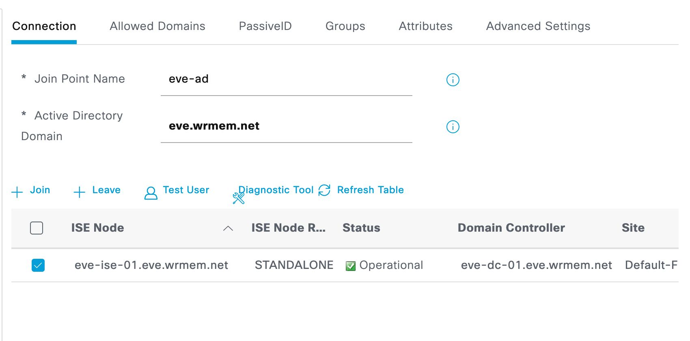
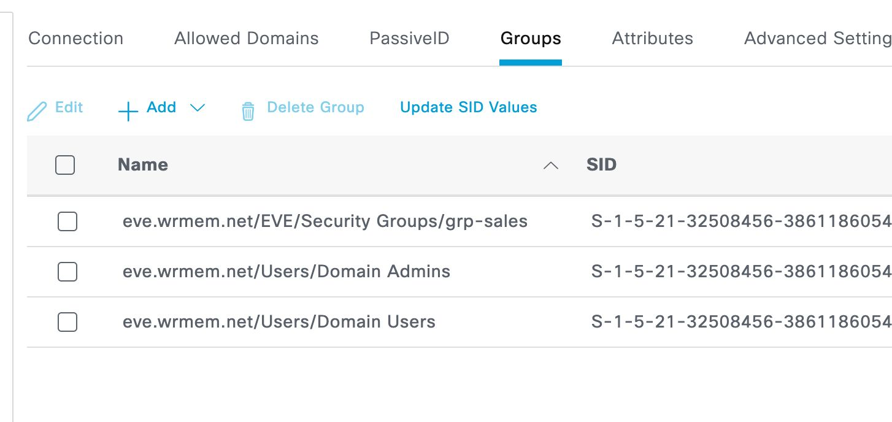
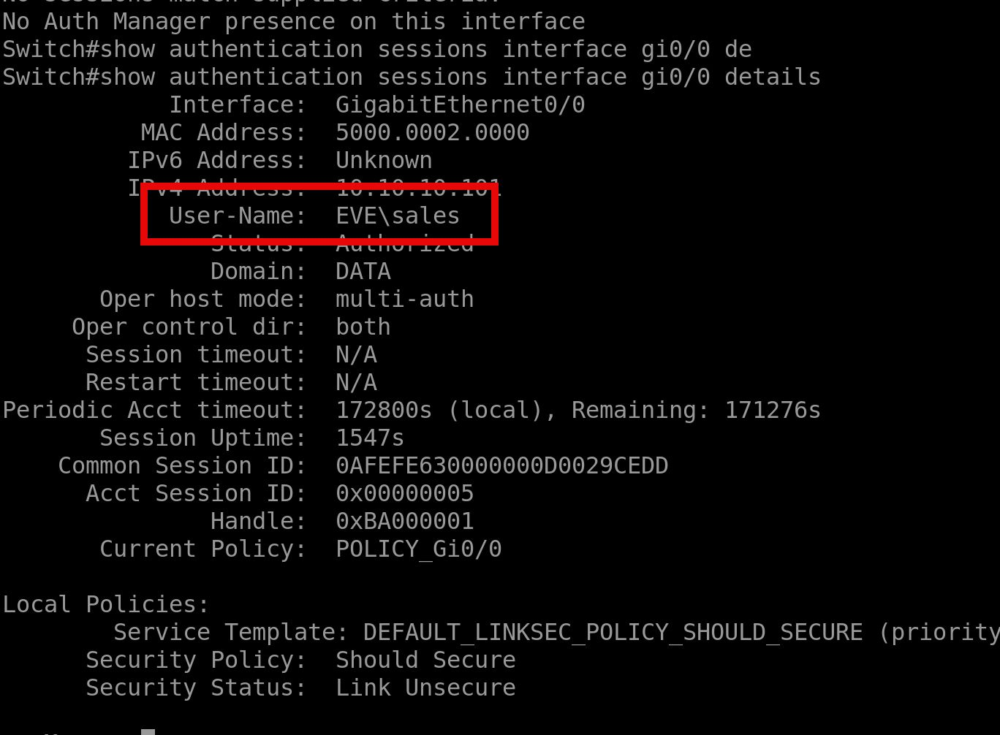
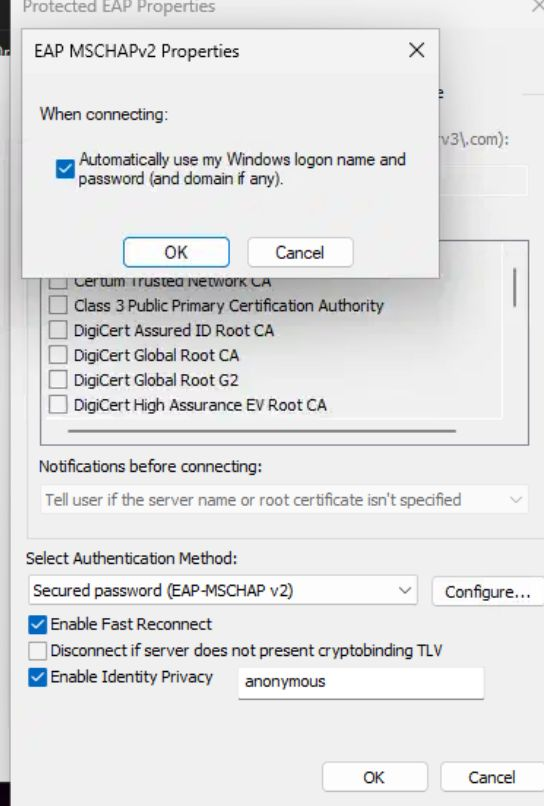

Join ISE to AD, use AD for Authentication

[Open: Pasted image 20260411102015.png](../../../Media/a617238ebf803a0573d862af0f074158_MD5.jpeg)

Note: ran into this issue with server 20205
https://www.cisco.com/c/en/us/support/docs/field-notices/743/fn74321.html

[Open: Pasted image 20260411103318.png](../../../Media/ce306983d992915f94711fe56d91fc53_MD5.jpeg)

[Open: Pasted image 20260411103327.png](../../../Media/24016202610d6f4bc67c8eb7e21d5f28_MD5.jpeg)

[Open: Pasted image 20260411103509.png](../../../Media/d5ef96fb7b1c4c385d5b84eab3ce1077_MD5.jpeg)

[Open: Pasted image 20260411103909.png](../../../Media/52c9a7e704b9019160a3dd56e4ccf91c_MD5.jpeg)

[Open: Pasted image 20260411103952.png](../../../Media/5eca4015188de88e0fd3e24618e2c982_MD5.jpeg)

