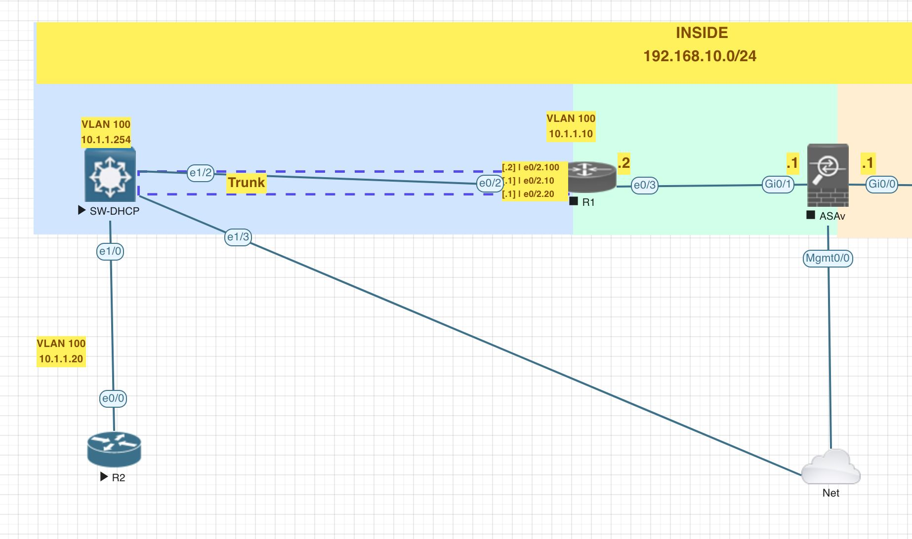
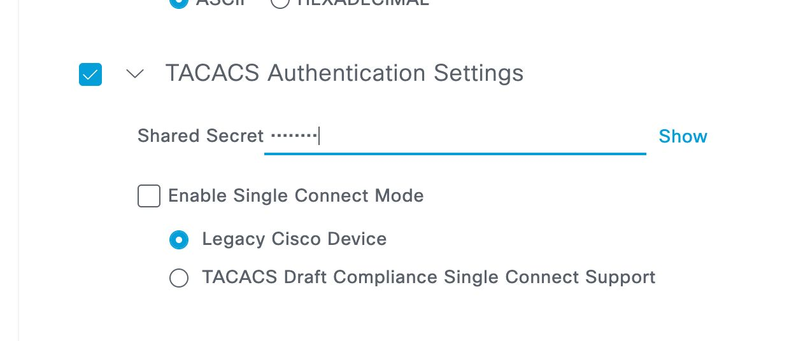
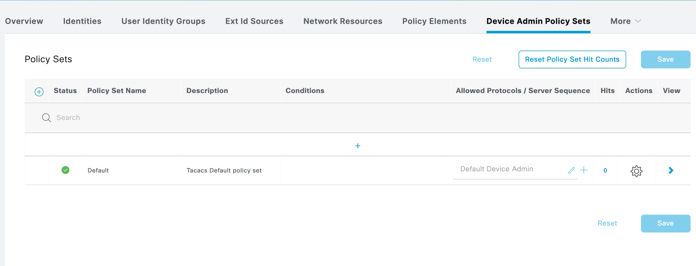

[Open: Pasted image 20260413193112.png](../../../Media/25405fe034bd251e1a259f4d62e2dd05_MD5.jpeg)


[Open: Pasted image 20260413193710.png](../../../Media/1a09bcdbc446b577af6e3e1a5e6a8bd4_MD5.jpeg)


R1 TACACS+ config

```

! Define the TACACS+ servers
tacacs server ISE
    address ipv4 10.254.254.21
    key cisco123


! Define the TACACS+ server groups
aaa group server tacacs+ ISE_TACACS
    server name ISE

! Configure AAA for TACACS+ authentication with local fallback
aaa authentication login default group ISE_TACACS local
aaa authentication enable default group ISE_TACACS enable
aaa authorization exec default group ISE_TACACS local if-authenticated
aaa authorization commands 0 default group ISE_TACACS local
aaa authorization commands 1 default group ISE_TACACS local
aaa authorization commands 15 default group ISE_TACACS local
aaa authorization config-commands

! Only enable authorization on the console if you absolutely want
! TACACS authorization on it. Not often used.
! aaa authorization console
aaa accounting exec default start-stop group ISE_TACACS
aaa accounting commands 1 default start-stop group ISE_TACACS
aaa accounting commands 15 default start-stop group ISE_TACACS

! Set command authorization on VTY lines 0 through 4
line vty 0 4
    authorization exec default
    authorization commands 0 default
    authorization commands 1 default
    authorization commands 15 default

```

ISE Policy Set

[Open: Pasted image 20260413194643.png](../../../Media/cd936cce884d2be933c6831b67de649e_MD5.jpeg)


