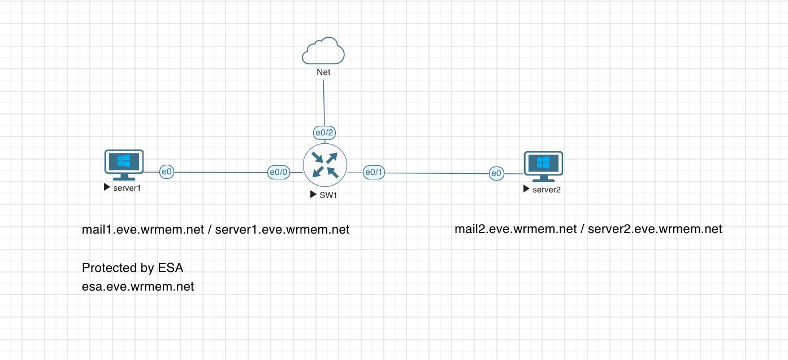
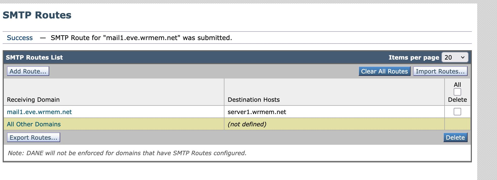
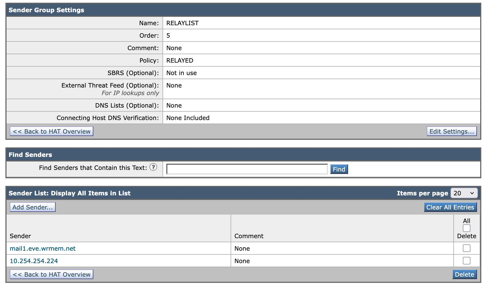
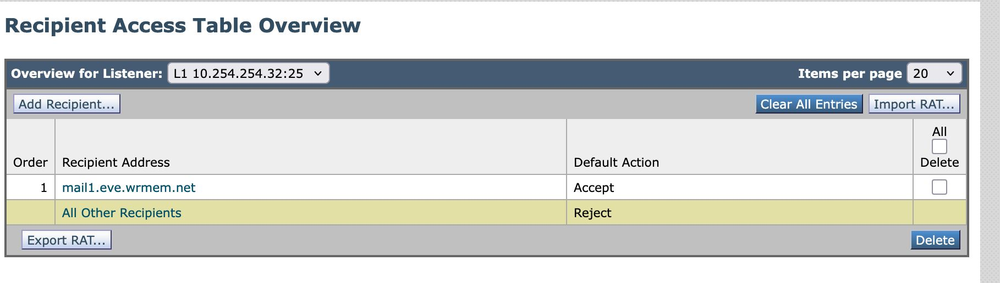

[Open: Pasted image 20260419094743.png](../../../Media/30ace796a637d8b858af6cdadc4ab19d_MD5.jpeg)


Default: admin / ironport

To configure management -

```
interfaceconfig 
```

To save changes

```
commit
```

[Open: Pasted image 20260419190514.png](../../../Media/efdf4917ac2974255e4beaddd1f815e9_MD5.jpeg)


Configure ESA to handle mail for mail1
[Open: Pasted image 20260419191632.png](../../../Media/1e1d843f9c7e5c47aa48eb5a672cf3d9_MD5.jpeg)


Configure relaylist

[Open: Pasted image 20260419192030.png](../../../Media/f8ed6fd2a02b500990a0e36d228f48b7_MD5.jpeg)


Configure RAT to contain email domain
[Open: Pasted image 20260419192134.png](../../../Media/679d6912eb6eb835eee304ad62656c06_MD5.jpeg)


