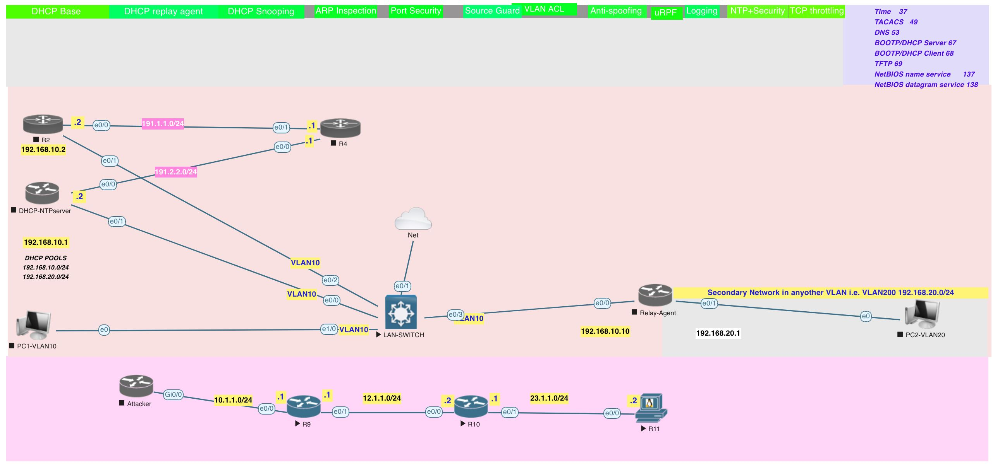

[Open: Pasted image 20260427194107.png](../../../Media/eb1c3a596e51f982db1a2c6c35174802_MD5.jpeg)


Switch port security

Cisco switchport port security ==limits a port's traffic by restricting input to authorized MAC addresses==, enhancing access layer security. Key features include limiting maximum MAC addresses, sticky MAC learning, and violation actions (shutdown, restrict, protect). It is commonly used to prevent unauthorized device access. 

**Key Port Security Commands**

- **[Enable Port Security](https://www.google.com/search?client=firefox-b-1-d&q=Enable+Port+Security&ved=2ahUKEwjix8_Am4-UAxWll4kEHU0jKgIQgK4QegYIAQgAEAw):** `switchport port-security` (requires access or trunk mode).
- **[Set Maximum MACs](https://www.google.com/search?client=firefox-b-1-d&q=Set+Maximum+MACs&ved=2ahUKEwjix8_Am4-UAxWll4kEHU0jKgIQgK4QegYIAQgAEA4):** `switchport port-security maximum <value>`.
- **[Configure Sticky MACs](https://www.google.com/search?client=firefox-b-1-d&q=Configure+Sticky+MACs&ved=2ahUKEwjix8_Am4-UAxWll4kEHU0jKgIQgK4QegYIAQgAEBA):** `switchport port-security mac-address sticky` (retains MACs after reboot).

- **[Violation Actions](https://www.google.com/search?client=firefox-b-1-d&q=Violation+Actions&ved=2ahUKEwjix8_Am4-UAxWll4kEHU0jKgIQgK4QegYIAQgBEAE):**
    - `shutdown`: Puts interface in error-disable state (default).
    - `restrict`: Drops traffic, sends SNMP trap/log.
    - `protect`: Drops traffic without logging.
- **[Verify Configuration](https://www.google.com/search?client=firefox-b-1-d&q=Verify+Configuration&ved=2ahUKEwjix8_Am4-UAxWll4kEHU0jKgIQgK4QegYIAQgBEAY):** `show port-security interface <interface>`. 

**Important Considerations**

- **Voice VLANs:** IP phones usually require 2-3 MAC addresses (phone + PC).
- **Re-enabling Ports:** If a port shuts down (`shutdown`), you must run `shutdown` then `no shutdown` to recover it.
- **Constraints:** Port security is not supported on SPAN destination ports. 

**Example Configuration**

cisco

```
interface FastEthernet0/1
 switchport mode access
 switchport port-security
 switchport port-security maximum 2
 switchport port-security mac-address sticky
 switchport port-security violation shutdown
```

- [](https://community.cisco.com/t5/networking-knowledge-base/how-to-configure-port-security-on-cisco-catalyst-switches-that/ta-p/3132907)
    
    How to configure port security on Cisco Catalyst switches that run Cisco IOS system software
    
    To configure port security on Cisco Catalyst switches that run Cisco IOS system software, you can do the following: 1. Enable the ...
    
    
    
    Cisco Community
    
- [](https://www.cisco.com/c/en/us/td/docs/switches/lan/catalyst6500/ios/15-4SY/config_guide/sup6T/15_3_sy_swcg_6T/port_security.pdf)
    
    Port Security - Cisco
    
    * • Port security supports private VLAN (PVLAN) ports. * • Port security supports IEEE 802.1Q tunnel ports. * • Port security does...
    
    
    
    Cisco
    
- [](https://www.reddit.com/r/Cisco/comments/kvujld/cisco_switchport_portsecurity_command/)
    
    Cisco "switchport port-security" command: clarification needed.
    
    This happens because the VOIP phone is initially tied into the access VLAN before the interface identifies it as a Voice VLAN devi...
    
    
    
    Reddit
    

Show all

```
interface FastEthernet0/1
 switchport mode access
 switchport port-security
 switchport port-security maximum 2
 switchport port-security mac-address sticky
 switchport port-security violation shutdown

```