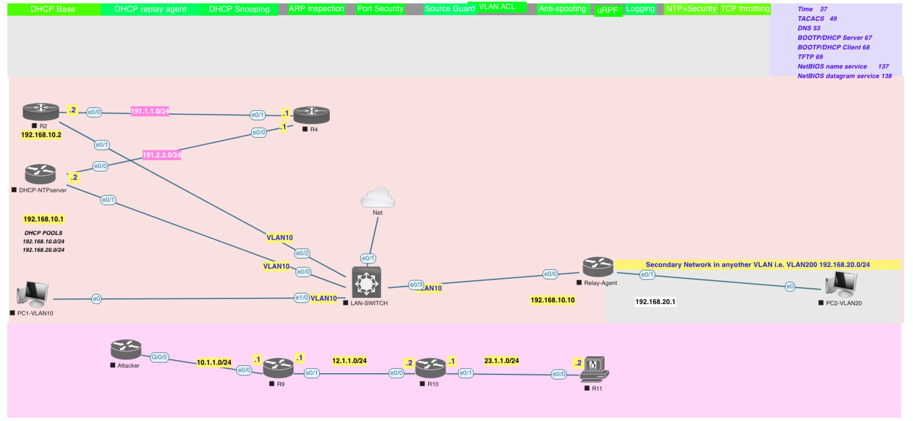
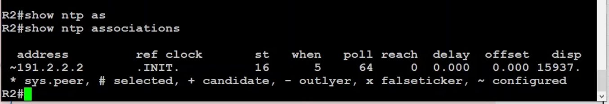

[Open: Pasted image 20260429130257.png](../../../Media/10d840e96eb7f2b5332dd1c827b6f34d_MD5.jpeg)


NTP - network time protocol

```
# Configure router as ntp server

# Set time zone
clock timezone SYD 10

# Set ntp stratum
ntp master 1

# Confgure NTP authentication
ntp authenticate
ntp authentication-key 111 md5 Cisco123
ntp trusted-key 111
```

```
# Configure router as ntp client

# Set time zone
clock timezone UTC 

# Configure ntp authentication
ntp authenticate
ntp authentication-key 111 md5 Cisco123
ntp trusted-key 111

# Configure ntp server, use key configured earlier
ntp server X.X.X.X key 111
```

[Open: Pasted image 20260429182101.png](../../../Media/a0f12884173f21a4cba19a02392a0bac_MD5.jpeg)


