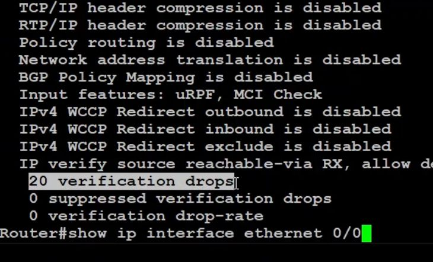

uRPF - unicast reverse path forwarding

Have router evaluate source ip when making routing decisions. If routing table does not match then drop the packet.

```
int e0/0
	ip verify unicast source reachable-via rx allow-default
```

[Open: Pasted image 20260429190041.png](../../../Media/f48c3360ed3679b4b1d9cc8dbf39129b_MD5.jpeg)


