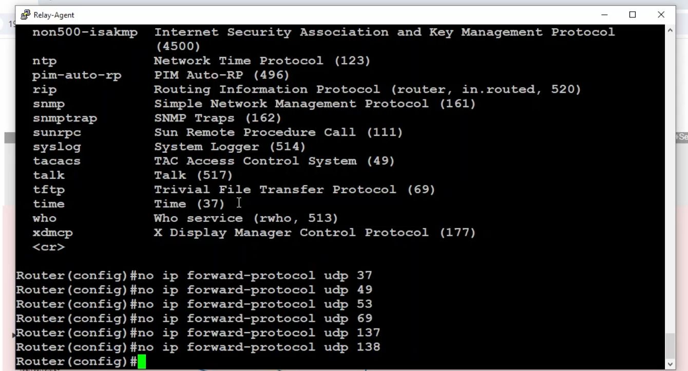

Common DHCP Lab Tasks

- DHCP Server
- DHCP Relay
- DHCP Snooping
- Remove un-needed options

[Open: Pasted image 20260503102016.png](../../../Media/7c327e47d9ece9ea9cecbaa1754d2729_MD5.jpeg)


DORA
The DHCP DORA process is ==a four-step negotiation (Discover, Offer, Request, Acknowledge) used by client devices to automatically obtain an IP address and network configuration from a DHCP server==. It automates IP management, prevents conflicts, and simplifies network administration. [[1](https://www.geeksforgeeks.org/how-dora-works/), [2](https://techcommunity.microsoft.com/blog/coreinfrastructureandsecurityblog/the-poky-little-dhcp-server-and-finding-dora/2107787), [3](https://www.gdsys.com/en/service/glossary/dhcp), [4](https://www.manageengine.com/products/oputils/tech-topics/dhcp-dora-process.html)]

Configuration

```
ip dhcp excluded-address 10.10.10.1 10.10.10.100
ip dhcp excluded-address 10.20.20.1 10.20.20.100
!
ip dhcp pool Sales
 network 10.10.10.0 255.255.255.0
 default-router 10.10.10.1 
 dns-server 10.254.254.5 
!
ip dhcp pool Accounting
 network 10.20.20.0 255.255.255.0
 default-router 10.20.20.1 
 dns-server 10.254.254.5 
!
```