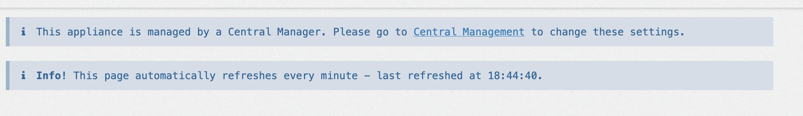
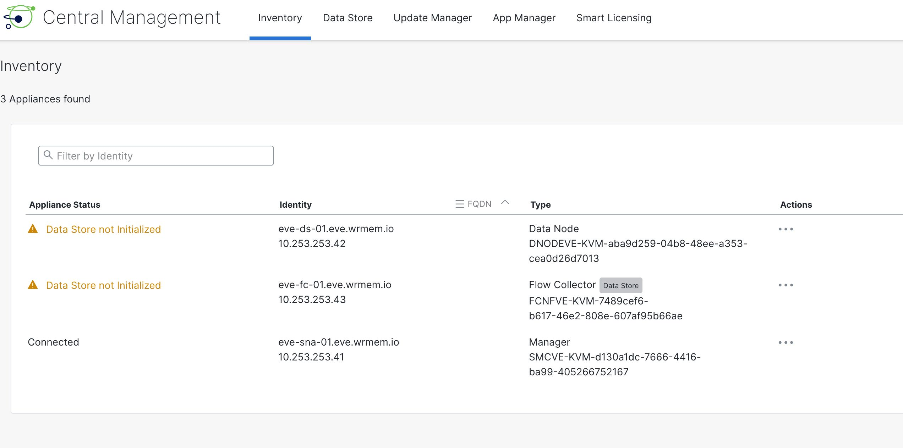
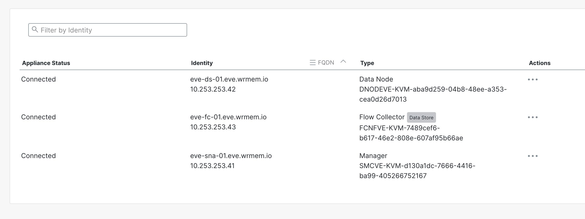
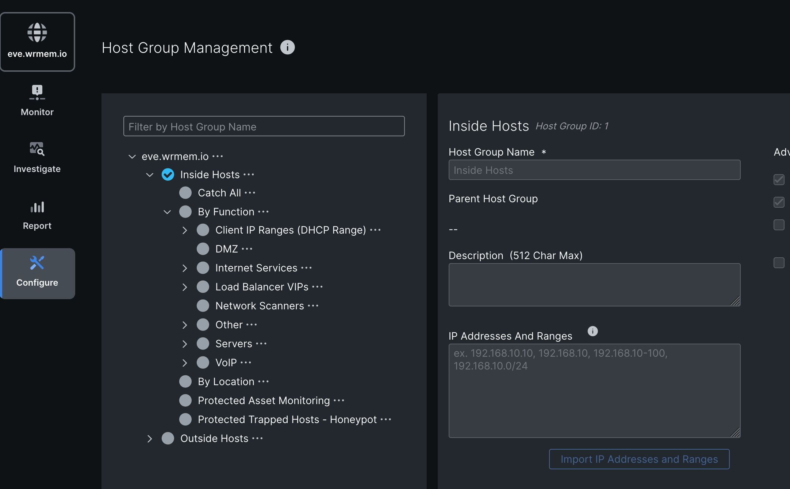

FC and DS will show the following when managed by a SMC

[Open: Pasted image 20260507184509.png](../../../Media/508afb4baaae36c1d884036f86af761c_MD5.jpeg)

Follow link to central management

[Open: Pasted image 20260507184610.png](../../../Media/414e239a51089059a4449631bec2dbef_MD5.jpeg)

Enable SSH on smc. SSH to smc with sysadmin account. Walk through wizard to enable initialize datastores

[Open: Pasted image 20260507191017.png](../../../Media/d4346d30185ee72e792ef9c637462ddb_MD5.jpeg)

[Open: Pasted image 20260507191850.png](../../../Media/ae09bb905dfc1b8c56b0c23034cf0321_MD5.jpeg)
