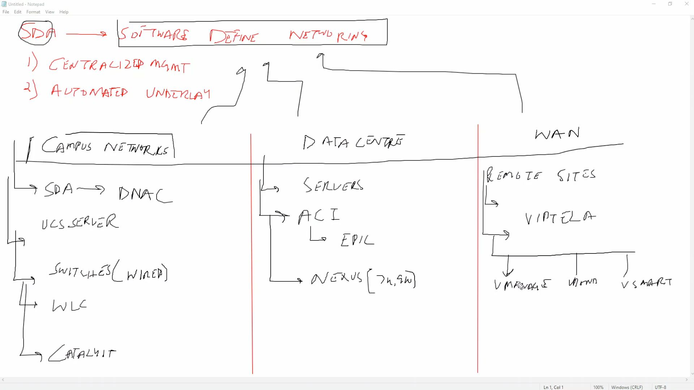
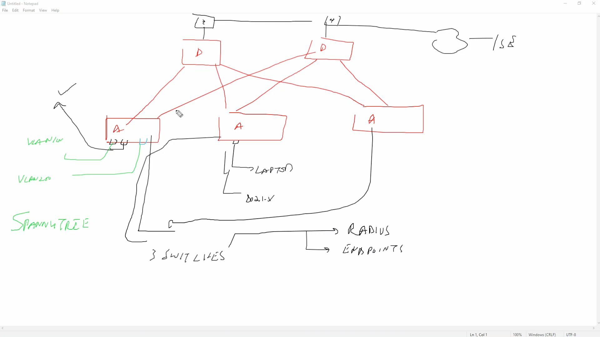
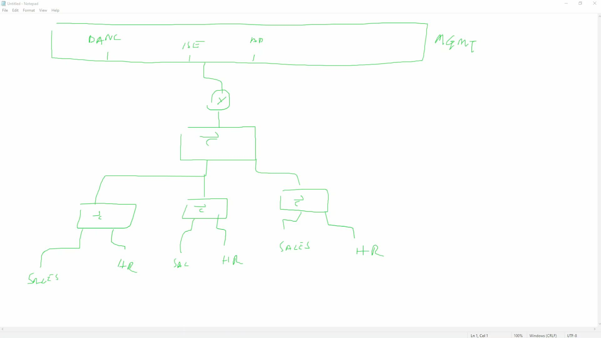
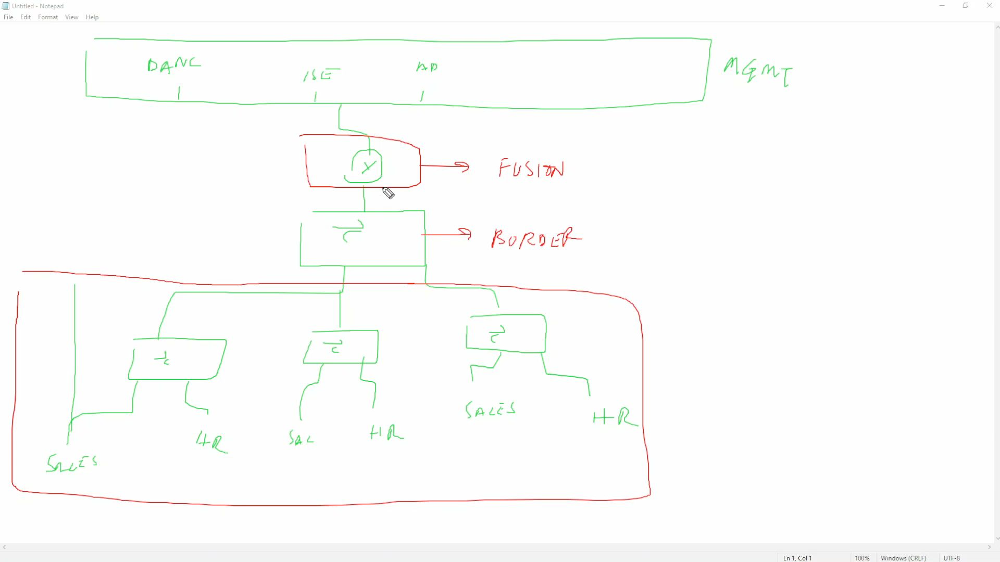
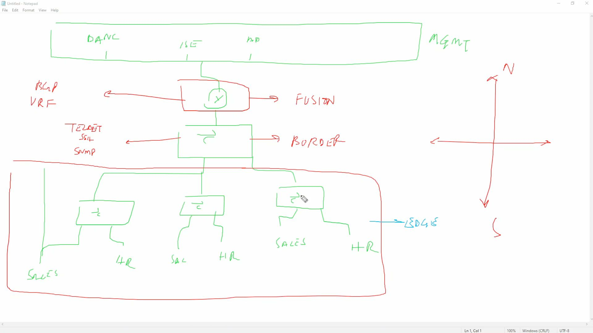
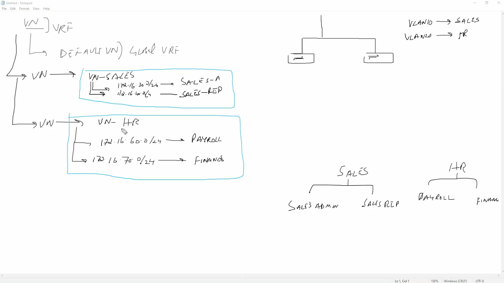

DNAC - controller for SDA (software defined access)

Router - 
mgmt plane
control plane
data plane

SDN - software defined networking
separate mgmt/control plane from the device, managed by a controller

SDA - software defined access
Benefits:
centralized management
automated underlay

Campus
==========
End users
Departments
PC/laptops/etc

SDA
Managed by DNAC/CAT C
Swiches, wlc

Datacenter
==============
Servers
Nexus switches
ACI/epic

WAN
======
Routers
SD-WAN
viptela
vmanage
vbond
vsmart

Remote sites

[Open: Pasted image 20260513120543.png](../../../Media/d07929fe10a950496eba0a33e9b788dd_MD5.jpeg)

-----

[Open: Pasted image 20260513121222.png](../../../Media/4bf28dd275295e6301fe39fc82a39205_MD5.jpeg)

[Open: Pasted image 20260513121425.png](../../../Media/fcf2e0217d16b93bd3898f8459073121_MD5.jpeg)

[Open: Pasted image 20260513121527.png](../../../Media/2b54c02f5c124cab09888e87349ed76b_MD5.jpeg)

[Open: Pasted image 20260513121744.png](../../../Media/24a7c41e957df7d36e540ea2c080f5c1_MD5.jpeg)

IS-IS as underlay

Data pools - will use anycast for gateways
LISP
Endpoint table - shared over vxlan

Underlay - IS-IS
Overlay - VXLAN

DNAC uses netconf/ssh to configure devices/mgmt plane

-------

Integrations to know:
ISE

Important to know:
SGTs

AuthZ Policies

IP Pools

VRF / DNAC Called them VN (virtual network)

Macro and Micro segmentation

Macro - use VNs

[Open: Pasted image 20260513124738.png](../../../Media/cf8e3470bfb5c46c52a0fe681a3c1afe_MD5.jpeg)

Micro - how to segment within a virtual network?
Use SGTs/dACLs

DNAC contracts will use tags

