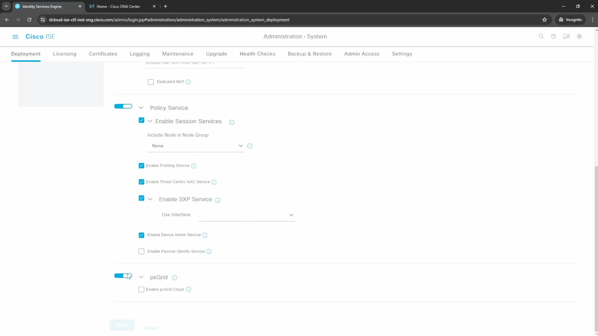
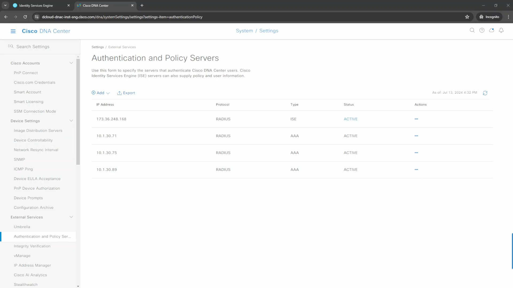
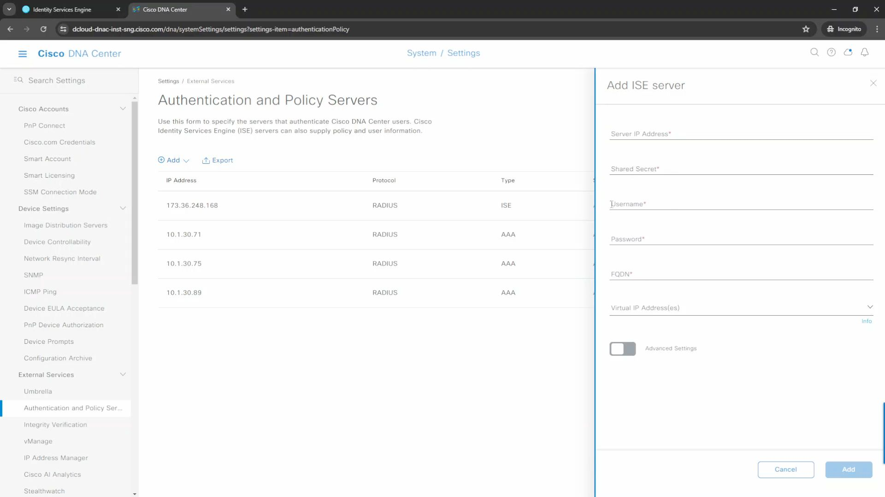
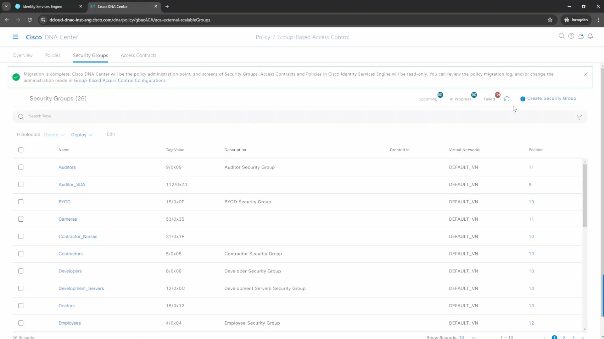
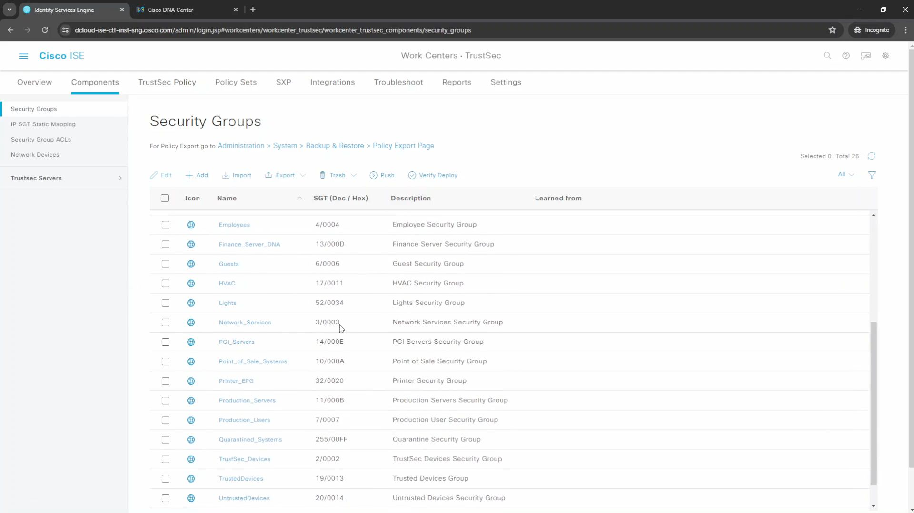

[Open: Pasted image 20260513130306.png](../../../Media/09dd32a0133aa9288fff513b7952cf33_MD5.jpeg)

ISE-DNAC Integration

Ensure pxGrid is enabled

[Open: Pasted image 20260513130908.png](../../../Media/072c6093822c77c219a1b610fbe05375_MD5.jpeg)

Ensure API is enabled
(Admin -> Settings -> API Settings: enable ERS, enable open api r/wr)

Login to DNAC

System -> Settings -> Authentication and Policy Servers

[Open: Pasted image 20260513131409.png](../../../Media/19ceb3efe9d7444db156f3f7fe836e40_MD5.jpeg)

[Open: Pasted image 20260513131522.png](../../../Media/a6cb75c1d4ddd77a12bd5f24acc1a92a_MD5.jpeg)

Back in ISE - approve DNAC as a pxGrid client

DNAC - Policy -> Group Based Access control
This will have security groups

[Open: Pasted image 20260513131848.png](../../../Media/6071874f1d5d4d15be85ff564b50d6b4_MD5.jpeg)

[Open: Pasted image 20260513132029.png](../../../Media/f76d0a37a1dfc71dbb1368d743a7abda_MD5.jpeg)

