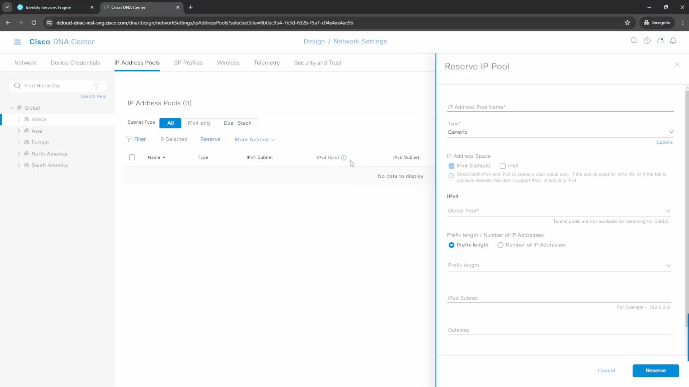
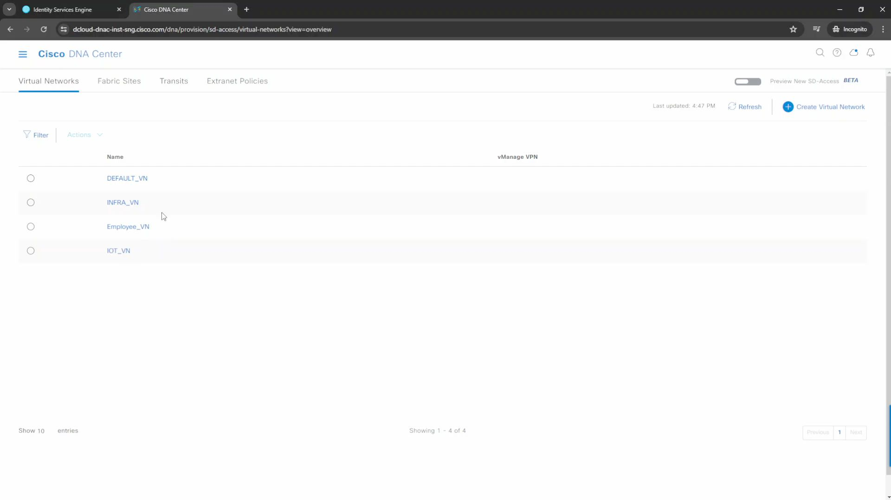
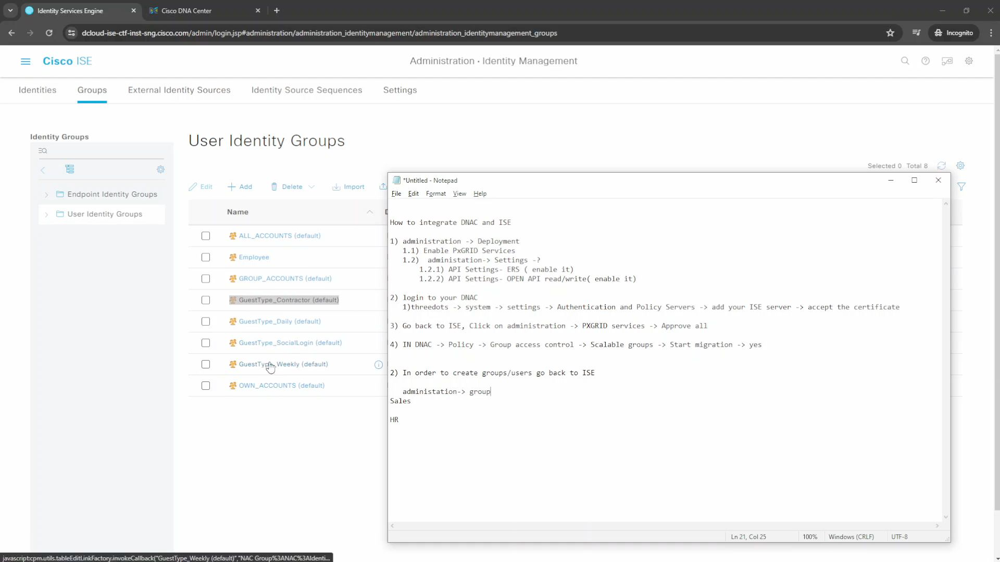
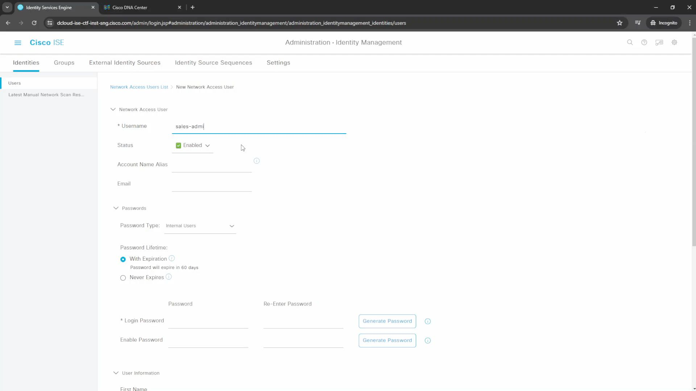
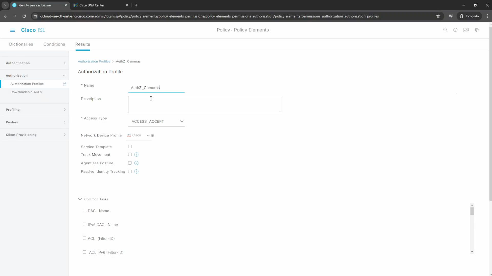

Create Pools
Design -> Network Settings -> IP Address Pools

[Open: Pasted image 20260513132735.png](../../../Media/8e74e042ef792c76ae6a8be6b6655807_MD5.jpeg)

VNs
Provision -> Virtual Networks

[Open: Pasted image 20260513132917.png](../../../Media/dbe73f94f05031b6b14a25f325e990bc_MD5.jpeg)

Users /Groups/AuthZ policies are created in ISE

[Open: Pasted image 20260513133922.png](../../../Media/c65588f6cb366656b5cb055ee93da1af_MD5.jpeg)

[Open: Pasted image 20260513133953.png](../../../Media/ecaafebeb617664db49a262f91163718_MD5.jpeg)

[Open: Pasted image 20260513134513.png](../../../Media/53ac026d7b180ade406d8bc0a33eb281_MD5.jpeg)

