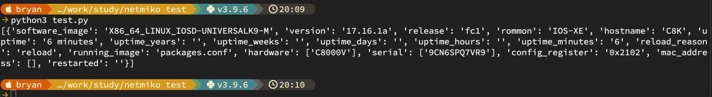

Netmiko


```
from netmiko import ConnectHandler

# Define device
device = {
    'device_type': 'cisco_ios',
    'host': '10.253.253.99',
    'username': 'admin',
    'password': 'cisco123',
    'secret': 'cisco123',
}

# Connect
conn = ConnectHandler(**device)
conn.enable()                                    # Enter enable mode

# Show commands
output = conn.send_command('show ip int brief')  # Run show command
output = conn.send_command('show version', use_textfsm=True)  # Parsed output

print(output)

# Disconnect
conn.disconnect()
```

```
# create virtual env

python3 -m venv myenv

# start venv

source myenv/bin/activate

# install netmiko

pip install netmiko

# run script


```

[Open: Pasted image 20260520201040.png](../../../Media/898cbaacd51bb36b56ba1e544a73f4f4_MD5.jpeg)


----

# 🌐 Netmiko — A Beginner's Guide to Network Automation with Python

If you've ever SSH'd into a switch, typed `show run`, copied the output, then repeated that on 30 more devices — **Netmiko was built for you.** It's a Python library that turns those repetitive SSH sessions into scripts you can run, version, and reuse on demand.

---

## 🧠 The Core Idea

Network engineers already know the CLI. The problem isn't _what_ to type — it's doing it **over and over**, across dozens or hundreds of devices, without mistakes.

> _"What if I could write a script that SSHs into every switch, runs my commands, and gives me all the output — while I drink my coffee?"_

That's exactly what Netmiko does.

---

## 🔹 1. What Is Netmiko?

**Netmiko** is an open-source Python library created by **Kirk Byers** (CCIE #6243 emeritus) that simplifies SSH connections to network devices. It's built on top of another library called **Paramiko** (a raw Python SSH library), but adds all the network-specific intelligence that engineers need. [[blog.cloudmylab.com]](https://blog.cloudmylab.com/netmiko-python-for-network-automation), [[pynet.twb-tech.com]](https://pynet.twb-tech.com/)

### What it handles for you:

- 🔐 **SSH connection management** — login, authentication, session handling
- 📟 **Prompt detection** — knows when the device is ready for the next command
- ⚙️ **Config mode handling** — automatically enters/exits `configure terminal`
- 📄 **Output capture** — returns command output as clean Python strings
- 🔓 **Enable mode** — handles privilege escalation (`enable` / `secret`)
- 🏭 **Multi-vendor support** — works with Cisco, Juniper, Arista, Palo Alto, Fortinet, and many more

---

## 🔹 2. Why Does Netmiko Matter?

### The problem it solves

|Manual Approach|With Netmiko|
|---|---|
|SSH into each device one by one|Script connects to all devices automatically|
|Copy/paste commands, hope you don't miss one|Commands sent programmatically — consistent every time|
|Manually save output to notepad|Output captured in variables, files, or databases|
|One device fails → you might not notice|Error handling catches failures immediately|
|Takes hours for 50 devices|Takes minutes (or seconds)|

### The business impact

According to industry research, organizations that implement network automation see **operational costs decrease by up to 40%** and **configuration errors reduce by over 70%**. Manual configuration accounts for **over 75% of network downtime**. [[dev.to]](https://dev.to/oliverbennet/automating-network-devices-with-python-and-netmiko-a-comprehensive-guide-4j4k)

> 💡 **Bottom line:** Netmiko is the bridge between "I know the CLI" and "I can automate the CLI."

---

## 🔹 3. Installing Netmiko

It's a one-liner:

pip install netmiko

That's it. This installs Netmiko and all its dependencies (Paramiko, TextFSM, etc.). [[pypi.org]](https://pypi.org/project/netmiko/)

> **Prerequisites:** Python 3.x installed on your machine and SSH enabled on your network devices.

---

## 🔹 4. Your First Netmiko Script (Step by Step)

### Step 1: Import the library

from netmiko import ConnectHandler

### Step 2: Define the device as a dictionary

device = {

    'device_type': 'cisco_ios',      # What kind of device?

    'host': '192.168.1.1',           # IP address

    'username': 'admin',             # Login credentials

    'password': 'mypassword',

    'secret': 'enablepassword',      # Enable password (optional)

}

### Step 3: Connect

net_connect = ConnectHandler(**device)

### Step 4: Send a command and capture the output

output = net_connect.send_command('show ip int brief')

print(output)

### Step 5: Disconnect

net_connect.disconnect()

### Full script together:

from netmiko import ConnectHandler

  

device = {

    'device_type': 'cisco_ios',

    'host': '192.168.1.1',

    'username': 'admin',

    'password': 'mypassword',

    'secret': 'enablepass',

}

  

# Connect

net_connect = ConnectHandler(**device)

  

# Enter enable mode (if needed)

net_connect.enable()

  

# Run a show command

output = net_connect.send_command('show ip int brief')

print(output)

  

# Disconnect

net_connect.disconnect()

**Output:**

```
Interface              IP-Address      OK? Method Status    Protocol
FastEthernet0          unassigned      YES unset  down      down
FastEthernet4          10.10.10.10     YES manual up        up
Vlan1                  unassigned      YES unset  down      down
```

> 🎉 That's it — you just automated your first network device interaction! [[netmiko |...ons to ...]](http://ktbyers.github.io/netmiko/), [[orhanergun.net]](https://orhanergun.net/getting-started-with-netmiko-a-beginner-s-guide-to-python-automation)

---

## 🔹 5. Key Netmiko Methods

These are the most important functions you'll use:

### 📖 Reading from devices

|Method|What it does|Example|
|---|---|---|
|`send_command()`|Send a **show command** and return the output|`send_command('show version')`|
|`send_command_timing()`|Same, but waits based on a **timer** instead of prompt detection|Useful for slow devices|
|`find_prompt()`|Returns the current device prompt|`Router#`|

### ✏️ Writing to devices

|Method|What it does|Example|
|---|---|---|
|`send_config_set()`|Send **configuration commands** (auto-enters config mode)|`send_config_set(['interface Gi0/1', 'shutdown'])`|
|`send_config_from_file()`|Send config commands **from a text file**|`send_config_from_file('changes.txt')`|
|`save_config()`|Save the running config (`write mem` / `copy run start`)|`save_config()`|

### 🔐 Session management

|Method|What it does|
|---|---|
|`enable()`|Enter privileged EXEC mode|
|`exit_enable_mode()`|Drop back to user EXEC|
|`disconnect()`|Close the SSH session|

[[pyneng.rea...thedocs.io]](https://pyneng.readthedocs.io/en/latest/book/18_ssh_telnet/netmiko.html), [[python-aut...thedocs.io]](https://python-automation-book.readthedocs.io/en/stable/12_netmiko/index.html)

---

## 🔹 6. Real-World Use Cases

### ✅ Pull info from multiple devices

from netmiko import ConnectHandler

  

devices = [

    {'device_type': 'cisco_ios', 'host': '10.0.0.1', 'username': 'admin', 'password': 'pass1'},

    {'device_type': 'cisco_ios', 'host': '10.0.0.2', 'username': 'admin', 'password': 'pass2'},

    {'device_type': 'cisco_ios', 'host': '10.0.0.3', 'username': 'admin', 'password': 'pass3'},

]

  

for device in devices:

    net_connect = ConnectHandler(**device)

    output = net_connect.send_command('show version')

    print(f"--- {device['host']} ---")

    print(output)

    net_connect.disconnect()

### ✅ Push config changes in bulk

config_commands = [

    'interface loopback 99',

    'ip address 1.1.1.1 255.255.255.255',

    'description AUTOMATED_BY_NETMIKO',

]

  

net_connect.send_config_set(config_commands)

net_connect.save_config()

### ✅ Backup running configs

output = net_connect.send_command('show running-config')

  

with open(f"backup_{device['host']}.txt", 'w') as f:

    f.write(output)

---

## 🔹 7. Supported Platforms

One of Netmiko's biggest strengths is its **massive multi-vendor support**. As of version **4.7.0** (released May 2026): [[pypi.org]](https://pypi.org/project/netmiko/)

### Regularly tested:

- ✅ Cisco IOS, IOS-XE, IOS-XR, NX-OS, ASA, SG300
- ✅ Arista vEOS
- ✅ Juniper Junos
- ✅ Linux

### Limited testing (but supported):

- Palo Alto PAN-OS
- Fortinet
- Meraki (via API, not Netmiko)
- HP ProCurve / Comware
- Huawei
- MikroTik RouterOS
- Ubiquiti EdgeSwitch
- Nokia SR OS / SR Linux
- Check Point GAiA
- VyOS
- Dell OS9/OS10
- ...and **dozens more**

[[Supported...| netmiko]](http://ktbyers.github.io/netmiko/PLATFORMS.html)

> The full list is available on the [Netmiko GitHub PLATFORMS page](http://ktbyers.github.io/netmiko/PLATFORMS.html).

---

## 🔹 8. Where Netmiko Fits in the Automation Toolbox

Netmiko is the **starting point**, not the finish line. Here's how it compares to related tools:

|Tool|What It Is|Best For|Learning Curve|
|---|---|---|---|
|**Paramiko**|Raw Python SSH library|Custom SSH workflows, non-network devices|Medium|
|**Netmiko**|SSH library for **network devices** (built on Paramiko)|CLI automation — the first tool to learn|**Low** ⭐|
|**NAPALM**|Vendor-agnostic API for device state|Config management, validation, compliance|Medium|
|**Nornir**|Python automation framework|Inventory-driven automation at scale|High|
|**Ansible**|Declarative playbook-based automation|Cross-team, no-Python teams|Medium|

[[blog.cloudmylab.com]](https://blog.cloudmylab.com/netmiko-python-for-network-automation), [[blog.apnic.net]](https://blog.apnic.net/2023/02/13/automation-tools-paramiko-netmiko-napalm-ansible-nornir-or/)

> 💡 **Think of it this way:**
> 
> - **Paramiko** = raw socket wrench 🔧
> - **Netmiko** = power drill 🔩*(this is where you start)*
> - **NAPALM** = standardized toolkit 🧰
> - **Nornir** = full workshop with inventory system 🏭

---

## 🔹 9. Error Handling (Don't Skip This!)

In production, things go wrong — devices are unreachable, credentials fail, commands time out. Netmiko provides exceptions to handle this:

from netmiko import ConnectHandler

from netmiko.exceptions import NetmikoTimeoutException, NetmikoAuthenticationException

  

try:

    net_connect = ConnectHandler(**device)

    output = net_connect.send_command('show ip int brief')

    print(output)

  

except NetmikoTimeoutException:

    print(f"⏰ Timeout connecting to {device['host']}")

  

except NetmikoAuthenticationException:

    print(f"🔐 Authentication failed for {device['host']}")

  

except Exception as e:

    print(f"❌ Error: {e}")

  

finally:

    net_connect.disconnect()

> Always wrap your connections in `try/except` — especially when looping through many devices.

---

## 🔹 10. Tips for Getting Started

### ✔ Start in a lab

Don't test automation scripts on production gear. Use tools like **GNS3**, **EVE-NG**, **CML (Cisco Modeling Labs)**, or **ContainerLab** to build a safe sandbox.

### ✔ Use Python dictionaries for device info

Keeps your code clean and reusable (as shown in the examples above).

### ✔ Combine with TextFSM for structured output

`send_command()` returns raw text. Adding `use_textfsm=True` parses it into structured data:

output = net_connect.send_command('show ip int brief', use_textfsm=True)

# Returns a list of dictionaries instead of raw text!

### ✔ Secure your credentials

Never hardcode passwords. Use Python's `getpass` module or environment variables:

from getpass import getpass

password = getpass("Enter password: ")

### ✔ Start small

- Script 1: Connect and run `show version` on one device
- Script 2: Loop through 3 devices
- Script 3: Push a config change
- Script 4: Add error handling
- Script 5: Save outputs to files

---

## 📋 Quick Reference Cheat Sheet

from netmiko import ConnectHandler

  

# Define device

device = {

    'device_type': 'cisco_ios',

    'host': '10.0.0.1',

    'username': 'admin',

    'password': 'password',

    'secret': 'enable_pass',

}

  

# Connect

conn = ConnectHandler(**device)

conn.enable()                                    # Enter enable mode

  

# Show commands

output = conn.send_command('show ip int brief')  # Run show command

output = conn.send_command('show version', use_textfsm=True)  # Parsed output

  

# Config commands

conn.send_config_set(['interface Gi0/1', 'description AUTOMATED'])

conn.send_config_from_file('config_changes.txt')

conn.save_config()                               # Write mem

  

# Disconnect

conn.disconnect()

---

## 🗺️ Where You've Been & Where You're Going

|✅ Covered|📍 You Are Here|⬜ Up Next|
|---|---|---|
|Operators|**Netmiko**|NAPALM / Nornir|
|Conditionals||TextFSM (parsing output)|
|Loops||Building multi-device scripts|

Netmiko is the **gateway drug to network automation** 😄 — once you see a script pull `show version` from 50 switches in 30 seconds, there's no going back.

---

Want me to continue the series with a **hands-on multi-device script example**, dive into **TextFSM parsing**, or move up to **NAPALM / Nornir**? 🚀