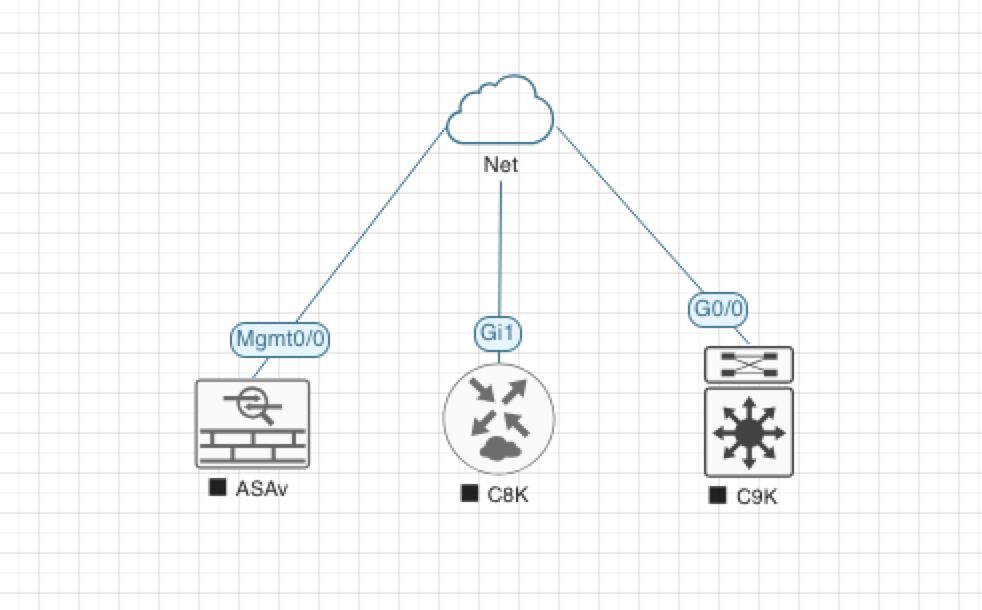
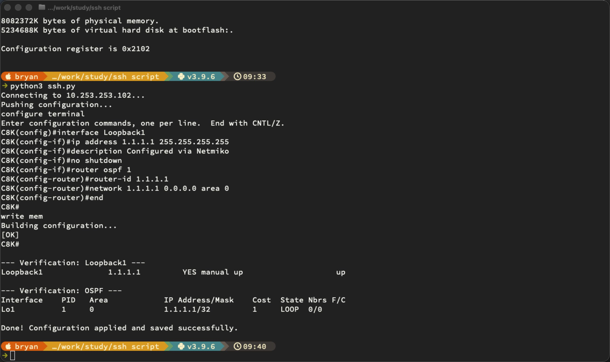

[Open: Pasted image 20260528082647.png](../../../Media/e98d815a41847e43c8147176d4e669ee_MD5.jpeg)


```
import getpass
from netmiko import ConnectHandler

device = {
    'device_type': 'cisco_ios',
    'host': '10.253.253.102',
    'username': 'admin',
    'password': 'EVE-Secret123',
    'secret': 'EVE-Secret123',
}

# Configuration commands to push
config_commands = [
    # --- Create Loopback Interface ---
    "interface Loopback1",
    "ip address 1.1.1.1 255.255.255.255",
    "description Configured via Netmiko",
    "no shutdown",

    # --- Enable OSPF and advertise the loopback ---
    "router ospf 1",
    "router-id 1.1.1.1",
    "network 1.1.1.1 0.0.0.0 area 0",
]

try:
    # Connect to the device
    print(f"Connecting to {device['host']}...")
    connection = ConnectHandler(**device)

    # Enter enable mode (if not already privileged)
    connection.enable()

    # Send configuration commands
    print("Pushing configuration...")
    output = connection.send_config_set(config_commands)
    print(output)

    # Save the configuration
    save_output = connection.save_config()
    print(save_output)

    # Verify — show the new loopback interface
    print("\n--- Verification: Loopback1 ---")
    print(connection.send_command("show ip interface brief | include Loopback1"))

    # Verify — show OSPF neighbors/config
    print("\n--- Verification: OSPF ---")
    print(connection.send_command("show ip ospf interface brief"))

    # Disconnect
    connection.disconnect()
    print("\nDone! Configuration applied and saved successfully.")

except Exception as e:
    print(f"An error occurred: {e}")
```

[Open: Pasted image 20260528094218.png](../../../Media/9027a63e4578d5d06b51e499aa1e1c24_MD5.jpeg)



