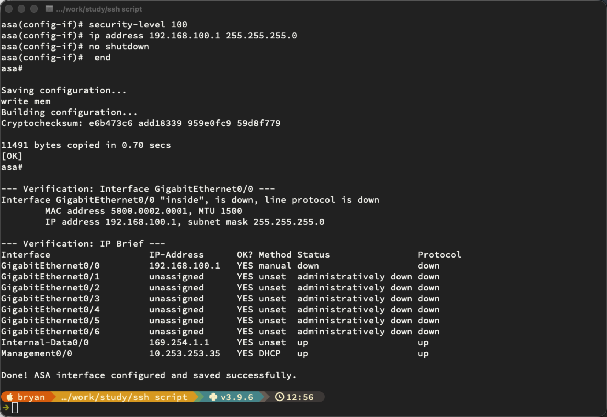

```
from netmiko import ConnectHandler

# Define the ASA connection parameters
device = {
    "device_type": "cisco_asa",       # ASA-specific device type
    "host": "10.253.253.35",            # Replace with your ASA's management IP
    "username": "admin",              # Replace with your username
    "password": "NEW-Secret",       # Replace with your password
    "secret": "EVE-Secret",       # Replace with your enable secret (if needed)
}

# ASA configuration commands
config_commands = [
    "interface GigabitEthernet0/0",
    "nameif inside",                           # Assigns the logical name "inside"
    "security-level 100",                      # Highest trust level
    "ip address 192.168.100.1 255.255.255.0",  # Assigns the IP address
    "no shutdown",                             # Ensures the interface is active
]

try:
    # Connect to the ASA
    print(f"Connecting to ASA at {device['host']}...")
    connection = ConnectHandler(**device)

    # Enter enable mode
    connection.enable()

    # Push the configuration
    print("Pushing interface configuration...")
    output = connection.send_config_set(config_commands)
    print(output)

    # Save the running config to startup
    print("\nSaving configuration...")
    save_output = connection.save_config()
    print(save_output)

    # Verify — show the interface details
    print("\n--- Verification: Interface GigabitEthernet0/0 ---")
    print(connection.send_command("show interface GigabitEthernet0/0 | include Interface|nameif|address|security"))

    # Verify — show interface IP summary
    print("\n--- Verification: IP Brief ---")
    print(connection.send_command("show interface ip brief"))

    # Disconnect
    connection.disconnect()
    print("\nDone! ASA interface configured and saved successfully.")

except Exception as e:
    print(f"An error occurred: {e}")from netmiko import ConnectHandler

# Define the ASA connection parameters
device = {
    "device_type": "cisco_asa",       # ASA-specific device type
    "host": "10.253.253.35",            # Replace with your ASA's management IP
    "username": "admin",              # Replace with your username
    "password": "NEW-Secret",       # Replace with your password
    "secret": "EVE-Secret",       # Replace with your enable secret (if needed)
}

# ASA configuration commands
config_commands = [
    "interface GigabitEthernet0/0",
    "nameif inside",                           # Assigns the logical name "inside"
    "security-level 100",                      # Highest trust level
    "ip address 192.168.100.1 255.255.255.0",  # Assigns the IP address
    "no shutdown",                             # Ensures the interface is active
]

try:
    # Connect to the ASA
    print(f"Connecting to ASA at {device['host']}...")
    connection = ConnectHandler(**device)

    # Enter enable mode
    connection.enable()

    # Push the configuration
    print("Pushing interface configuration...")
    output = connection.send_config_set(config_commands)
    print(output)

    # Save the running config to startup
    print("\nSaving configuration...")
    save_output = connection.save_config()
    print(save_output)

    # Verify — show the interface details
    print("\n--- Verification: Interface GigabitEthernet0/0 ---")
    print(connection.send_command("show interface GigabitEthernet0/0 | include Interface|nameif|address|security"))

    # Verify — show interface IP summary
    print("\n--- Verification: IP Brief ---")
    print(connection.send_command("show interface ip brief"))

    # Disconnect
    connection.disconnect()
    print("\nDone! ASA interface configured and saved successfully.")

except Exception as e:
    print(f"An error occurred: {e}")
```

[Open: Pasted image 20260601125723.png](../../../Media/416f22e4fac3ccf8f3a2c4831b83c0aa_MD5.png)


