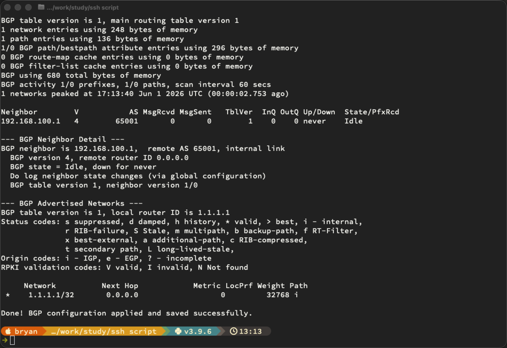

```
from netmiko import ConnectHandler

# Define the router connection parameters
device = {
    "device_type": "cisco_ios",
    "host": "10.253.253.102",            # Replace with your router's management IP
    "username": "admin",              # Replace with your username
    "password": "EVE-Secret123",       # Replace with your password
    "secret": "EVE-Secret123",       # Replace with your enable secret (if needed)
}

# Configuration commands
config_commands = [
    # --- Create Loopback Interface ---
    "interface Loopback0",
    "ip address 1.1.1.1 255.255.255.255",
    "description BGP Router-ID / Loopback",
    "no shutdown",

    # --- Ensure GigabitEthernet2 is up ---
    "interface GigabitEthernet2",
    "no shutdown",

    # --- Enable BGP with ASN 65001 ---
    "router bgp 65001",
    "bgp router-id 1.1.1.1",
    "bgp log-neighbor-changes",

    # --- Advertise the Loopback network ---
    "network 1.1.1.1 mask 255.255.255.255",

    # --- Configure the BGP neighbor on GigabitEthernet2 ---
    "neighbor 192.168.100.1 remote-as 65001",           # iBGP (same ASN) — change remote-as if eBGP
    "neighbor 192.168.100.1 update-source Loopback0",   # Best practice: source from loopback
    "neighbor 192.168.100.1 activate",
]

try:
    # Connect to the router
    print(f"Connecting to router at {device['host']}...")
    connection = ConnectHandler(**device)

    # Enter enable mode
    connection.enable()

    # Push the configuration
    print("Pushing BGP and Loopback configuration...")
    output = connection.send_config_set(config_commands)
    print(output)

    # Save the configuration
    print("\nSaving configuration...")
    save_output = connection.save_config()
    print(save_output)

    # --- Verification ---
    print("\n" + "=" * 50)
    print("          VERIFICATION OUTPUT")
    print("=" * 50)

    # Verify Loopback
    print("\n--- Loopback0 Status ---")
    print(connection.send_command("show ip interface brief | include Loopback0"))

    # Verify GigabitEthernet2
    print("\n--- GigabitEthernet2 Status ---")
    print(connection.send_command("show ip interface brief | include GigabitEthernet2"))

    # Verify BGP summary
    print("\n--- BGP Summary ---")
    print(connection.send_command("show ip bgp summary"))

    # Verify BGP neighbors
    print("\n--- BGP Neighbor Detail ---")
    print(connection.send_command("show ip bgp neighbors 192.168.100.1 | include BGP|state|remote"))

    # Verify advertised networks
    print("\n--- BGP Advertised Networks ---")
    print(connection.send_command("show ip bgp"))

    # Disconnect
    connection.disconnect()
    print("\nDone! BGP configuration applied and saved successfully.")

except Exception as e:
    print(f"An error occurred: {e}")
```

[Open: Pasted image 20260601131403.png](../../../Media/a5a5f016213bbf87472815bdc800959a_MD5.png)


