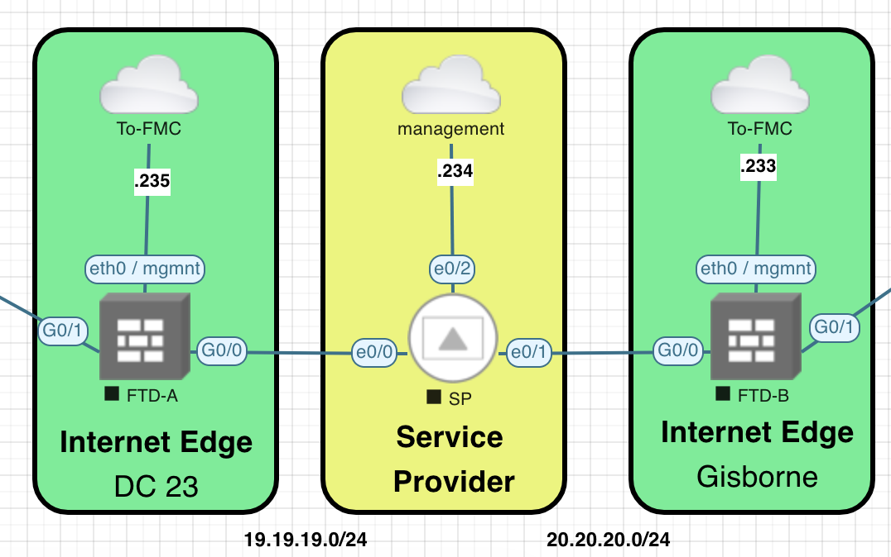
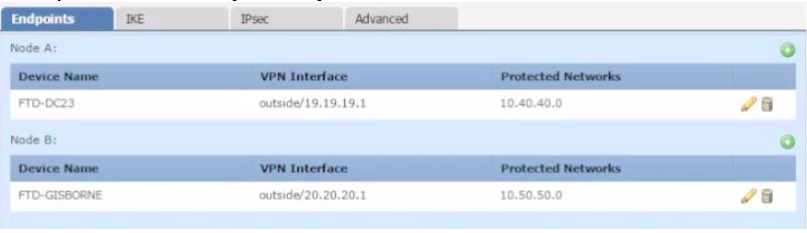

[Open: Pasted image 20260624191841.png](../../../Media/5f2e1c699ce1c1c16b1be45153033328_MD5.png)

Config happens in FMC as these are FTDs

[Open: Pasted image 20260624192033.png](../../../Media/9ba6ace6e9c78f8e591dca51fa587ffb_MD5.png)

