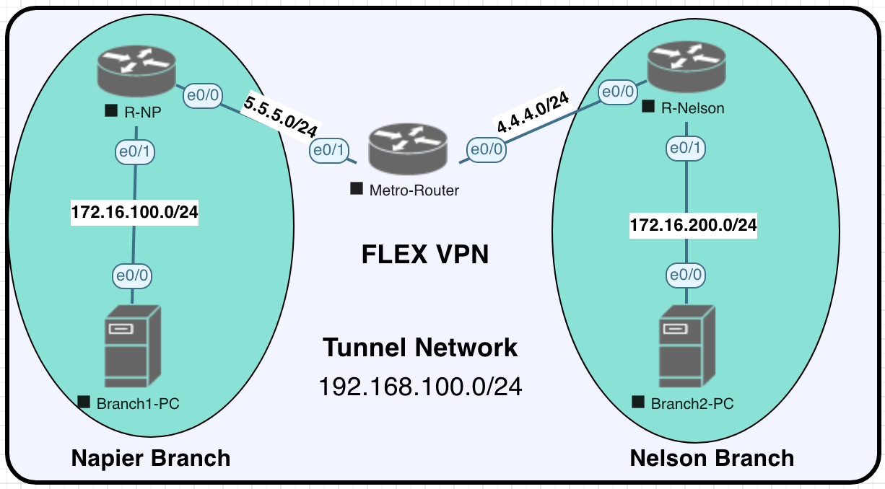

[Open: Pasted image 20260625204132.png](../../../Media/ab486cfbd0ef324c7cb69a09882ba0c6_MD5.png)


R-NP

```
crypto ikev2 proposal PROPOSAL
 encryption aes-cbc-128 3des
 integrity sha1 md5
 group 2 5
!
crypto ikev2 policy POLICY
 proposal PROPOSAL
!
crypto ikev2 keyring NAPIER
 peer NELSON
 address 4.4.4.1
 pre-shared-key Cisco123
!
!
!
crypto ikev2 profile IKEV2-PROF
 match identity remote address 4.4.4.1 255.255.255.255
 authentication remote pre-share
 authentication local pre-share
 keyring local NAPIER
 crypto ipsec transform-set TS esp-3des esp-sha-hmac
 mode tunnel
!
!
crypto ipsec profile IPSECPROF
 set transform-set TS
 set ikev2-profile IKEV2-PROF
!
interface Tunnel1
 no shutdown
 ip address 192.168.100.1 255.255.255.0
 tunnel source 5.5.5.1
 tunnel mode ipsec ipv4
 tunnel destination 4.4.4.1
 tunnel protection ipsec profile IPSECPROF
!
router eigrp 100
 network 172.16.100.0 0.0.0.255
 network 192.168.100.0
```

R-Nelson

```
crypto ikev2 proposal PROPOSAL
 encryption aes-cbc-128 3des
 integrity sha1 md5
 group 2 5
!
crypto ikev2 policy POLICY
 proposal PROPOSAL
!
crypto ikev2 keyring NAPIER
 peer NAPIER
 address 5.5.5.1
 pre-shared-key Cisco123
!
crypto ikev2 profile IKEV2-PROF
 match identity remote address 5.5.5.1 255.255.255.255
 authentication remote pre-share
 authentication local pre-share
 keyring local NAPIER
!
crypto ipsec transform-set TS esp-3des esp-sha-hmac
 mode tunnel
!
crypto ipsec profile IPSECPROF
 set transform-set TS
 set ikev2-profile IKEV2-PROF
!
interface Tunnel1
 no shutdown
 ip address 192.168.100.2 255.255.255.0
 tunnel source 4.4.4.1
 tunnel mode ipsec ipv4
 tunnel destination 5.5.5.1
 tunnel protection ipsec profile IPSECPROF
!
!
router eigrp 100
 network 172.16.200.0 0.0.0.255
 network 192.168.100.0
```