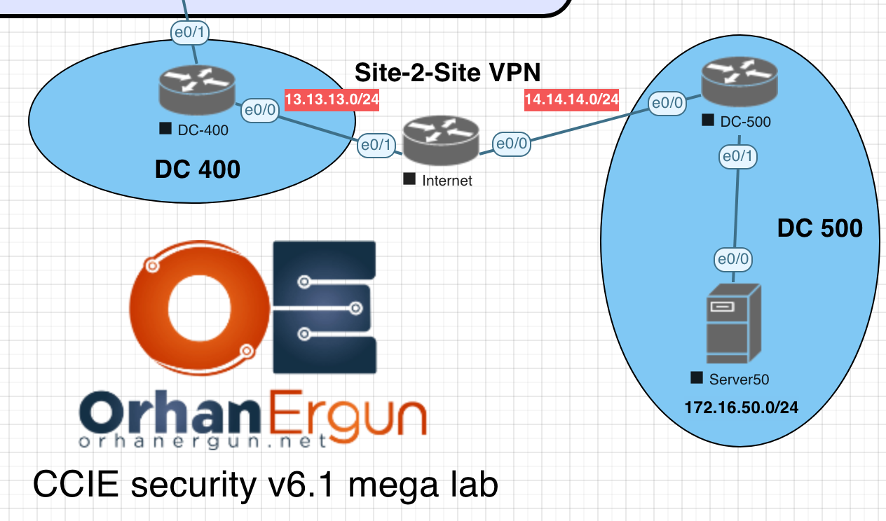

[Open: Pasted image 20260629191905.png](../../../Media/be325ab41b507e73cbebac11245e1e5d_MD5.png)


DC-400
```
crypto isakmp policy 10
 encr 3des
 hash md5
 authentication pre-share
 group 2

crypto isakmp key Cisco123 address 14.14.14.1
crypto ipsec transform-set TS esp-3des esp-sha-hmac
 mode tunnel
!
access-list 102 permit ip 172.16.40.0 0.0.0.255 172.16.50.0 0.0.0.255

crypto map CMAP 10 ipsec-isakmp
 set peer 14.14.14.1
 set transform-set TS
 match address 102

interface Ethernet0/0
 no shutdown
 ip address 13.13.13.1 255.255.255.0
 duplex auto
 crypto map CMAP
!
interface Ethernet0/1
 no shutdown
 ip address 172.16.40.254 255.255.255.0
 duplex auto

ip route 0.0.0.0 0.0.0.0 13.13.13.254
```

DC-500

```
crypto isakmp policy 10
 encr 3des
 hash md5
 authentication pre-share
 group 2

crypto isakmp key Cisco123 address 13.13.13.1
crypto ipsec transform-set TS esp-3des esp-sha-hmac
 mode tunnel

access-list 102 permit ip 172.16.50.0 0.0.0.255 172.16.40.0 0.0.0.255
access-list 102 permit ip 172.16.50.0 0.0.0.255 172.16.40.0 0.0.0.255

crypto map CMAP 10 ipsec-isakmp
 set peer 13.13.13.1
 set transform-set TS
 match address 102

interface Ethernet0/0
 no shutdown
 ip address 14.14.14.1 255.255.255.0
 duplex auto
 crypto map CMAP

interface Ethernet0/1
 no shutdown
 ip address 172.16.50.254 255.255.255.0
 duplex auto

ip route 0.0.0.0 0.0.0.0 14.14.14.254
```