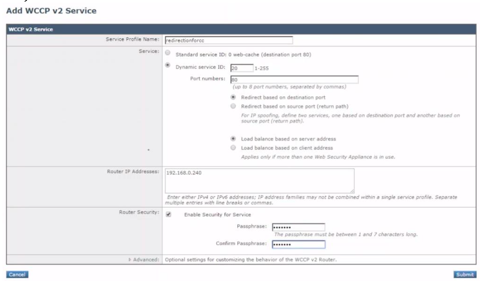
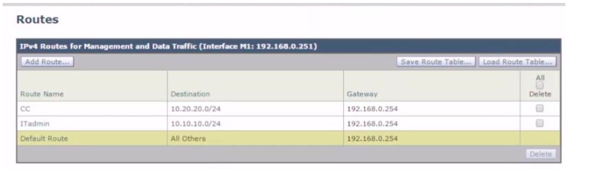
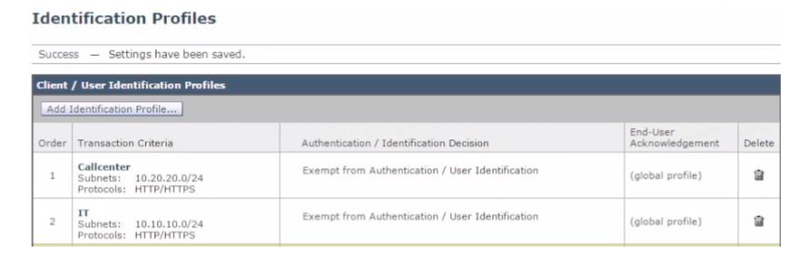

Call Center Router

```
ip host www.dashboard.com 100.100.100.100
ip host www.manager.com 100.100.100.200

ip name-server 192.168.0.240

access-list 1 permit 192.168.0.251

access-list 101 permit tcp any any eq www

ip wccp 20 redirect-list 101 group-list 1 password 0 cisco

interface Ethernet0/0
 no shutdown
 ip address 172.16.10.254 255.255.255.0
!
interface Ethernet0/1
 no shutdown
 ip address 192.168.0.240 255.255.255.0
!
interface Ethernet0/2
 no shutdown
 ip address 10.20.20.254 255.255.255.0
 ip wccp 20 redirect in
!
interface Ethernet0/3
 no shutdown
 ip address 10.10.10.254 255.255.255.0
 ip wccp 20 redirect in

router eigrp 100
network 10.10.10.0 0.0.0.255
network 10.20.20.0 0.0.0.255
```

[Open: Pasted image 20260706182448.png](../../../Media/b10706ae9e28db405cc1c22a2437c602_MD5.png)


[Open: Pasted image 20260706182506.png](../../../Media/b1211e0768b5ea39ce593a470057f8a9_MD5.png)


[Open: Pasted image 20260706182518.png](../../../Media/658054c2f3014184f02a6c2ea7ae5acf_MD5.png)


