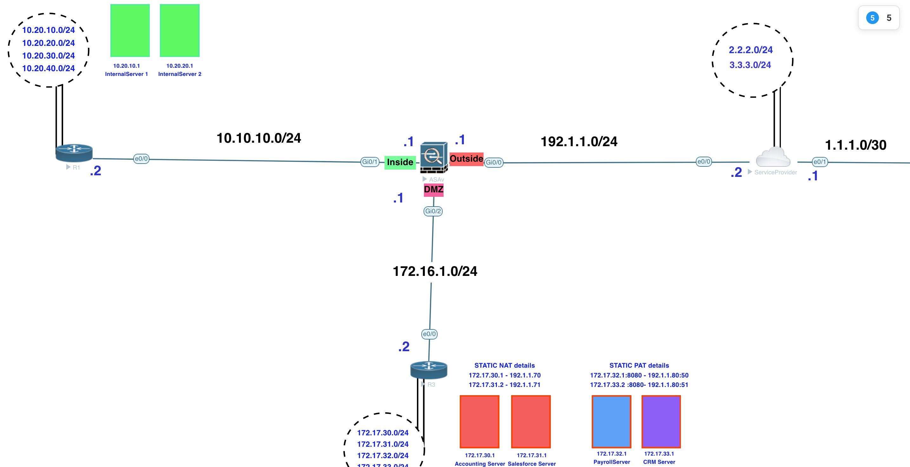

[Open: Pasted image 20260108143803.png](../../../Media/83db7e07983b058c477c812c5a535cf9_MD5.jpeg)


Static NAT Lab

Bi-directional NAT

NAT Accounting server 172.17.30.1 to 192.1.1.70
NAT Salesforce Server 172.17.31.1 to 192.1.1.71

Create objects and NAT Config

```
network object Accountingserver
	host 172.17.30.1
	nat (dmz,outside) static 192.1.1.70
	
network object Salesforceserver
	host 172.17.31.1
	nat (dmz,outside) static 192.1.1.71
```

This will work outbound (high to low security levels) but for an outside (level 0) resource to access the dmz (level 50) i.e. low to high, it needs to be allowed through the acl.

```
# show access-list
show access-list
access-list outside; 1 elements; name hash: 0x1a47dec4
access-list outside line 1 extended permit tcp any host 172.16.1.2

# edit access-list
access-list outside permit tcp any host 172.17.30.1
access-list outside permit tcp any host 172.17.31.1
```