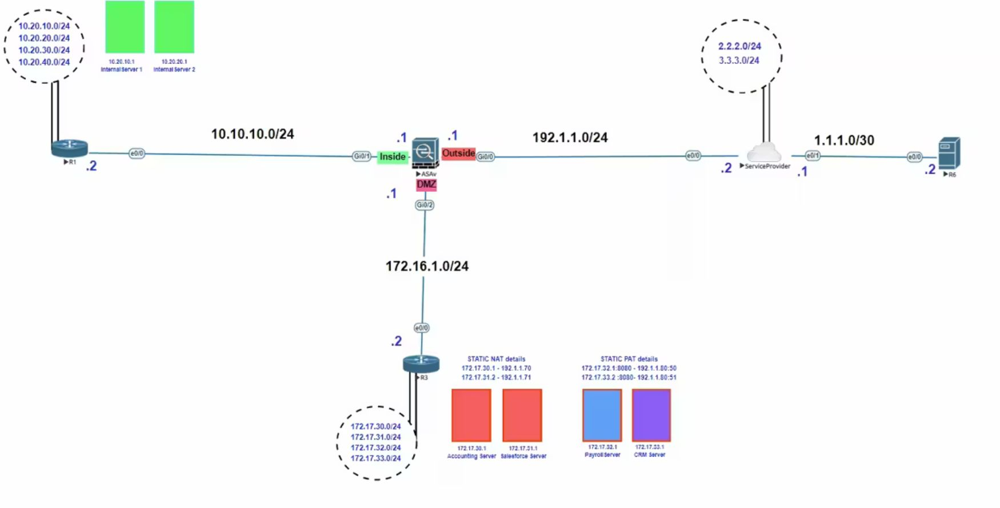

[Open: Pasted image 20260109145527.png](../../../Media/2625875d60b958559706c538a59224f8_MD5.jpeg)


Static PAT the following servers

Payroll Server 172.17.32.1:8080 -> 192.1.1.80:50
CRM Server 172.17.33.2:8080 -> 192.1.1.80:51

Create network objects
```
object network payrollserver
	host 172.17.32.1
	nat (dmz,outside) static 192.1.1.80 service tcp 8080 50
	
object network crmserver
	host 172.17.33.1
	nat (dmz,outside) static 192.1.1.80 service tcp 8080 51
```