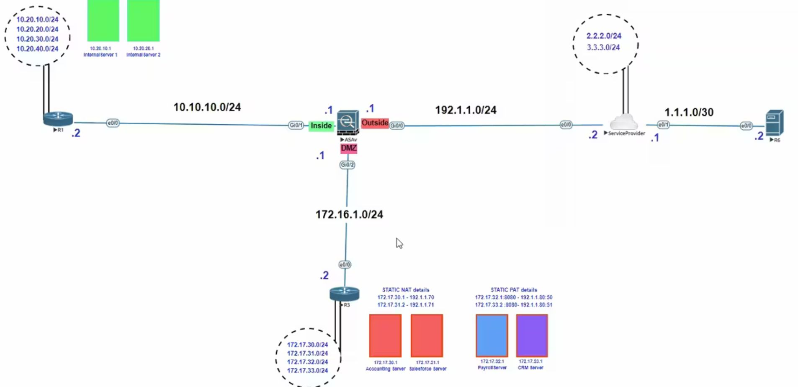

[Open: Pasted image 20260111094645.png](../../../Media/ec50d477022dc02012aa698682310ae0_MD5.jpeg)


Destination and Policy NAT

R3 Outside - 192.1.1.24
R3 Inside - 172.16.1.2

Remote Outside IP - 2.2.2.1
Dummy Remote Outside IP - 172.16.1.80

Traffic sourced from 2.2.2.1 will be translated to 172.16.1.90 to be able to telnet to R3 Inside of 172.16.1.2

Create all 4 objects

```
object network R3-inside
	host 172.16.1.2
	
object network R3-outside
	host 192.1.1.24
	
outside-remote
	host 2.2.2.1

outside-dummy
	host 172.16.1.80
```