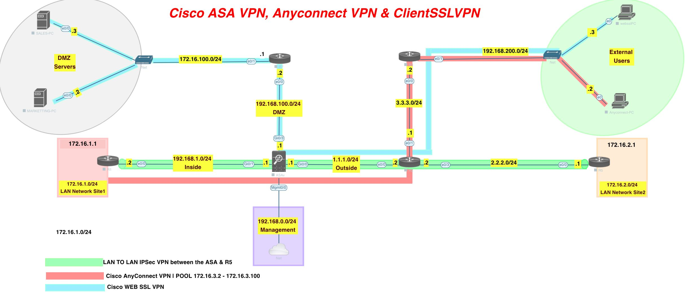

S2S VPN

Two phases

Phase 1 - ISAKMP SA
Pre-shared key set to encrypt and share session key

Phase 2 - IPSec SA

IKE - internet key exchange, part of phase 1. UDP/500

Phase 2 - ESP, UDP/50

# Lab

[Open: Pasted image 20260112142552.png](../../../Media/d4c8e76cb26204e487fa5a45a45299c6_MD5.jpeg)


First step will be connecting site 1 (r1)  and site 2 (r5) via s2s vpn tunnel

Second step any connect client vpn

Step 3 - clientless web ssl vpn

## Base config
ASA

```
# enable ikev1 and set policy

crypto ikev1 enable outside
crypto ikev1 policy 10
	authentication pre-share
	hash sha
	encryption aes
	group 14
	
# create tunnel group

tunnel-group 2.2.2.1 type ipsec-l2l
tunnel-group 2.2.2.1 ipsec-attributes
	ikev1 pre-shared-key key123

# set ipsec policy

crypto ipsec ikev1 transform-set TS esp-aes esp-sha-hmac

# create ACL for interesting traffic

access-list 101 permit ip 172.16.1.0 255.255.255.0 172.16.2.0 255.255.255.0

# Set crypto map options (peer, transform set, acl)
crypto map CMAP 10 set peer 2.2.2.1
crypto map CMAP 10 set ikev1 transform-set TS
crypto map CMAP 10 match address 101

# apply crypto map to outside interface
crypto map CMAP interface Outside

```

R5 - S2S Peer for ASA

```
crypto isakmp policy 10
	authentication pre-share
	hash sha
	group 14
	encryption aes
	
crypto isakmp key key123 address 1.1.1.1

# configure phase 2

crypto ipsec transform-set TS esp-aes esp-sha-hmac

access-list 101 permit ip 172.16.2.0 255.255.255.0 172.16.1.0 255.255.0

# configure crypto map

crypto map CMAP 10 ipsec-isakmp 
	set peer 1.1.1.1
	set transform-set TS
	match address 101
	
# apply crypto map
interface e0/0
	crypto map CMAP
	
# verify

show crypto ipsec sa
```